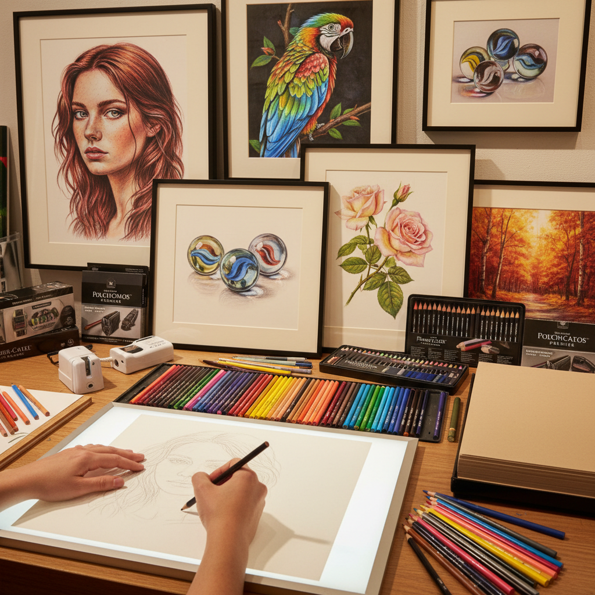

# Colored Pencil 彩色铅笔

> "Colored pencil is the slow art of layering light — each stroke a transparent veil of wax and pigment, built up patiently until the paper glows with a depth and luminosity that rivals any painting medium, yet retains the intimacy of drawing." — Unknown

## 概述

彩色铅笔（Colored Pencil）是一种以蜡或油为粘合剂、将颜料粉末包裹在木质笔杆中的绘画工具。彩色铅笔画通过逐层叠加半透明的色彩层来建立深度和丰富度——这种"分层"技法（layering）是彩色铅笔画的核心。彩色铅笔画可以达到极其精细和写实的效果——当代的彩色铅笔艺术家能创作出照片般逼真的作品。

彩色铅笔分为蜡基（wax-based，如Prismacolor）和油基（oil-based，如Faber-Castell Polychromos）两大类。蜡基彩色铅笔色彩浓郁、易于混合，但可能出现"蜡花"（wax bloom）；油基彩色铅笔更硬、更精确，不会出现蜡花。彩色铅笔画的优势在于：精确控制、便携、无毒、不需要干燥时间、可以在极小的区域内工作。

## 核心特征

| 特征 | 描述 |
|------|------|
| 分层 | 逐层叠加色彩 |
| 精确 | 极其精确的控制 |
| 便携 | 便携易用 |
| 无毒 | 安全无毒 |
| 精细 | 可达到极精细效果 |
| 耐心 | 需要极大耐心 |

## 视觉特征

- **精细**：极其精细的细节
- **层次**：丰富的色彩层次
- **光泽**：蜡质的柔和光泽
- **写实**：可达到照片般写实
- **柔和**：柔和的色彩过渡
- **深度**：多层叠加的深度感

## 代表作品

| 作品 | 艺术家 | 年代 | 意义 |
|------|--------|------|------|
| *Hyperrealistic portraits* | Various | 当代 | 超写实彩铅肖像 |
| *Botanical illustrations* | Various | 当代 | 植物学彩铅插画 |
| *Animal portraits* | Various | 当代 | 动物彩铅肖像 |
| *Colored pencil landscapes* | Various | 当代 | 彩铅风景画 |
| *Mixed media colored pencil* | Various | 当代 | 混合媒介彩铅 |

## 历史时间线

| 时期 | 事件 |
|------|------|
| 19世纪 | 现代彩色铅笔的发明 |
| 1920s | 商业彩色铅笔品牌的建立 |
| 1960s | 彩色铅笔作为严肃艺术媒介的认可 |
| 1980s | 彩色铅笔协会的成立 |
| 2000s | 超写实彩色铅笔画的流行 |
| 当代 | 社交媒体推动的全球流行 |

## 中国语境

彩色铅笔画在中国有极其广泛的流行——特别是在社交媒体时代。中国的彩色铅笔画教程书籍和在线课程数量庞大。中国的一些彩色铅笔艺术家在社交媒体上拥有大量粉丝。中国的美术爱好者群体中，彩色铅笔画因其"门槛低、效果好"的特点而极受欢迎。中国市场上有丰富的彩色铅笔品牌——从国产的中华、马利到进口的辉柏嘉、三菱等。中国的一些出版社出版了大量彩色铅笔画教程。

## AI生成概念图

## 与其他风格的关系

- **Graphite Drawing** → 石墨画
- **Pastel Painting** → 色粉画
- **Watercolor Pencil** → 水溶性彩铅
- **Illustration** → 插画
- **Hyperrealism** → 超写实主义
- **Botanical Art** → 植物学绘画

---

*浮光艺志 | Chronicle of Artistry*
