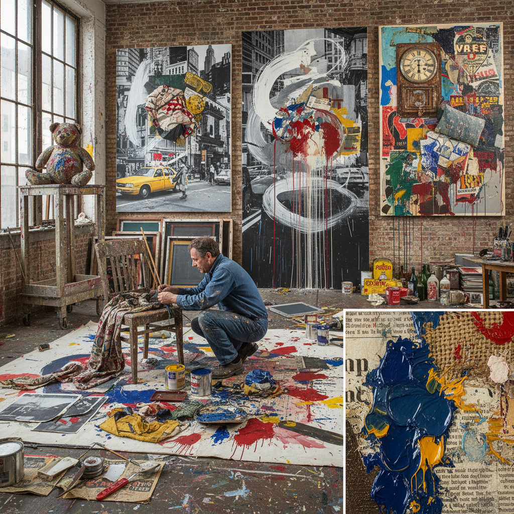

# Combine Painting 组合绘画

> "The combine is neither painting nor sculpture but a new species of art object — canvas married to chair, paint splashed over pillow, a stuffed goat wearing a tire standing on a painted platform, the everyday world physically entering the picture plane and refusing to leave, Robert Rauschenberg's declaration that art could operate in the gap between art and life without choosing either side." — Unknown

## 概述

组合绘画（Combine Painting），或简称"Combines"，是由罗伯特·劳森伯格（Robert Rauschenberg）在1950年代中期创造的一种艺术形式，将传统绘画与现成物品（found objects）、照片、织物等日常材料物理性地结合在一起。Combines既不是纯粹的绘画，也不是纯粹的雕塑，而是一种全新的混合形式——它们在画布上附着真实的物体，或者让绘画从墙面延伸到地面空间。

劳森伯格在1954-1964年间创作了大量Combines作品。他的名言"在艺术和生活之间的间隙中工作"（working in the gap between art and life）完美概括了Combines的精神。Combines是对抽象表现主义的回应——它保留了抽象表现主义的笔触和能量，但将现实世界的物体引入画面，打破了绘画的封闭性。Combines也是波普艺术的重要先驱——它将日常物品提升为艺术材料。

## 核心特征

| 特征 | 描述 |
|------|------|
| 混合 | 绘画与物体的混合 |
| 现成物 | 使用日常现成物品 |
| 间隙 | 艺术与生活的间隙 |
| 突破 | 突破绘画的平面性 |
| 拼贴 | 三维的拼贴 |
| 劳森伯格 | 劳森伯格的发明 |

## 视觉特征

- **混合**：绘画与物体的混合
- **日常**：日常物品的存在
- **层叠**：多层材料的叠加
- **笔触**：抽象表现主义的笔触
- **照片**：丝网印刷的照片
- **立体**：从平面延伸到空间

## 代表作品

| 作品 | 艺术家 | 年代 | 意义 |
|------|--------|------|------|
| *Monogram* | Robert Rauschenberg | 1955-59 | 山羊与轮胎的标志作品 |
| *Bed* | Robert Rauschenberg | 1955 | 真实床铺上的绘画 |
| *Canyon* | Robert Rauschenberg | 1959 | 秃鹰标本的组合 |
| *Odalisk* | Robert Rauschenberg | 1955-58 | 宫女的组合 |
| *Pilgrim* | Robert Rauschenberg | 1960 | 椅子与画布的组合 |

## 历史时间线

| 时期 | 事件 |
|------|------|
| 1953 | 劳森伯格的早期实验 |
| 1954-55 | 第一批Combines诞生 |
| 1955-59 | Combines的鼎盛期 |
| 1964 | 劳森伯格获威尼斯双年展金狮奖 |
| 当代 | Combines的持续影响 |

## 中国语境

组合绘画在中国当代艺术中有重要影响。中国的"85新潮"运动中，许多艺术家受到劳森伯格的启发——1985年劳森伯格在中国美术馆举办的展览对中国当代艺术产生了深远影响。中国的一些当代艺术家（如徐冰、蔡国强等）在创作中使用类似Combines的混合媒介方法。劳森伯格本人也在1985年的中国之行中创作了融合中国元素的作品。中国当代艺术中的"综合材料"创作很大程度上受到了Combines传统的影响。

## AI生成概念图

## 与其他风格的关系

- **Neo-Dada** → 新达达
- **Pop Art** → 波普艺术
- **Assemblage** → 集合艺术
- **Abstract Expressionism** → 抽象表现主义
- **Found Object** → 现成物艺术
- **Collage** → 拼贴艺术

---

*浮光艺志 | Chronicle of Artistry*
