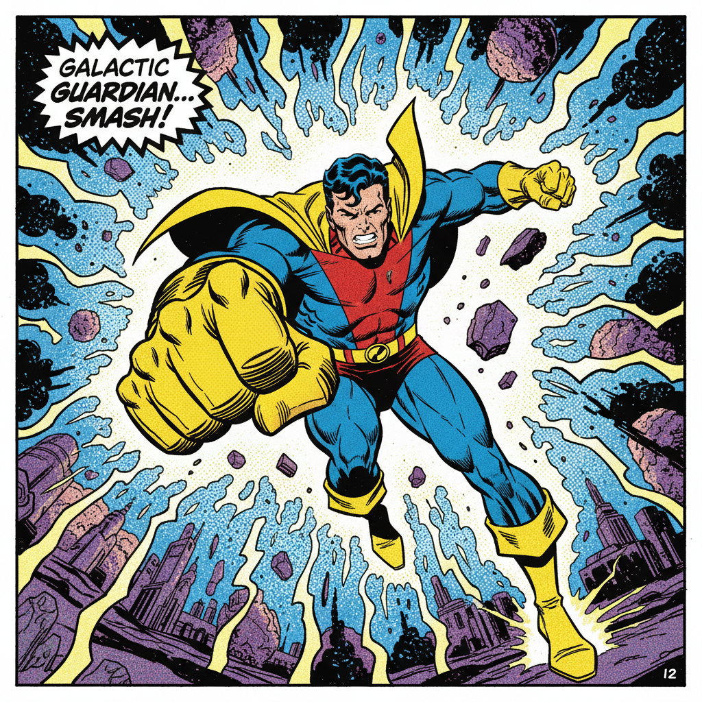

# Comic Art 漫画艺术（西方）



> **"超级英雄、四格漫画、图像小说——西方漫画用色彩和动态讲述英雄与日常。"**

## 概述

| 维度 | 描述 |
|------|------|
| 时期 | 1930s–至今 |
| 别名 | Comic Art, Comic Book Art, Sequential Art, Graphic Novel Art |
| 核心色彩 | 鲜艳四色印刷(CMYK)、粗黑轮廓、Ben-Day网点 |
| 关键元素 | 超级英雄、动作线、对话气泡、分格叙事、粗黑线条 |
| 代表人物 | Jack Kirby, Jim Lee, Frank Miller, Moebius, Art Spiegelman |
| 关联风格 | Pop Art, Manga, Pulp Art, Illustration, Graphic Design |

---

## 历史脉络

| 年份 | 事件 |
|------|------|
| 1938 | Superman 首次登场——超级英雄漫画诞生 |
| 1940s | "黄金时代"——Captain America, Batman |
| 1960s | Marvel 革命——Spider-Man, X-Men |
| 1986 | 《Watchmen》《Dark Knight Returns》——漫画成人化 |
| 1992 | Image Comics——独立漫画运动 |
| 2000s | MCU——漫画IP统治电影 |
| 2020s | Webtoon+数字漫画——新形态 |

### 核心哲学

西方漫画艺术的精神是**"每一格都是一幅画——每一页都是一部电影"**：
- 动态 = 力量（"Jack Kirby的拳头能打穿画框"）
- 色彩 = 身份（"红蓝 = Superman, 黑色 = Batman"）
- 叙事 = 连续（"Sequential Art——图像的序列就是时间"）
- 英雄 = 神话（"超级英雄是现代的希腊神话"）
- Stan Lee: "每一期漫画都可能是某个读者的第一期"

---

## 视觉语法

### 色彩系统

```
黄金/白银时代：
  四色印刷 — CMYK限制下的鲜艳
  Ben-Day网点 — 半调印刷
  粗黑轮廓 — 清晰可读
  鲜艳原色 — 红蓝黄绿

现代时代：
  数字着色 — 无限色彩
  渐变光影 — 电影化
  暗色调 — 成人化
  特殊效果 — 发光、粒子

规则：
  - 色彩 = 角色身份
  - 对比 = 可读性
  - 光影 = 戏剧性
  - 背景色 = 情绪

质感：
  墨线 — 粗细变化
  网点 — Ben-Day/数字
  平涂 — 经典风格
  渲染 — 现代风格
```

### 标志性元素

| 类别 | 元素 |
|------|------|
| 人物 | 超级英雄、肌肉、动态姿势、制服 |
| 叙事 | 分格、对话气泡、旁白框、音效字 |
| 动态 | Kirby Krackle、动作线、冲击波 |
| 印刷 | Ben-Day网点、四色、粗黑线 |
| 类型 | 超级英雄、犯罪、恐怖、科幻、独立 |
| 态度 | 英雄、动态、叙事、商业、神话 |

---

## 与千禧怀旧的关系

### MCU时代——漫画统治流行文化
- 2008-2023: MCU = 全球最大的电影系列
- 漫画美学 → 电影 → 游戏 → 时尚 → 一切
- "我们活在漫画书的世界里——只是现在它叫'IP'"
- Pop Art (Lichtenstein) 就是对漫画的致敬

### 对设计的影响
- 漫画分格 → 网页布局
- 对话气泡 → UI设计
- 超级英雄配色 → 品牌色彩
- 漫画字体 → 标题设计

---

## 中国语境

- 中国连环画传统与西方漫画的对比
- 中国对美漫的引进和影响
- 中国漫画产业中的西方漫画元素
- 中国超级英雄IP的发展

---

## 设计应用

| 场景 | 应用方式 |
|------|----------|
| 品牌 | IP联名+英雄+力量+年轻 |
| 出版 | 漫画+图像小说+Webtoon |
| 影视 | 概念设计+分镜+视觉开发 |
| 营销 | 漫画风格广告+社交媒体+互动 |

---

## 相关风格

← [Manga 漫画](manga.md) | [Pop Art 波普艺术](pop-art.md) →

↑ [返回千禧怀旧目录](README.md) | [返回总目录](../README.md)
