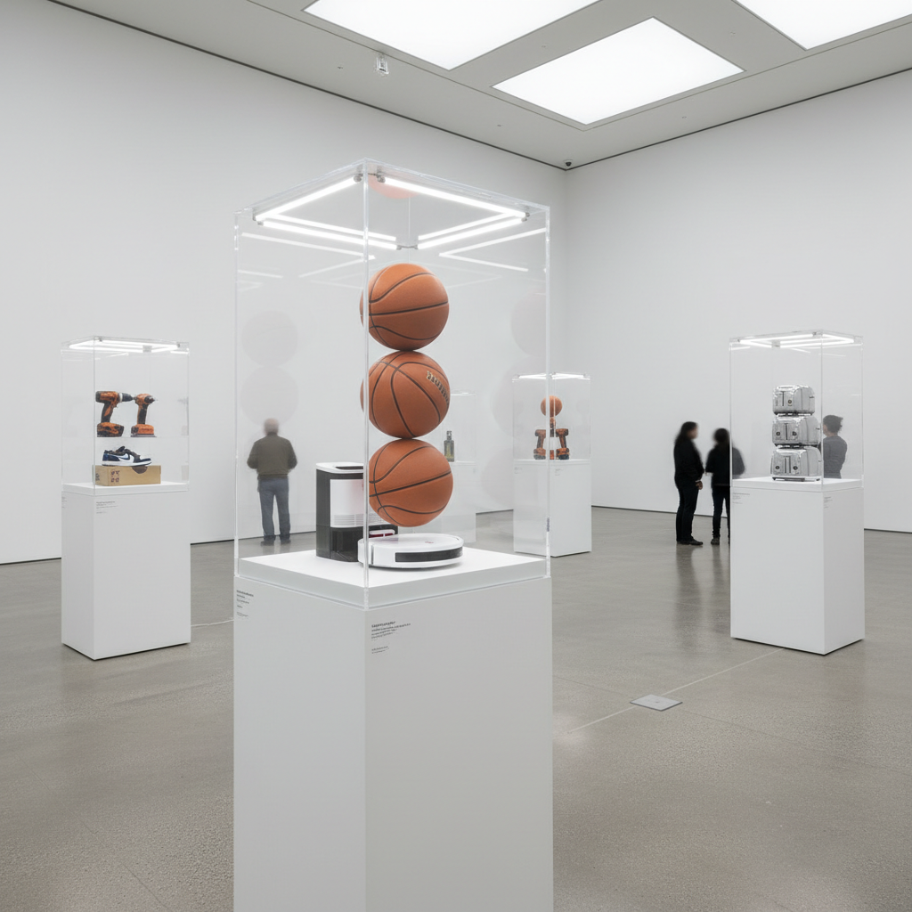

# Commodity Art 商品艺术

> **时期：** 1980年代–1990年代  
> **关键词：** 消费主义、现成品、市场批判、新波普、物质文化

## 概述

Commodity Art（商品艺术）是1980年代与模拟主义和新波普并行的艺术潮流，艺术家直接将消费品——吸尘器、篮球、充气玩具——置于艺术语境中，既是对杜尚现成品的延续，也是对里根时代消费狂热的镜像反射。它模糊了艺术品与商品的边界，追问：当一切都可以被买卖时，艺术的价值从何而来？

## 风格特征

- **现成品展示**：未经改造的商品直接作为艺术品
- **品牌符号**：商标和包装作为视觉主体
- **光滑表面**：工业制造的完美质感
- **市场自反**：艺术市场本身成为主题
- **规模生产**：版本和系列的商业逻辑

## 代表人物与作品

- 杰夫·昆斯《新》系列吸尘器
- 海姆·斯坦巴赫 货架雕塑
- 达明·赫斯特 药柜系列
- 村上隆 商品化卡通

## 概念图

