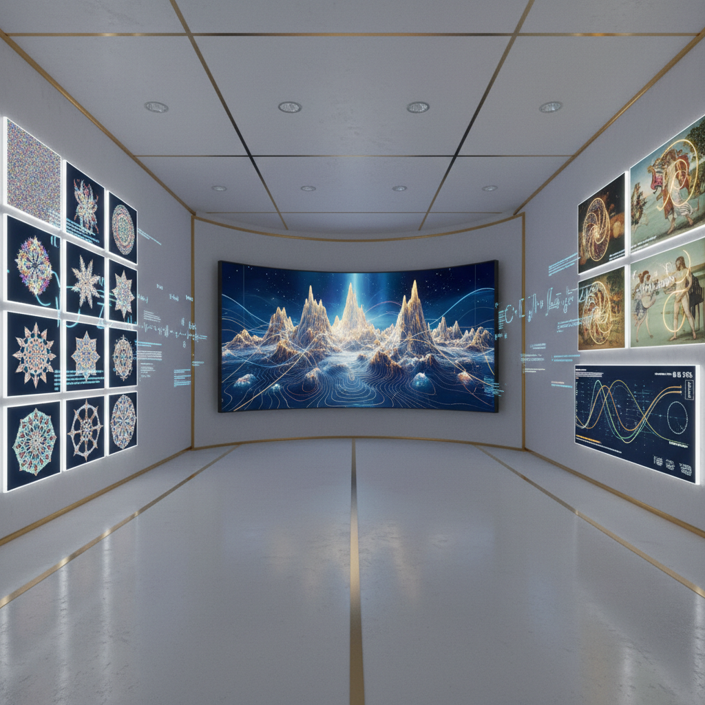

# Computational Aesthetics Art 计算美学艺术

> "Computational aesthetics asks the most dangerous question in art — can beauty be computed? Not whether a machine can make something pretty, but whether the deep structures of aesthetic experience — harmony, tension, surprise, resolution, elegance — have mathematical foundations that can be discovered, formalized, and explored by algorithms, revealing patterns of beauty that human intuition alone could never find." — Jürgen Schmidhuber

## 概述

计算美学艺术（Computational Aesthetics Art）是利用计算方法来分析、生成和探索美学体验的艺术实践。计算美学试图用数学和算法来理解"美"的结构——从黄金比例到分形维度，从信息论到复杂性理论，寻找美学体验背后的计算原理。

计算美学艺术的实践包括：1）美学度量的可视化——将美学属性（对称性、复杂度、新颖性、压缩性）量化并可视化；2）算法生成的美——使用优化算法搜索"美"的空间，生成满足特定美学标准的作品；3）美学进化——使用遗传算法和交互式进化来"培育"美的形式；4）美学分析——用计算方法分析已有艺术作品的美学结构；5）超越人类美学——探索人类感知范围之外的"美"的可能性。

## 核心特征

| 特征 | 描述 |
|------|------|
| 量化 | 美的量化 |
| 算法 | 算法生成 |
| 优化 | 美学优化 |
| 结构 | 美的结构 |
| 进化 | 美学进化 |
| 超越 | 超越人类美学 |

## 视觉特征

- **数学**：数学结构的可视化
- **对称**：对称和比例
- **复杂**：复杂度的梯度
- **进化**：形式的进化序列
- **参数**：参数空间的探索
- **精确**：计算的精确性

## 代表作品

| 作品 | 艺术家 | 年代 | 意义 |
|------|--------|------|------|
| *Evolved art* | Karl Sims | 1994 | 进化艺术 |
| *Aesthetic measure* | George Birkhoff | 1933 | 美学度量 |
| *Fractal art* | Various | 1980年代 | 分形艺术 |
| *Neural style transfer* | Various | 2015 | 神经风格迁移 |
| *GAN art* | Various | 2018至今 | 生成对抗网络艺术 |

## 历史时间线

| 时期 | 事件 |
|------|------|
| 1933 | Birkhoff的美学度量理论 |
| 1960年代 | 计算机艺术的早期实验 |
| 1994 | Karl Sims的进化虚拟生物 |
| 2015 | 神经风格迁移的突破 |
| 当代 | AI美学的全面发展 |

## 中国语境

计算美学在中国有独特的文化共鸣。中国传统美学中有丰富的"法则"和"程式"——从书法的笔法规则，到绘画的"六法"（气韵生动、骨法用笔等），到园林的造景法则，到音乐的律制。这些传统的美学"算法"与计算美学有深层的对应。中国当代的一些研究者和艺术家在探索计算美学：用算法分析中国书法的美学结构、用AI学习中国画的构图法则、以及用计算方法探索中国传统美学概念（如"气韵"、"意境"）的形式化可能性。

## AI生成概念图

## 与其他风格的关系

- **Algorithmic Art** → 算法艺术
- **Generative Art** → 生成艺术
- **Mathematical Art** → 数学艺术
- **AI Art** → 人工智能艺术
- **Fractal Art** → 分形艺术
- **Information Art** → 信息艺术

---

*浮光艺志 | Chronicle of Artistry*
