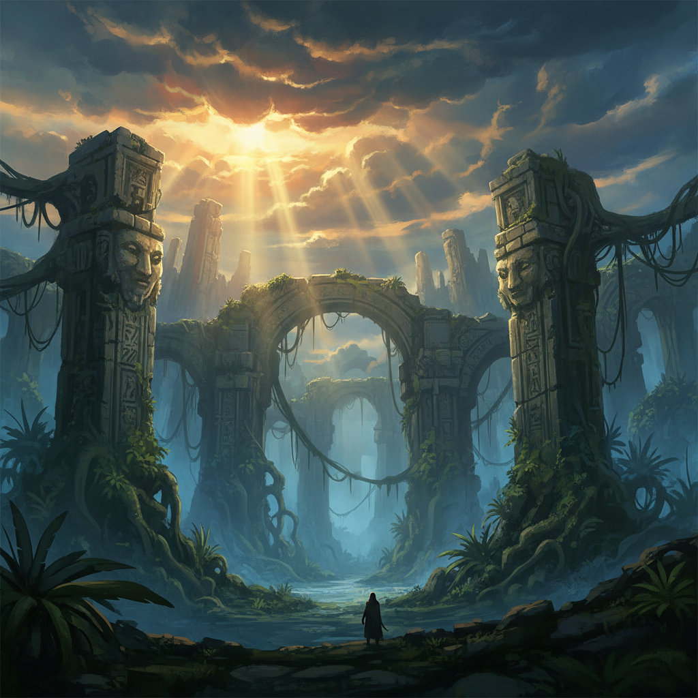

# Concept Art 概念艺术



> **"在电影开拍之前、游戏开发之前——一切都从概念艺术家的画笔开始。"**

## 概述

| 维度 | 描述 |
|------|------|
| 时期 | 1930s（迪士尼）–至今 |
| 别名 | Concept Art, Visual Development, 概念设计 |
| 核心色彩 | 无固定——服务于项目世界观 |
| 关键元素 | 世界观构建、角色设计、环境设计、氛围图、快速迭代 |
| 代表人物 | Ralph McQuarrie (星球大战), Syd Mead (银翼杀手), Feng Zhu |
| 关联风格 | Fantasy Art, Sci-Fi Art, Matte Painting, Illustration |

---

## 历史脉络

| 年份 | 事件 |
|------|------|
| 1930s | 迪士尼动画工作室——"Visual Development"部门 |
| 1977 | Ralph McQuarrie 为《星球大战》设计视觉 |
| 1982 | Syd Mead 为《银翼杀手》设计未来城市 |
| 2000s | 游戏产业爆发——概念艺术需求激增 |
| 2010s | ArtStation 平台——概念艺术社区化 |
| 2020s | AI辅助概念设计——工作流变革 |

### 核心哲学

概念艺术的精神是**"在任何东西被制造之前——先让人'看到'它"**：
- 可视化 = 沟通（"一张概念图胜过一万字描述"）
- 迭代 = 探索（"画100个方案——选1个"）
- 服务 = 核心（"概念艺术不是为了挂在墙上——是为了让项目前进"）
- 想象 = 职业（"把不存在的世界画得像真的一样"）
- "概念艺术家是'看见未来'的人"

---

## 视觉语法

### 色彩系统

```
无固定色彩规则——服务于项目

常见策略：
  氛围色调 — 整体情绪
  光影为主 — 明暗关系
  有限调色板 — 快速表达
  色彩脚本 — 叙事节奏

工作阶段色彩：
  灰阶 — 构图、光影
  有限色 — 氛围探索
  全色 — 最终渲染
  线稿 — 设计细节

质感：
  速涂 — 快速探索
  精渲 — 最终展示
  线稿 — 设计说明
  照片合成 — 快速氛围
```

### 标志性元素

| 类别 | 元素 |
|------|------|
| 类型 | 角色设计、环境设计、道具设计、生物设计 |
| 展示 | 三视图、表情表、色彩变体、比例图 |
| 技法 | 速涂、精渲、线稿、照片合成、3D辅助 |
| 工具 | Photoshop, Procreate, Blender, ZBrush |
| 产业 | 电影、游戏、动画、主题公园 |
| 态度 | 服务性、迭代性、想象力、专业性 |

---

## 与千禧怀旧的关系

### 从幕后到台前
- 概念艺术曾经是"幕后工作"——现在是独立艺术形式
- ArtStation = 概念艺术家的"画廊"
- "The Art of..."画册 = 电影/游戏的收藏品
- 概念艺术 = 2010s-2020s最受欢迎的数字艺术类型

### AI的冲击与机遇
- AI生成 = 概念艺术工作流的变革
- "AI不会取代概念艺术家——但会改变他们的工作方式"
- 从"画100张"到"生成1000张然后选择"
- 概念艺术的核心是"设计思维"而非"绘画技巧"

---

## 中国语境

- 中国游戏产业的概念艺术需求
- 中国概念艺术家在全球的影响力
- 中国动画电影的概念设计（哪吒、大圣归来）
- 中国概念艺术教育和社区

---

## 设计应用

| 场景 | 应用方式 |
|------|----------|
| 游戏 | 角色+环境+道具+UI+世界观 |
| 电影 | 场景+角色+特效+分镜+氛围 |
| 动画 | 视觉开发+色彩脚本+角色设计 |
| 主题公园 | 环境+体验+沉浸式+叙事 |

---

## 相关风格

← [Matte Painting 数字绘景](matte-painting.md) | [Fantasy Art 奇幻艺术](fantasy-art.md) →

↑ [返回千禧怀旧目录](README.md) | [返回总目录](../README.md)
