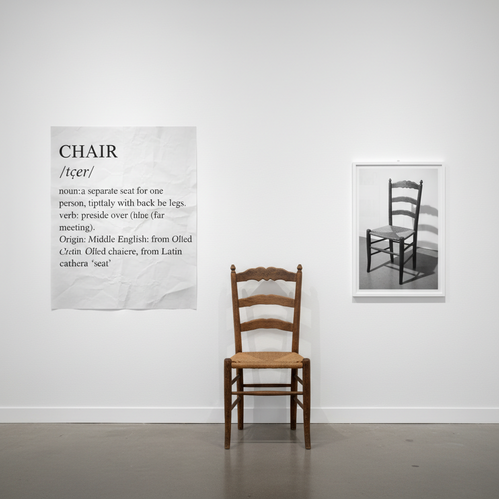

# Conceptual Art Painting 观念艺术绘画

> **时期：** 1960年代末–至今  
> **关键词：** 观念优先、去物质化、语言与艺术、科苏斯、制度批判

## 概述

Conceptual Art（观念艺术）是1960年代末对艺术本质的根本质疑——如果艺术的价值在于观念而非物质形式，那么一个想法、一段文字、一份文件是否就已经是艺术？约瑟夫·科苏斯的"一把椅子和三个定义"、劳伦斯·韦纳的墙上文字——观念艺术将艺术从视觉愉悦中解放出来，让思考本身成为作品。

## 风格特征

- **观念优先**：想法比形式更重要
- **去物质化**：拒绝传统艺术媒介
- **语言运用**：文字作为艺术材料
- **文件记录**：过程和指令即作品
- **制度批判**：质疑艺术体制本身

## 代表人物与作品

- 约瑟夫·科苏斯《一把和三把椅子》
- 劳伦斯·韦纳 声明作品
- 索尔·勒维特 墙画指令
- 河原温 日期画

## 概念图

