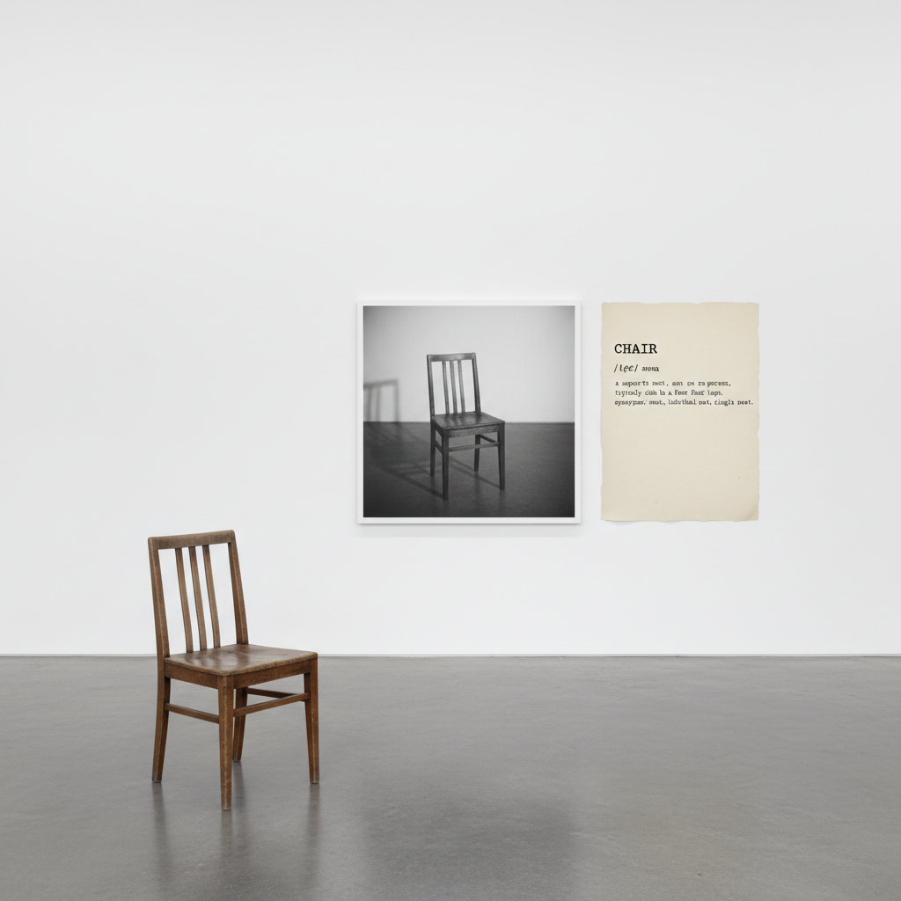

# Conceptual Art 观念艺术

> "The idea becomes a machine that makes the art." — Sol LeWitt

## 概述

观念艺术（Conceptual Art）是1960年代末至1970年代兴起的艺术运动，主张艺术的核心是观念（idea）而非物质形式。在观念艺术中，思想本身就是作品——物质载体可以是文字、照片、地图、指令，甚至完全不存在。

观念艺术是对商品化艺术市场的激进挑战：如果艺术是一个想法，它就无法被买卖。

## 核心特征

| 特征 | 描述 |
|------|------|
| 观念优先 | 想法比物质形式更重要 |
| 去物质化 | 艺术不必是可触摸的物体 |
| 语言即媒介 | 文字、定义、指令可以是艺术 |
| 反商品 | 挑战艺术品作为商品的地位 |
| 过程记录 | 文档、照片、证书作为作品 |
| 自我指涉 | 艺术关于艺术本身的本质 |

## 视觉特征

- **文字**：打字机字体的陈述和定义
- **文档**：照片、地图、图表、证书
- **极简**：白色空间、简洁排版
- **指令**：可执行的文字指令作为作品
- **无形**：有时完全没有视觉形式
- **档案感**：文件夹、索引卡、系统化呈现

## 代表作品

| 作品 | 年代 | 意义 |
|------|------|------|
| *One and Three Chairs* (Kosuth) | 1965 | 实物、照片、定义的三重呈现 |
| *Wall Drawings* (LeWitt) | 1968– | 指令即作品 |
| *I Got Up At* (Kawara) | 1968–79 | 日常行为的记录 |
| *An Oak Tree* (Craig-Martin) | 1973 | 一杯水就是一棵橡树 |
| *4'33"* (Cage) | 1952 | 沉默即音乐——观念艺术的先声 |

## 真实作品（公共领域）

| 作品 | 来源 |
|------|------|
| *One and Three Chairs* | [MoMA](https://www.moma.org/collection/works/81435) |
| *Wall Drawing #118* | [MassMoCA](https://massmoca.org/sol-lewitt/) |
| *An Oak Tree* | [Tate](https://www.tate.org.uk/art/artworks/craig-martin-an-oak-tree-l02262) |

## AI生成概念图

## 与其他风格的关系

- **Dada** → 达达的反艺术精神的延续
- **Minimalism** → 极简主义的逻辑终点
- **Fluxus** → 激浪派的跨媒介实验
- **Land Art** → 大地艺术共享去画廊化理念
