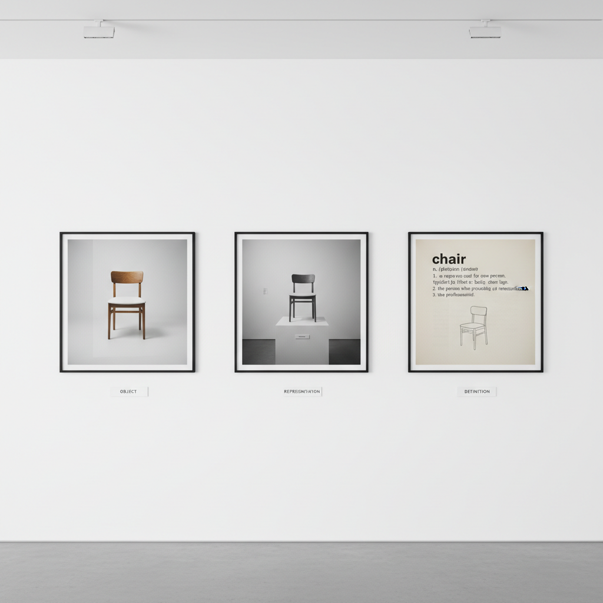

# Conceptual Photography 观念摄影

> "The idea becomes a machine that makes the art." — Sol LeWitt

## 概述

观念摄影（Conceptual Photography）是以概念和思想为核心驱动力的摄影实践——图像不是为了记录现实或追求形式美，而是为了传达一个想法、提出一个问题或挑战一种假设。从1960年代的观念艺术运动开始，摄影成为艺术家表达概念的重要工具。

观念摄影的关键在于"想法先于图像"——拍摄之前，概念已经完成；照片只是概念的物质化呈现。

## 核心特征

| 特征 | 描述 |
|------|------|
| 概念优先 | 想法比视觉效果更重要 |
| 预设性 | 拍摄前概念已经确定 |
| 系列性 | 常以系列形式呈现 |
| 文本性 | 常需要文字说明或标题 |
| 批判性 | 质疑摄影本身或社会现象 |
| 策略性 | 有意识的视觉策略 |

## 视觉特征

- **冷静**：客观的、非情感化的视觉
- **系统**：系统性的拍摄方法
- **类型学**：同类对象的系统记录
- **舞台**：精心布置的场景
- **文字**：文字作为图像的一部分
- **极简**：去除多余的视觉信息

## 代表作品

| 作品 | 艺术家 | 年代 | 意义 |
|------|--------|------|------|
| *One and Three Chairs* | Joseph Kosuth | 1965 | 观念艺术的经典——椅子、照片、定义 |
| *Untitled Film Stills* | Cindy Sherman | 1977-80 | 身份与再现的观念探索 |
| *Typologies* | Bernd & Hilla Becher | 1960s-90s | 类型学摄影——工业建筑的系统记录 |
| *Proof* | Sophie Calle | 1990s+ | 私人生活的观念化 |
| *Tableaux* | Jeff Wall | 1978-至今 | 摄影作为绘画的观念 |
| *For the Love of God* | Damien Hirst | 2007 | 观念与商业的极端 |

## 历史时间线

| 时期 | 事件 |
|------|------|
| 1960s | 观念艺术运动——摄影作为文档 |
| 1965 | Kosuth——"One and Three Chairs" |
| 1970s | 身体艺术和行为艺术的摄影记录 |
| 1977 | Sherman开始"Untitled Film Stills" |
| 1980s-90s | 杜塞尔多夫学派——观念与形式的结合 |
| 2000s | 数字技术扩展了观念摄影的可能 |
| 2010s-至今 | 后网络时代的观念摄影 |

## 中国语境

观念摄影在中国当代艺术中占有重要位置。从1990年代的"观念摄影"热潮到当代的多元实践，中国艺术家如王庆松、洪磊、缪晓春、蒋志等以摄影为媒介进行观念表达。中国的观念摄影常常涉及社会转型、身份认同、历史记忆等主题，形成了独特的中国当代摄影语言。

## AI生成概念图

## 与其他风格的关系

- **Conceptual Art** → 观念艺术是观念摄影的思想基础
- **Photography Art** → 观念摄影是摄影艺术的重要分支
- **Minimalism** → 极简主义的系统性影响了观念摄影
- **Pop Art** → 波普的图像策略影响了观念摄影
- **Performance Art** → 行为艺术常通过摄影记录和传播
- **Digital Art** → 数字技术扩展了观念摄影的边界

---

*浮光艺志 | Chronicle of Artistry*
