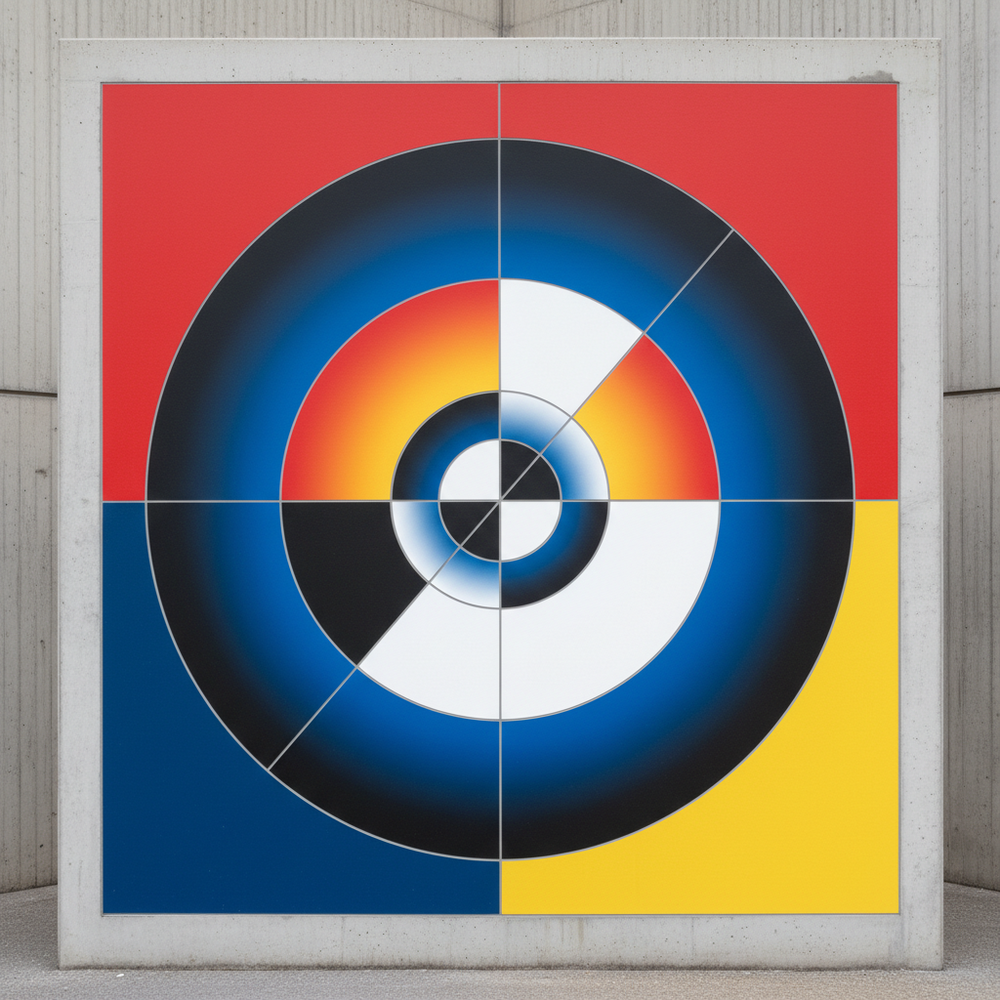

# Concrete Art 具体艺术



> **"不抽象任何东西——因为从一开始就没有具象。纯粹的形式、纯粹的色彩、纯粹的数学。"**

## 概述

| 维度 | 描述 |
|------|------|
| 时期 | 1930–至今 |
| 别名 | Concrete Art, Art Concret, 具体艺术, 具象艺术(非写实) |
| 核心色彩 | 纯色——红黄蓝+黑白+几何渐变 |
| 关键元素 | 纯几何、数学规则、无参照物、系统性 |
| 代表人物 | Theo van Doesburg, Max Bill, Richard Paul Lohse, Josef Albers |
| 关联风格 | De Stijl, Bauhaus, Minimalism, Op Art, Hard-Edge Painting |

---

## 历史脉络

| 年份 | 事件 |
|------|------|
| 1930 | Theo van Doesburg发表《具体艺术宣言》 |
| 1936 | Max Bill开始系统性的具体艺术创作 |
| 1944 | 巴塞尔"具体艺术"展——瑞士成为中心 |
| 1950s | 巴西具体艺术运动——拉美的重要分支 |
| 1960 | Max Bill创立乌尔姆设计学院——具体艺术+设计教育 |
| 1960s | 具体艺术影响瑞士平面设计(Swiss Design) |

### 核心哲学

具体艺术的精神是**"我们不'抽象'任何东西——我们从零开始创造纯粹的视觉现实"**：
- Van Doesburg："具体——不是抽象。因为没有什么比一条线、一种颜色、一个平面更具体的了"
- Max Bill："艺术可以用数学方法创造——这不是限制，是自由"
- "抽象艺术 = 从现实中抽取 → 具体艺术 = 从无中创造"
- "规则不是牢笼——规则是生成器"
- "色彩和形式本身就是内容——不需要外部参照"

---

## 视觉语法

### 色彩系统

```
主色：
  纯红 (#FF0000) — 基本色
  纯黄 (#FFFF00) — 基本色
  纯蓝 (#0000FF) — 基本色
  黑 (#000000) — 结构
  白 (#FFFFFF) — 空间

系统：
  数学渐变 — 色彩按规则变化
  系统排列 — 网格、序列、排列组合
  纯色平涂 — 无笔触、无纹理
  色彩关系 — Josef Albers的色彩交互

规则：
  - 纯几何形式——圆、方、三角
  - 数学/逻辑规则生成构图
  - 无笔触——机械般精确
  - 无参照物——不代表任何外部事物
  - 系统性——可以用规则描述整幅画
```

### 标志性元素

| 类别 | 元素 |
|------|------|
| 形式 | 纯几何——圆、方、三角、线 |
| 色彩 | 纯色平涂、系统渐变 |
| 构图 | 数学规则、网格、序列 |
| 表面 | 无笔触、机械精确 |
| 维度 | 平面→雕塑→建筑→设计 |
| 态度 | 理性、系统、纯粹、普世 |

---

## 与千禧怀旧/当代的关系

### Swiss Design / 国际主义平面设计
- 具体艺术 → 瑞士平面设计 → 国际主义风格
- Max Bill的乌尔姆学院 = 具体艺术+工业设计
- 当代UI设计的网格系统 = 具体艺术的遗产

### 生成艺术(Generative Art)的祖先
- "用规则生成图像" = 具体艺术的核心 = 生成艺术的核心
- Processing/p5.js = 数字时代的具体艺术工具
- NFT生成艺术 = 具体艺术精神的区块链化

---

## 设计应用

| 场景 | 应用方式 |
|------|----------|
| 平面 | 瑞士风格+网格+纯几何 |
| 数字 | 生成艺术+算法+系统 |
| 品牌 | 理性+纯粹+系统+现代 |
| 空间 | 几何雕塑+色彩装置 |

---

## 相关风格

← [De Stijl 风格派](de-stijl.md) | [Op Art 欧普艺术](op-art.md) →

↑ [返回千禧怀旧目录](README.md) | [返回总目录](../README.md)
