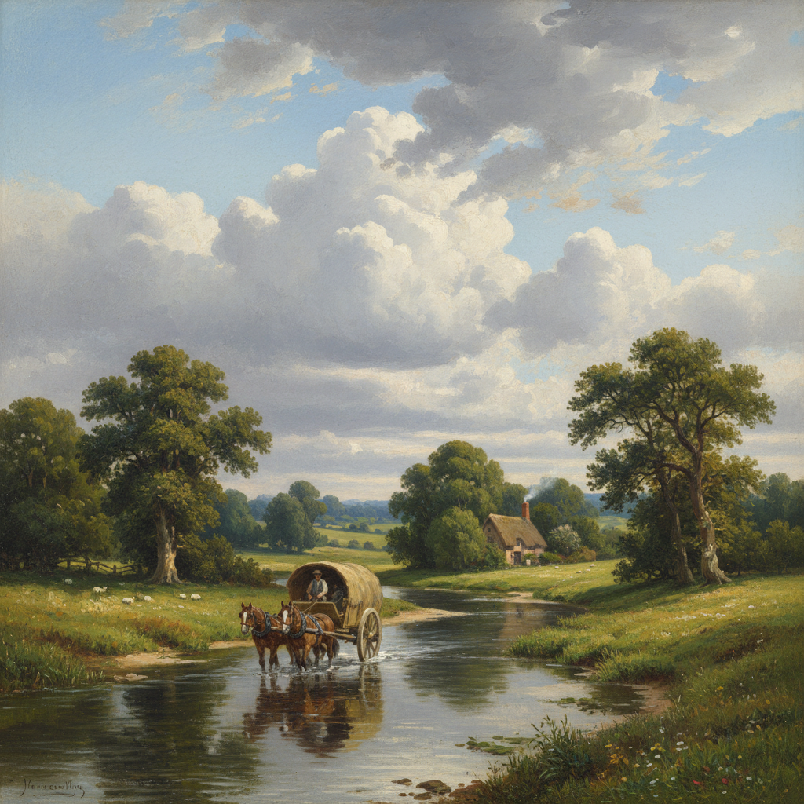

# John Constable 康斯太勃尔

> "I should paint my own places best." — John Constable

## 概述

约翰·康斯太勃尔（John Constable，1776–1837）是英国风景画的伟大革新者，以描绘萨福克郡乡村的真实风景闻名。他拒绝意大利化的理想风景，坚持画自己熟悉的英格兰田野、天空和河流，用前所未有的真实性捕捉自然光线和天气的变化。

康斯太勃尔的天空研究是绘画史上最系统的气象观察——他像科学家一样记录云的形态、光线的角度和大气的湿度。

## 核心特征

| 特征 | 描述 |
|------|------|
| 英格兰风景 | 萨福克郡的真实地点——非理想化 |
| 天空研究 | 系统性的云和大气观察 |
| 自然光线 | 真实的、变化的户外光线 |
| 白色高光 | 调色刀点上的白色闪光——"康斯太勃尔的雪" |
| 绿色革命 | 打破棕色调传统——真实的绿色 |
| 油画速写 | 户外油画速写——印象派的先声 |

## 视觉特征

- **天空**：占据画面大面积的动态云层
- **绿色**：真实的、多变的英格兰绿
- **高光**：白色调色刀点——闪烁的光斑
- **水面**：河流和水闸的反射
- **笔触**：自由的、可见的——尤其在速写中
- **氛围**：湿润的、清新的英格兰空气

## 代表作品

| 作品 | 年代 | 意义 |
|------|------|------|
| *The Hay Wain* | 1821 | 英国风景画的图标 |
| *Salisbury Cathedral from the Meadows* | 1831 | 戏剧性的天空 |
| *The Cornfield* | 1826 | 英格兰田园的诗意 |
| *Cloud Studies* | 1821–22 | 系统性的天空研究 |
| *Flatford Mill* | 1816–17 | 童年风景的忠实记录 |

## 真实作品（公共领域）

| 作品 | 来源 |
|------|------|
| *The Hay Wain* | [National Gallery](https://www.nationalgallery.org.uk/paintings/john-constable-the-hay-wain) |
| *Salisbury Cathedral* | [Tate](https://www.tate.org.uk/art/artworks/constable-salisbury-cathedral-from-the-meadows-t13896) |
| *The Cornfield* | [National Gallery](https://www.nationalgallery.org.uk/paintings/john-constable-the-cornfield) |

> ⚠️ 本条目优先使用真实作品。

## AI生成概念图

## 与其他风格的关系

- **Romanticism** → 英国浪漫主义风景画
- **Impressionism** → 户外速写直接影响了印象派
- **Barbizon School** → 巴比松画派受康斯太勃尔启发
- **Turner** → 与透纳并列为英国风景画双峰
