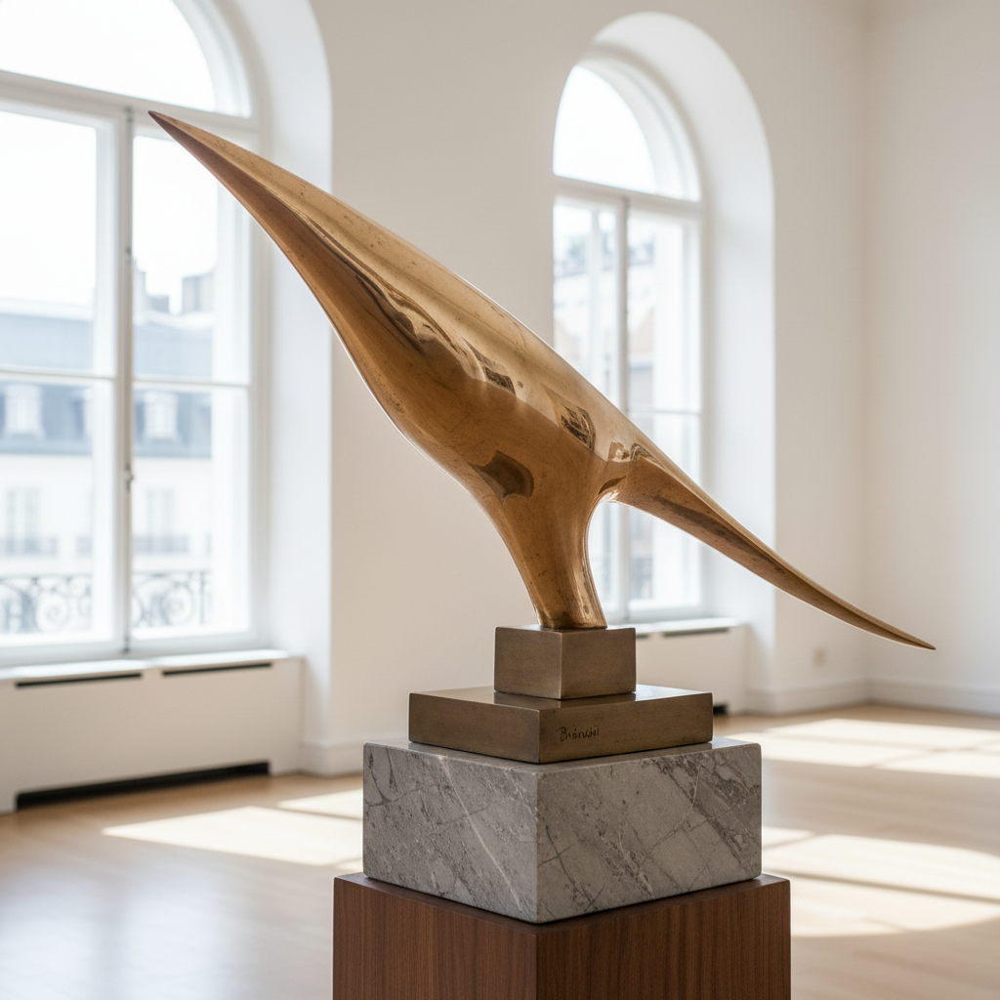

# Constantin Brancusi 康斯坦丁·布朗库西

> **流派**: 现代主义雕塑 · 原始主义  
> **时期**: 1876–1957 罗马尼亚/法国  
> **关键词**: 纯粹形态、抛光青铜、无尽之柱、本质追求

## 概述

康斯坦丁·布朗库西是现代雕塑之父。他追求形态的绝对纯粹——将鸟简化为一条飞翔的弧线，将头颅简化为一个光滑的卵形。他的作品融合了罗马尼亚民间艺术的质朴与现代主义的极简，创造出超越时代的永恒形式。

## 视觉特征

- **纯粹形态**: 将对象简化到最本质的几何形
- **抛光表面**: 镜面般的青铜反射周围环境
- **垂直韵律**: 《无尽之柱》的重复菱形模块
- **材料对话**: 石头、木头、青铜各有不同的处理方式
- **底座即作品**: 底座与雕塑融为一体的整体设计

## 代表作品

- 《空间中的鸟》(1923–40)
- 《无尽之柱》(1938)
- 《吻》(1907–08)
- 《沉睡的缪斯》(1910)

## 历史影响

布朗库西证明了雕塑不必模仿自然——它可以追求形态本身的完美。他对纯粹形式的追求影响了极简主义、工业设计和当代雕塑的整个发展方向。

## 相关风格

- [Henry Moore 亨利·摩尔](henry-moore.md)
- [Alberto Giacometti 阿尔贝托·贾科梅蒂](alberto-giacometti.md)
- [Minimalism 极简主义](minimalism.md)
