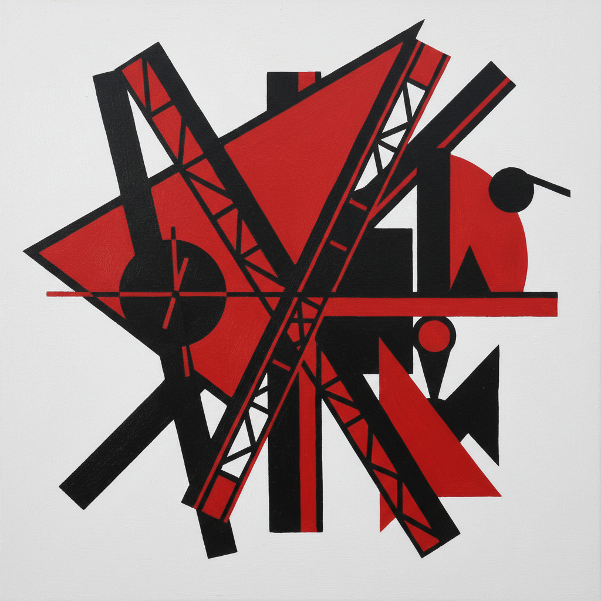

# Constructivism Painting 构成主义绘画

> **时期：** 1913年–1930年代  
> **关键词：** 几何抽象、革命艺术、工业材料、俄罗斯先锋、社会功能

## 概述

Constructivism Painting（构成主义绘画）是俄国革命时期诞生的激进艺术运动——艺术家们拒绝传统绘画的装饰功能，转而用几何形式和工业材料"构建"新的视觉秩序。塔特林的角落浮雕、罗德琴科的纯色画布、利西茨基的"普罗恩"——构成主义相信艺术应该像工程一样精确，像革命一样彻底，为新社会服务。

## 风格特征

- **几何形式**：圆、方、三角的纯粹组合
- **工业美学**：金属、玻璃、混凝土的质感
- **动态构图**：对角线和不对称的张力
- **有限色彩**：红、黑、白的革命配色
- **功能导向**：艺术为社会生产服务

## 代表人物与作品

- 弗拉基米尔·塔特林 角落浮雕
- 亚历山大·罗德琴科 纯色三联画
- 埃尔·利西茨基 普罗恩系列
- 柳博芙·波波娃 建筑绘画

## 概念图

