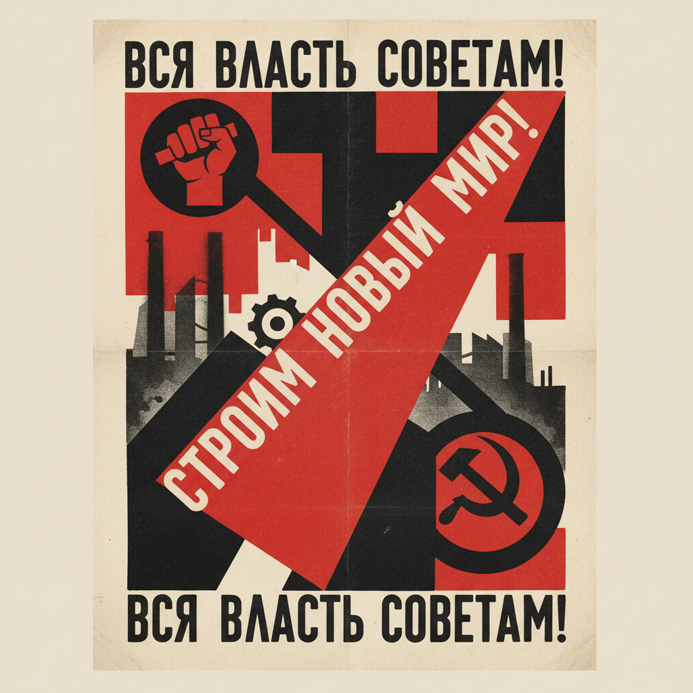

# Constructivism 构成主义



> **"红色楔子劈开白色——当艺术为革命服务。"**

## 概述

| 维度 | 描述 |
|------|------|
| 时期 | 1913–1935 原版 / 影响至今 |
| 别名 | Constructivism, Russian Constructivism, Soviet Avant-Garde |
| 核心色彩 | 红色、黑色、白色（偶尔黄色） |
| 关键元素 | 对角线构图、几何形态、蒙太奇、粗体字 |
| 代表人物 | El Lissitzky、Alexander Rodchenko、Tatlin |
| 关联风格 | Bauhaus, De Stijl, Swiss Design, Brutalism |

---

## 历史脉络

### 从革命到设计遗产

| 年份 | 事件 |
|------|------|
| 1913 | Tatlin 的"反浮雕"——构成主义萌芽 |
| 1917 | 十月革命——艺术为人民服务 |
| 1919 | El Lissitzky "Beat the Whites with the Red Wedge" |
| 1920 | Rodchenko 的摄影蒙太奇 |
| 1923 | 构成主义国际化 |
| 1932 | 斯大林压制前卫艺术 |
| 2000s | 在平面设计和海报中持续影响 |

### 核心哲学

Constructivism 的精神是**"艺术不是装饰——是建设新世界的工具"**：
- 艺术为社会服务
- 功能 > 装饰
- 几何 = 理性 = 进步
- "艺术家是工程师"
- 打破旧世界，建设新世界

---

## 视觉语法

### 色彩系统

```
主色：
  红色 (#FF0000) — 革命、力量
  黑色 (#000000) — 力量、对比
  白色 (#FFFFFF) — 空间、纯净

辅色：
  黄色 (#FFFF00) — 偶尔使用
  灰色 (#808080) — 工业

规则：
  - 极少用色（通常2-3色）
  - 红+黑+白 = 经典组合
  - 颜色是功能性的
  - 高对比度
  - 大面积色块

质感：
  平涂 — 无渐变
  摄影 — 蒙太奇
  印刷 — 粗糙、工业
```

### 标志性元素

| 类别 | 元素 |
|------|------|
| 构图 | 对角线、动态平衡、不对称 |
| 形态 | 三角形、圆形、矩形、楔形 |
| 字体 | 粗体无衬线、大写、倾斜 |
| 技法 | 摄影蒙太奇、拼贴、叠印 |
| 符号 | 齿轮、工厂、工人、星星 |
| 态度 | 激进、宣传、动员 |

---

## 与千禧怀旧的关系

### 设计遗产
- 构成主义 → Bauhaus → Swiss Design → 现代平面设计
- 对角线构图在当代海报设计中无处不在
- 红+黑+白 = 永恒的力量组合
- Shepard Fairey (OBEY) = 当代构成主义

### 政治海报的复兴
- 社会运动中的构成主义视觉语言
- "Hope" 海报 (Obama 2008) 的构成主义基因
- 抗议艺术中的几何+粗体字+高对比

---

## 中国语境

- 中国革命宣传画与构成主义的关系
- 当代中国设计中的构成主义元素
- "红色设计"的历史与当代
- 与"国潮"中红色元素的交叉

---

## 设计应用

| 场景 | 应用方式 |
|------|----------|
| 海报 | 对角线+红黑白+粗体字+几何 |
| 品牌 | 力量感+几何+高对比+简洁 |
| 社会 | 宣传+动员+视觉冲击 |
| 数字 | 动态几何+蒙太奇+大胆排版 |

---

## 相关风格

← [Bauhaus 包豪斯](bauhaus.md) | [De Stijl 风格派](de-stijl.md) →

↑ [返回千禧怀旧目录](README.md) | [返回总目录](../README.md)
