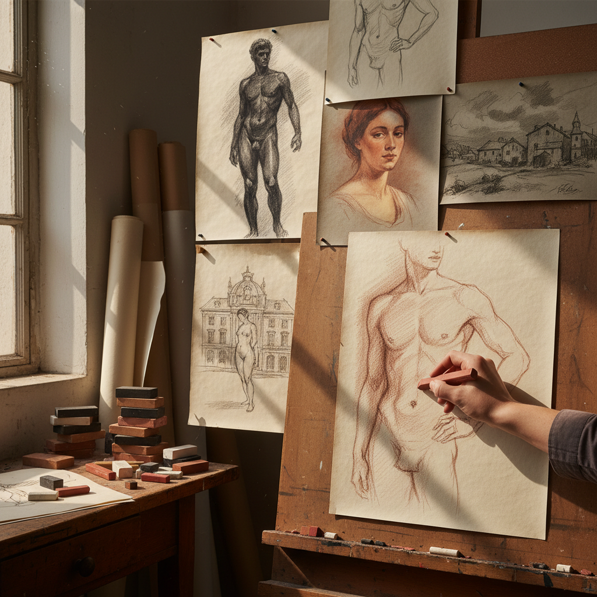

# Conté Crayon 孔特蜡笔

> "Conté crayon is the aristocrat of drawing sticks — harder than charcoal, softer than graphite, it glides across textured paper leaving marks of such velvety richness that Seurat built entire worlds of light and shadow from its touch alone." — Unknown

## 概述

孔特蜡笔（Conté Crayon）是一种由法国科学家Nicolas-Jacques Conté在1795年发明的绘画棒——由石墨或颜料粉末与粘土混合后高温烧制而成。孔特蜡笔比木炭硬、比铅笔软，能产生丰富的色调变化和天鹅绒般的质感。传统的孔特蜡笔有四种颜色：黑色（noir）、白色（blanc）、赭色（sanguine）和棕色（bistre/sépia）。

孔特蜡笔在素描和速写中被广泛使用——特别是人体素描和肖像画。Georges Seurat是孔特蜡笔最著名的使用者——他用黑色孔特蜡笔在粗纹纸上创作了一系列著名的素描，利用纸面纹理产生独特的光影效果。孔特蜡笔的方形截面使其既可以用尖角画细线，也可以用侧面画宽阔的色调。

## 核心特征

| 特征 | 描述 |
|------|------|
| 烧制 | 高温烧制成型 |
| 方形 | 方形截面 |
| 硬度 | 介于木炭和铅笔之间 |
| 四色 | 传统四种颜色 |
| 丰富 | 丰富的色调 |
| 耐久 | 不易断裂 |

## 视觉特征

- **天鹅绒**：天鹅绒般的质感
- **丰富**：丰富的色调层次
- **温暖**：赭色的温暖感
- **纹理**：与纸面纹理的互动
- **深沉**：深沉的黑色
- **优雅**：优雅的线条

## 代表作品

| 作品 | 艺术家 | 年代 | 意义 |
|------|--------|------|------|
| *Conté crayon drawings* | Georges Seurat | 1880s | 孔特蜡笔的巅峰 |
| *Figure studies* | Various | 19世纪 | 人体素描传统 |
| *Sanguine portraits* | Various | 18-19世纪 | 赭色肖像画 |
| *Life drawing studies* | Various | 当代 | 人体速写 |
| *Contemporary conté works* | Various | 当代 | 当代孔特蜡笔作品 |

## 历史时间线

| 时期 | 事件 |
|------|------|
| 1795 | Nicolas-Jacques Conté发明孔特蜡笔 |
| 19世纪 | 孔特蜡笔在学院素描中的标准化 |
| 1880s | Seurat的孔特蜡笔素描杰作 |
| 20世纪 | 孔特蜡笔在美术教育中的持续使用 |
| 当代 | 孔特蜡笔在人体素描中的流行 |
| 当代 | 新颜色和硬度的开发 |

## 中国语境

孔特蜡笔在中国的美术教育中有一定的使用——特别是在人体素描和速写课程中。中国的一些美术院校在素描教学中引入孔特蜡笔作为铅笔和木炭之外的选择。中国的画材市场上可以买到Conté à Paris品牌的孔特蜡笔。中国的一些画家使用赭色（sanguine）孔特蜡笔进行人体速写——这种温暖的色调特别适合表现人体肤色。

## AI生成概念图

## 与其他风格的关系

- **Charcoal Drawing** → 炭笔画
- **Graphite Drawing** → 铅笔画
- **Pastel Painting** → 色粉画
- **Figure Drawing** → 人体素描
- **Pointillism** → 点彩派
- **Academic Drawing** → 学院素描

---

*浮光艺志 | Chronicle of Artistry*
