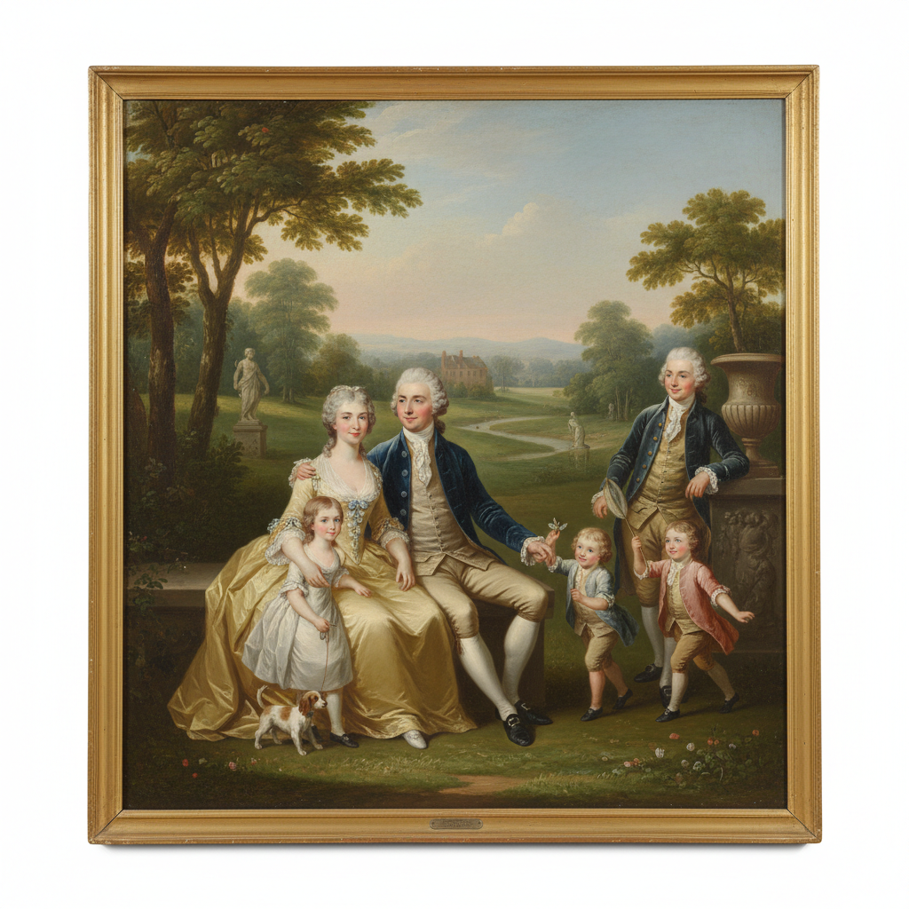

# Conversation Piece 谈话画

> **时期：** 18世纪–19世纪  
> **关键词：** 群体肖像、非正式姿态、家庭场景、社交互动、英国传统

## 概述

Conversation Piece（谈话画）是一种非正式的群体肖像画，描绘家庭成员或朋友在日常环境中的自然互动——在花园中散步、在客厅中饮茶、在书房中阅读。它打破了正式肖像画的僵硬姿态，用叙事性的场景展示人物之间的关系和社会地位，在18世纪英国尤为流行。

## 风格特征

- **非正式姿态**：自然放松的人物安排
- **互动关系**：人物之间的目光和手势交流
- **环境叙事**：室内装饰或花园暗示身份
- **小尺幅**：适合家庭悬挂的亲密尺度
- **全身像**：人物通常为全身或四分之三身

## 代表人物与作品

- 威廉·霍加斯 家庭群像
- 约翰·佐法尼 皇家谈话画
- 阿瑟·戴维斯 英国乡绅家庭
- 托马斯·庚斯博罗《安德鲁斯夫妇》

## 概念图

