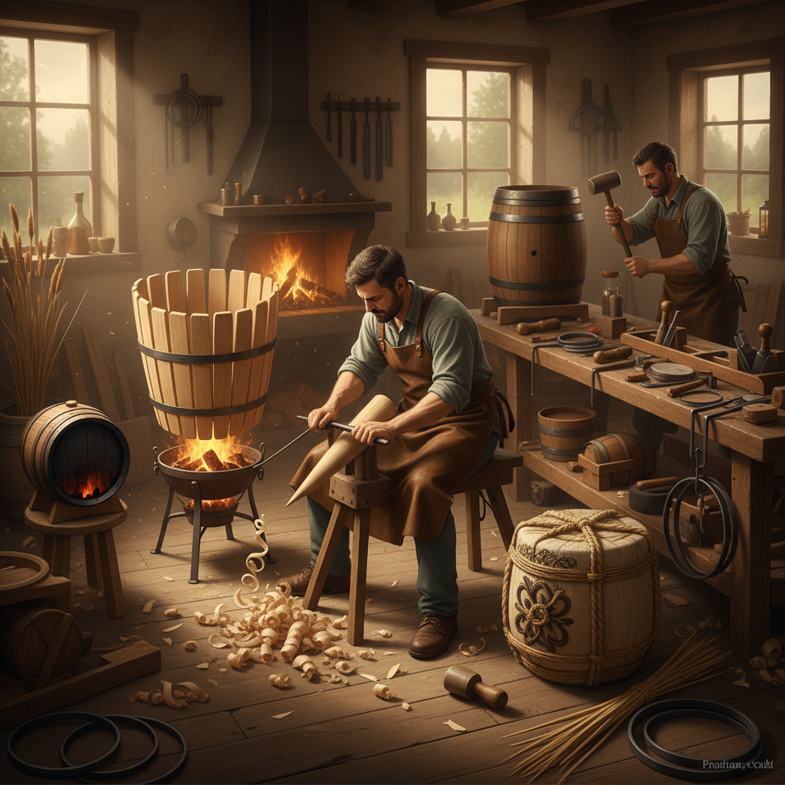

# Coopering Art 箍桶艺术

> "The cooper builds vessels from staves — narrow boards shaped by hand, heated over fire, and drawn together with iron hoops into watertight containers without a drop of glue or a single nail. It is engineering disguised as craft: each stave must be tapered, beveled, and curved so precisely that when assembled they form a perfect cylinder or barrel shape, holding liquid under pressure through nothing but geometry and the swelling of wood." — Unknown

## 概述

箍桶艺术（Coopering Art）是使用木板条（桶板/staves）和金属箍圈制作桶、盆、桶等圆形木容器的传统手工艺——以其精确的几何计算、对木材特性的深刻理解和不使用胶水即可实现防水密封的技术著称。箍桶匠（Cooper）是中世纪最重要的手工艺人之一。

箍桶艺术的实践包括：1）紧桶——用于盛装液体的防水桶（如酒桶）；2）松桶——用于盛装干货的非防水桶；3）白桶——用于盛装食品的无味木桶；4）橡木酒桶——用于陈酿葡萄酒和威士忌的橡木桶；5）装饰桶——作为装饰品的小型桶；6）当代箍桶——将传统技法与现代设计结合的创作。

## 核心特征

| 特征 | 描述 |
|------|------|
| 几何 | 精确的几何计算 |
| 防水 | 无胶水的防水密封 |
| 弯曲 | 木材的热弯技术 |
| 箍圈 | 金属箍的紧固 |
| 功能 | 强大的实用功能 |
| 传统 | 深厚的行业传统 |

## 视觉特征

- **弧形**：优美的桶身弧线
- **条纹**：桶板的竖向条纹
- **箍圈**：金属箍的水平线条
- **纹理**：橡木的粗犷纹理
- **色泽**：木材的自然色泽
- **比例**：桶身的经典比例

## 代表作品

| 作品 | 艺术家/文化 | 年代 | 意义 |
|------|-------------|------|------|
| *Wine barrels* | 欧洲传统 | 古罗马至今 | 葡萄酒陈酿桶 |
| *Whisky casks* | 苏格兰传统 | 15世纪至今 | 威士忌陈酿桶 |
| *Butter churns* | 北欧传统 | 中世纪至今 | 黄油搅拌桶 |
| *Japanese sake barrels* | 日本传统 | 古代至今 | 日本酒桶 |
| *Decorative coopered vessels* | 当代 | 当代 | 装饰性箍桶 |

## 历史时间线

| 时期 | 事件 |
|------|------|
| 古代 | 凯尔特人发明木桶 |
| 罗马时期 | 木桶取代陶罐 |
| 中世纪 | 箍桶匠行会的建立 |
| 工业革命 | 机械化对手工箍桶的冲击 |
| 当代 | 箍桶作为手工艺和酿酒传统的复兴 |

## 中国语境

箍桶艺术在中国有悠久的传统——箍桶匠曾是中国城镇和乡村中不可或缺的手艺人。中国传统的木桶制作使用杉木、柏木等材料——用于水桶、饭桶、浴桶、马桶等日常生活器具。中国的箍桶技艺与西方有所不同——中国传统多使用竹箍而非铁箍，利用竹子的弹性来紧固桶板。中国江南地区的箍桶匠是传统"百工"之一——"箍桶匠"曾是走街串巷的流动手艺人。中国的一些地区（如浙江绍兴的酒桶、四川的泡菜坛）保留着特色的箍桶传统。中国当代的一些手工艺人正在复兴传统箍桶技艺——将其作为非物质文化遗产进行保护和传承。中国的木桶浴缸（如香柏木浴桶）是箍桶技艺在当代生活中的延续——将传统工艺与现代生活方式结合。

## AI生成概念图

## 与其他风格的关系

- **Woodworking** → 木工艺术
- **Woodturning** → 车木艺术
- **Blacksmithing** → 铁匠艺术
- **Functional Art** → 功能艺术
- **Folk Art** → 民间艺术
- **Steam Bending** → 蒸汽弯曲

---

*浮光艺志 | Chronicle of Artistry*
