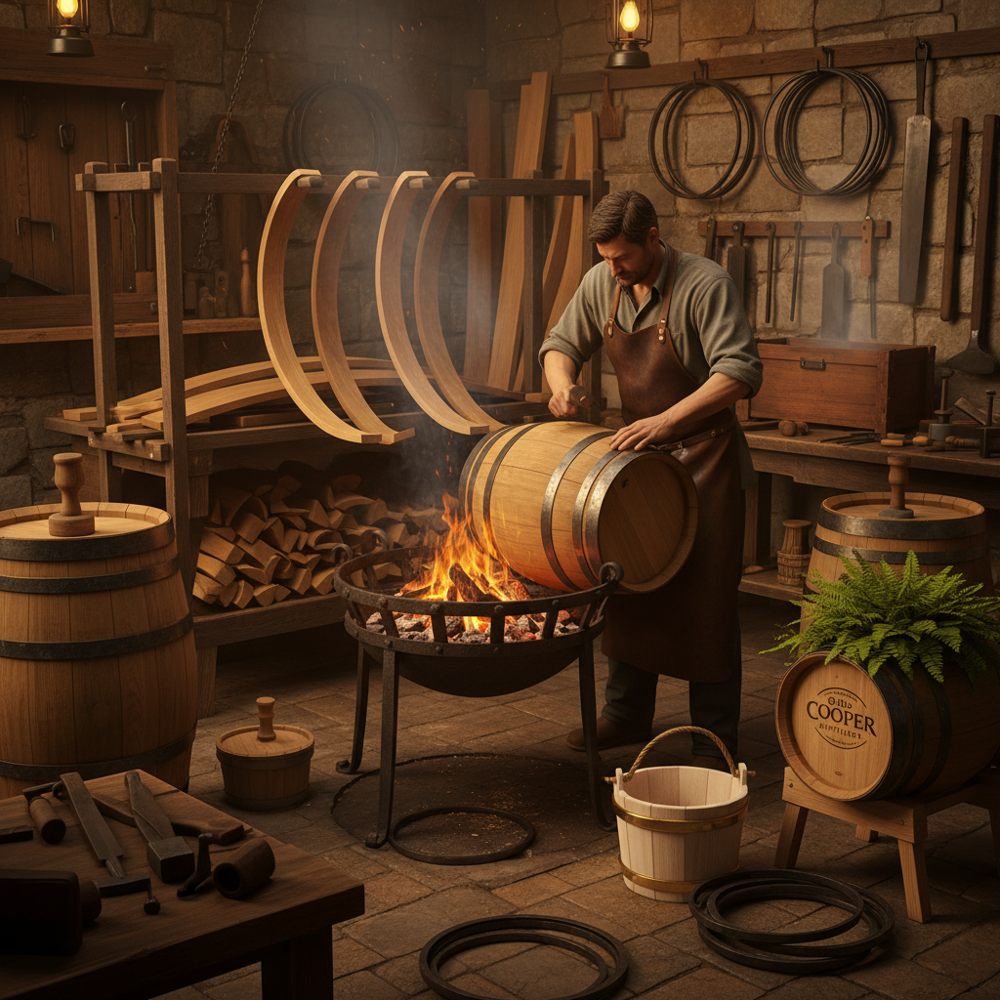

# Coopering 箍桶

> "Coopering is geometry in wood — staves cut at precise angles, edges beveled to invisible joints, bound by iron hoops into a vessel that holds liquid without a drop of glue or a single nail." — Unknown

## 概述

箍桶（Coopering）是使用木板条（staves，桶板）制作桶、桶形容器和木桶的传统木工技艺。箍桶匠（cooper）将木板条按精确的角度切割和刨削，使其拼合成圆形或椭圆形的桶身，再用金属箍（hoops）将其紧固。精湛的箍桶技艺可以制作出不用任何胶水或密封剂就能盛装液体的容器——木板之间的精密配合和木材吸水膨胀的特性确保了密封性。

箍桶分为三类：紧桶（tight coopering，制作盛液体的桶，如酒桶、啤酒桶）、松桶（slack coopering，制作盛干货的桶，如面粉桶）和白桶（white coopering，制作直壁容器，如水桶、浴桶）。葡萄酒和威士忌的陈酿至今仍依赖橡木桶——桶的制作工艺直接影响酒的风味。

## 核心特征

| 特征 | 描述 |
|------|------|
| 桶板 | 精确切割的木板条 |
| 箍 | 金属箍紧固 |
| 密封 | 无胶无钉的密封 |
| 角度 | 精确的角度计算 |
| 弯曲 | 蒸汽弯曲桶板 |
| 功能 | 高度功能性 |

## 视觉特征

- **圆形**：完美的圆形截面
- **条纹**：桶板的竖向条纹
- **箍**：金属箍的装饰性
- **弧度**：桶身的优美弧度
- **木纹**：橡木的纹理
- **工整**：精密的工整感

## 代表作品

| 作品 | 艺术家 | 年代 | 意义 |
|------|--------|------|------|
| *Wine barrels (barriques)* | 匿名 | 传统 | 葡萄酒桶 |
| *Whisky casks* | 匿名 | 传统 | 威士忌桶 |
| *Beer barrels* | 匿名 | 传统 | 啤酒桶 |
| *Decorative cooperage* | Various | 当代 | 装饰性箍桶 |
| *Contemporary barrel art* | Various | 当代 | 当代桶艺术 |

## 历史时间线

| 时期 | 事件 |
|------|------|
| 公元前2000年 | 古埃及的早期桶形容器 |
| 凯尔特时期 | 欧洲箍桶技术的发展 |
| 罗马时期 | 木桶取代陶罐运输 |
| 中世纪 | 箍桶行会的建立 |
| 18-19世纪 | 箍桶的工业化 |
| 当代 | 葡萄酒和威士忌桶的持续需求 |

## 中国语境

箍桶在中国有着悠久的传统——中国古代的木桶、水桶、浴桶、饭桶等都是箍桶匠的作品。中国传统的箍桶使用竹箍或铁箍。一些地区（如江南水乡）的箍桶技艺被列为非物质文化遗产。中国传统的"马桶"（子孙桶）在婚嫁习俗中有重要地位。当代中国的葡萄酒产业发展也带动了对橡木桶的需求。一些中国的手工艺人仍在传承传统箍桶技艺，制作木浴桶、木饭桶等日用器具。

## AI生成概念图

## 与其他风格的关系

- **Green Woodworking** → 绿木工
- **Woodworking** → 木工
- **Steam Bending** → 蒸汽弯曲
- **Joinery** → 细木工
- **Winemaking** → 酿酒
- **Folk Craft** → 民间工艺

---

*浮光艺志 | Chronicle of Artistry*
