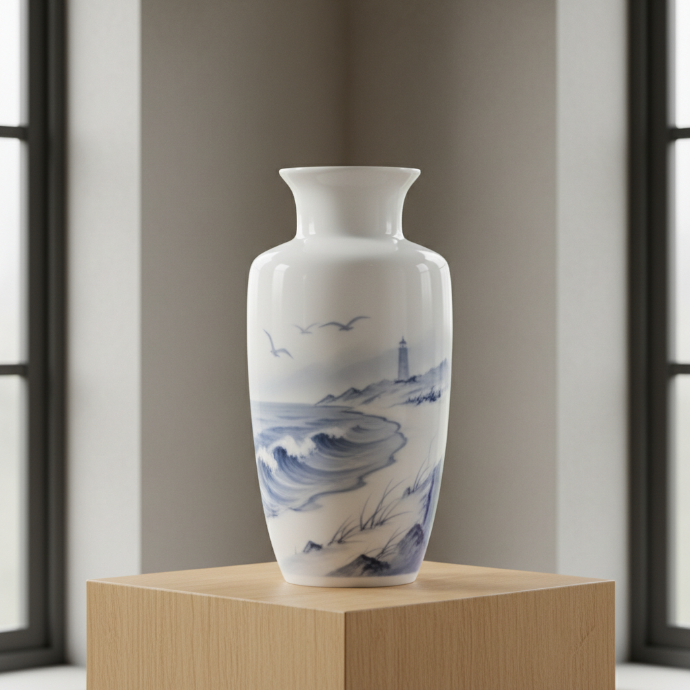

# Copenhagen Porcelain Art 哥本哈根瓷器艺术

> "The beauty of simplicity and the poetry of the North." — Royal Copenhagen motto

## 概述

哥本哈根瓷器艺术（Copenhagen Porcelain Art）是18世纪末至今丹麦皇家哥本哈根瓷器厂（Royal Copenhagen）及宾格与格伦达尔（Bing & Grondahl）为代表的北欧瓷器艺术风格。哥本哈根瓷器以其独特的蓝白色调、精致的釉下彩绘和北欧自然主义美学著称——它将斯堪的纳维亚的简洁设计理念与精湛的瓷器工艺完美结合。

皇家哥本哈根瓷器厂成立于1775年——其标志性的"蓝色唐草"（Blue Fluted）系列以手绘的蓝色花卉纹样闻名世界。19世纪末，在艺术总监阿诺德·克罗格（Arnold Krog）的领导下，工厂引入了革命性的釉下彩技术——以柔和的灰蓝色调描绘丹麦的自然风景、海洋和动物，创造了独特的"哥本哈根风格"。这种风格在1889年巴黎世博会上获得大奖，确立了哥本哈根瓷器在世界瓷器艺术中的独特地位。

哥本哈根瓷器艺术的核心要素包括：1）蓝白色调——标志性的蓝色和白色；2）釉下彩——精湛的釉下彩绘技术；3）北欧自然——丹麦自然风景和动物；4）简洁设计——斯堪的纳维亚的简洁美学；5）手绘传统——每件作品的手工绑绘；6）年度圣诞盘——收藏传统的开创；7）雕塑瓷器——精美的瓷器雕塑。

## 核心特征

| 特征 | 描述 |
|------|------|
| 蓝白色调 | 标志性蓝色和白色 |
| 釉下彩 | 精湛釉下彩绘技术 |
| 北欧自然 | 丹麦自然风景动物 |
| 简洁设计 | 斯堪的纳维亚简洁美学 |
| 手绘传统 | 每件作品手工绑绘 |
| 年度圣诞盘 | 收藏传统的开创 |

## 视觉特征

- **蓝色唐草**：精细的蓝色花卉纹样
- **灰蓝色调**：柔和的灰蓝釉下彩
- **自然风景**：丹麦海岸、森林、田野
- **动物形象**：北极熊、海鸥、鹿等
- **白色瓷胎**：纯净的白色瓷器底色
- **简洁造型**：优雅简洁的器形

## 代表作品

| 作品 | 年代 | 意义 |
|------|------|------|
| *蓝色唐草系列* (Blue Fluted) | 1775至今 | 标志性产品 |
| *植物学系列* (Flora Danica) | 1790至今 | 最奢华的餐具 |
| *釉下彩风景花瓶* | 1889年后 | 艺术瓷器巅峰 |
| *年度圣诞盘* | 1908至今 | 收藏传统 |
| *北极熊雕塑* | 20世纪初 | 动物瓷雕 |
| *蓝色元素系列* (Blue Elements) | 当代 | 现代诠释 |

## 历史时间线

| 时期 | 事件 |
|------|------|
| 1775年 | 皇家哥本哈根瓷器厂成立 |
| 1790年 | 开始制作Flora Danica系列 |
| 1853年 | 宾格与格伦达尔成立 |
| 1885年 | 阿诺德·克罗格任艺术总监 |
| 1889年 | 巴黎世博会获大奖 |
| 1908年 | 首枚年度圣诞盘 |
| 1987年 | 两厂合并 |

## 中国语境

哥本哈根瓷器艺术与中国有着深厚的历史渊源。丹麦瓷器的蓝白传统直接受到中国青花瓷的影响——18世纪欧洲对中国瓷器的狂热推动了丹麦瓷器工业的诞生。然而，哥本哈根瓷器在吸收中国青花传统的基础上发展出了独特的北欧风格——以更加柔和的色调和自然主义的题材区别于中国青花的装饰性。哥本哈根瓷器的"简洁设计"理念与当代中国设计界对北欧设计的推崇形成了有趣的对话——从中国影响丹麦到丹麦影响中国，瓷器艺术见证了东西方美学的双向交流。Flora Danica系列作为世界上最昂贵的餐具之一，也展示了瓷器艺术可以达到的极致精细程度。

## 概念图

## 与其他风格的关系

- **Chinese Blue-and-White** → 中国青花瓷（灵感来源）
- **Meissen** → 梅森瓷器（欧洲瓷器先驱）
- **Scandinavian Design** → 斯堪的纳维亚设计
- **Art Nouveau** → 新艺术运动
- **Wedgwood** → 韦奇伍德（英国瓷器）
- **Sevres** → 塞夫尔（法国瓷器）

---

*浮光艺志 | Chronicle of Artistry*
