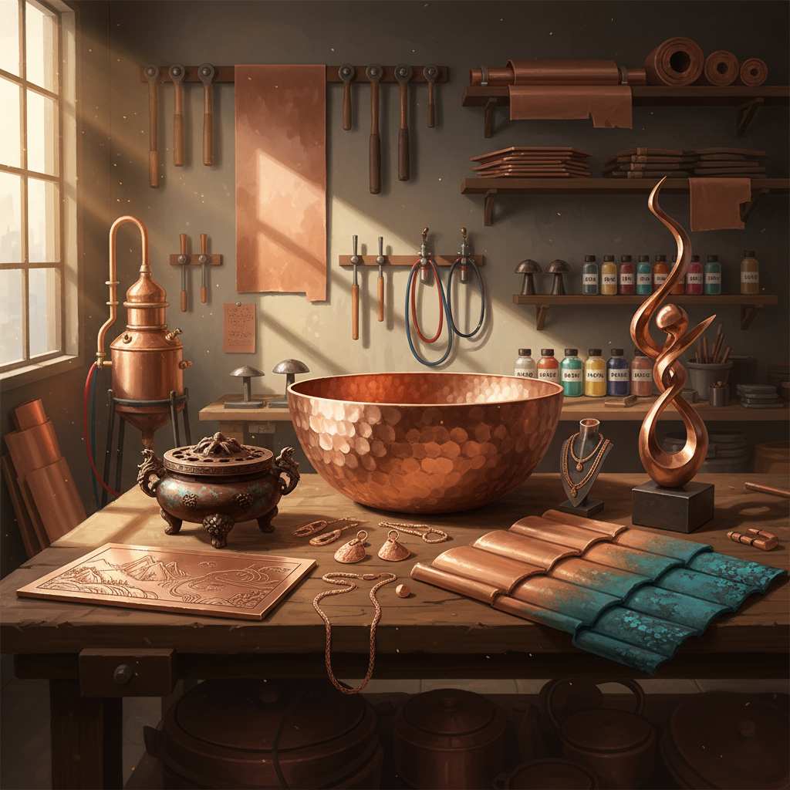

# Copper Art 铜艺术

> "Copper is the first metal humanity learned to work — ten thousand years ago, someone picked up a green-stained nugget and hammered it into shape, beginning the age of metals. Copper remembers this history in its color: the warm rose-gold of fresh metal, the rich brown of age, and the green patina of centuries. It is a metal that wears time beautifully, each stage of oxidation adding character rather than diminishing it." — Unknown

## 概述

铜艺术（Copper Art）是以铜为主要材料进行艺术创作的实践——利用铜的延展性、导热性、温暖色泽和独特的氧化特性（铜绿patina）创造各种艺术形式。铜是人类最早使用的金属，铜艺术有超过一万年的历史。

铜艺术的实践包括：1）铜雕塑——用铜铸造或锻造的雕塑；2）铜版画——用铜板进行蚀刻和雕版印刷；3）铜器——用铜制作的器皿和装饰品；4）铜锻造——用锤打技法塑造铜板；5）铜珐琅——在铜表面施加珐琅釉料；6）铜建筑——用铜作为建筑覆盖材料（如铜屋顶）；7）铜首饰——用铜制作的首饰和装饰品；8）铜线艺术——用铜线编织和塑形。

## 核心特征

| 特征 | 描述 |
|------|------|
| 古老 | 人类最早使用的金属 |
| 温暖 | 温暖的玫瑰金色 |
| 延展 | 极好的延展性 |
| 铜绿 | 独特的氧化铜绿 |
| 导热 | 优良的导热性 |
| 抗菌 | 天然的抗菌性 |

## 视觉特征

- **玫瑰金**：新铜的温暖色泽
- **铜绿**：氧化后的绿色铜锈
- **光泽**：抛光后的明亮光泽
- **温暖**：比银更温暖的色调
- **纹理**：锤打的纹理效果
- **渐变**：氧化程度的色彩渐变

## 代表作品

| 作品 | 艺术家 | 年代 | 意义 |
|------|--------|------|------|
| *Statue of Liberty* | Bartholdi | 1886 | 铜建筑雕塑 |
| *Copper etchings* | Rembrandt等 | 17世纪 | 铜版画 |
| *Copper vessels* | 各文化传统 | 古代至今 | 铜器 |
| *Copper roofs* | 建筑传统 | 古代至今 | 铜屋顶 |
| *Contemporary copper* | Various | 当代 | 当代铜艺术 |

## 历史时间线

| 时期 | 事件 |
|------|------|
| 公元前8000年 | 最早的铜器使用 |
| 铜器时代 | 铜器的广泛使用 |
| 青铜时代 | 铜锡合金（青铜） |
| 文艺复兴 | 铜版画的发展 |
| 当代 | 铜作为当代艺术材料 |

## 中国语境

铜艺术在中国有极其辉煌的历史。中国的青铜器文明是世界古代文明的巅峰之一——商周青铜器以其精湛的铸造技术、复杂的纹饰和深厚的文化内涵著称于世。中国传统的铜器制作涵盖了从宣德炉（铜香炉）到铜镜、铜钟、铜佛像的广泛领域。中国的铜版画（珂罗版）在近代也有发展。中国云南的"斑铜"工艺——利用铜的天然结晶纹理创造独特的装饰效果——是中国独有的铜艺术形式。中国当代的铜艺术家将传统青铜器的美学与当代雕塑结合，创作出融合古代气韵与现代形式的铜艺术品。

## AI生成概念图

## 与其他风格的关系

- **Bronze Art** → 青铜艺术
- **Metal Art** → 金属艺术
- **Printmaking** → 版画
- **Enamel Art** → 珐琅艺术
- **Tin Art** → 锡艺术
- **Architecture** → 建筑

---

*浮光艺志 | Chronicle of Artistry*
