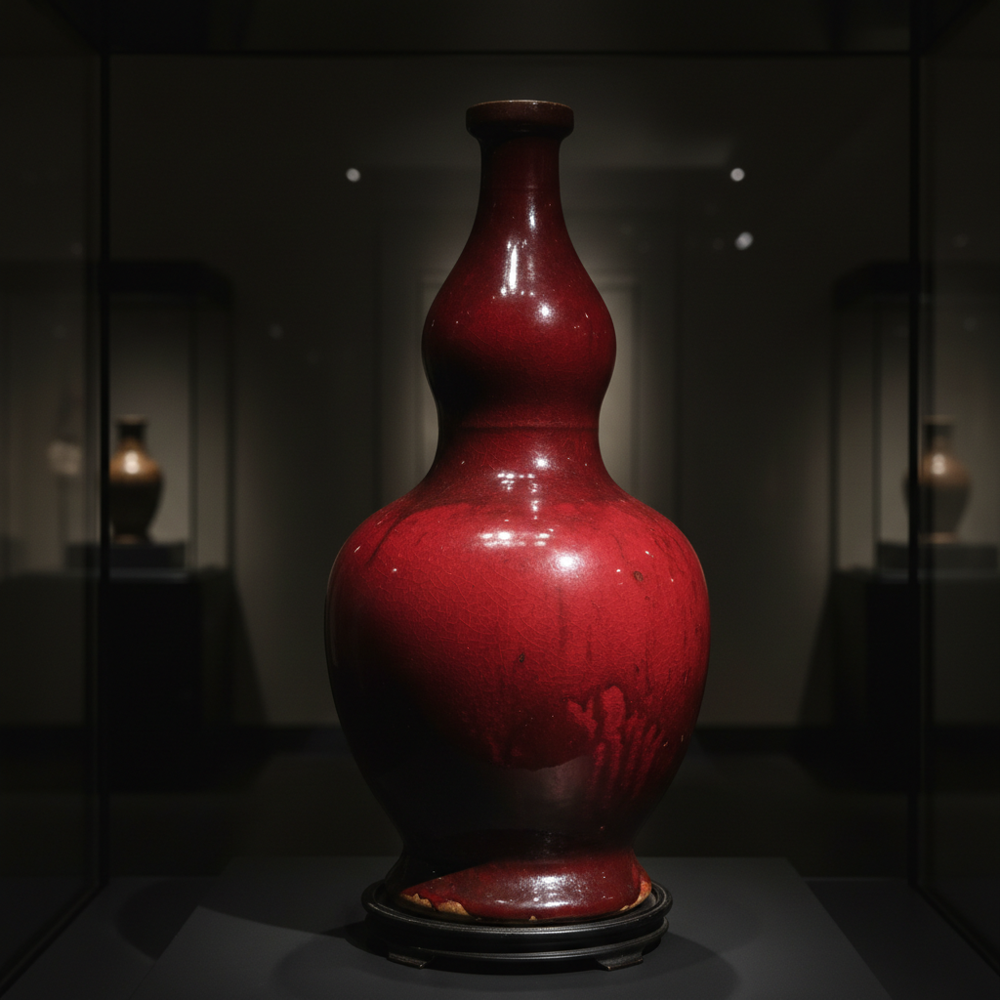

# Copper Red Glaze Art 铜红釉艺术

> "Copper red is the most elusive color in ceramics — a trace of copper oxide dissolved in glaze, fired in reduction until oxygen is stolen from the metal and it blooms into the red of fresh blood, ripe cherries, or sunset clouds, but only if every variable aligns: too much air and it vanishes to clear, too little and it turns liver-dark, the potter chasing a color that exists only in a razor-thin window between chemistry and chance." — Unknown

## 概述

铜红釉艺术（Copper Red Glaze Art）是一种以微量氧化铜为着色剂、在还原气氛中烧制而成的红色釉陶瓷艺术。铜红釉是陶瓷釉料中最难控制的颜色之一——铜在还原气氛中呈现鲜艳的红色，但对温度、气氛和冷却速度极其敏感，稍有偏差就会失败。中国元代景德镇首先成功烧制铜红釉（釉里红），此后铜红釉成为中国陶瓷最珍贵的品种之一。

铜红釉艺术的核心要素包括：1）铜着色——微量氧化铜作为着色剂；2）还原烧成——严格的还原气氛控制；3）温度精确——对烧成温度极其敏感；4）色彩变化——从鲜红到暗红到紫红的色谱；5）窑变效果——不可完全预测的色彩变化；6）技术难度——陶瓷釉料中最难的颜色之一；7）珍贵性——因难度高而格外珍贵。

## 核心特征

| 特征 | 描述 |
|------|------|
| 铜着色 | 微量氧化铜的红色呈色 |
| 还原气氛 | 必须在缺氧环境中烧制 |
| 极高难度 | 对所有变量极其敏感 |
| 色彩丰富 | 从鲜红到暗红的丰富色谱 |
| 窑变 | 不可完全预测的效果 |
| 珍贵 | 因难度高而极为珍贵 |

## 视觉特征

- **鲜红色**：如宝石般的鲜艳红色
- **暗红色**：深沉浓郁的暗红
- **紫红色**：带紫色调的红色
- **桃花红**：柔和的粉红色调
- **窑变过渡**：红色与其他色调的自然过渡
- **深邃光泽**：温润深邃的釉面光泽

## 代表作品

| 作品 | 艺术家/窑口 | 年代 | 意义 |
|------|-------------|------|------|
| *元代釉里红* | 景德镇 | 元代 | 铜红釉的开创 |
| *永乐鲜红釉* | 景德镇御窑 | 明永乐 | 鲜红釉的巅峰 |
| *宣德宝石红* | 景德镇御窑 | 明宣德 | 宝石红的典范 |
| *康熙郎窑红* | 景德镇 | 清康熙 | 郎窑红的辉煌 |
| *豇豆红* | 景德镇御窑 | 清康熙 | 柔和的铜红变化 |

## 历史时间线

| 时期 | 事件 |
|------|------|
| 元代 | 景德镇成功烧制釉里红 |
| 明永乐 | 鲜红釉达到巅峰 |
| 明宣德 | 宝石红釉的成熟 |
| 明中期 | 铜红釉技术一度失传 |
| 清康熙 | 郎窑红、豇豆红的复兴 |
| 当代 | 铜红釉的科学研究与创作 |

## 中国语境

铜红釉是中国陶瓷最伟大的成就之一。中国是世界上最早成功烧制高温铜红釉的国家——元代景德镇的釉里红开创了这一传统。明代永乐、宣德时期的鲜红釉（祭红）代表了铜红釉的最高水平，被视为"千窑一宝"——烧制成功率极低。清代康熙时期的郎窑红以其鲜艳如牛血的红色著称，豇豆红则以柔和的粉红变化见长。铜红釉在中国文化中象征吉祥、喜庆，红色本身在中国文化中有特殊的地位。今天，铜红釉仍然是景德镇陶瓷艺术家追求的最高技术挑战之一。

## AI生成概念图

## 与其他风格的关系

- **Celadon** → 青瓷（同为还原烧成）
- **Jun Ware** → 钧窑（铜红窑变）
- **Flambe** → 窑变红釉
- **Sang de Boeuf** → 牛血红
- **Reduction Firing** → 还原烧成
- **Jingdezhen** → 景德镇传统

---

*浮光艺志 | Chronicle of Artistry*
