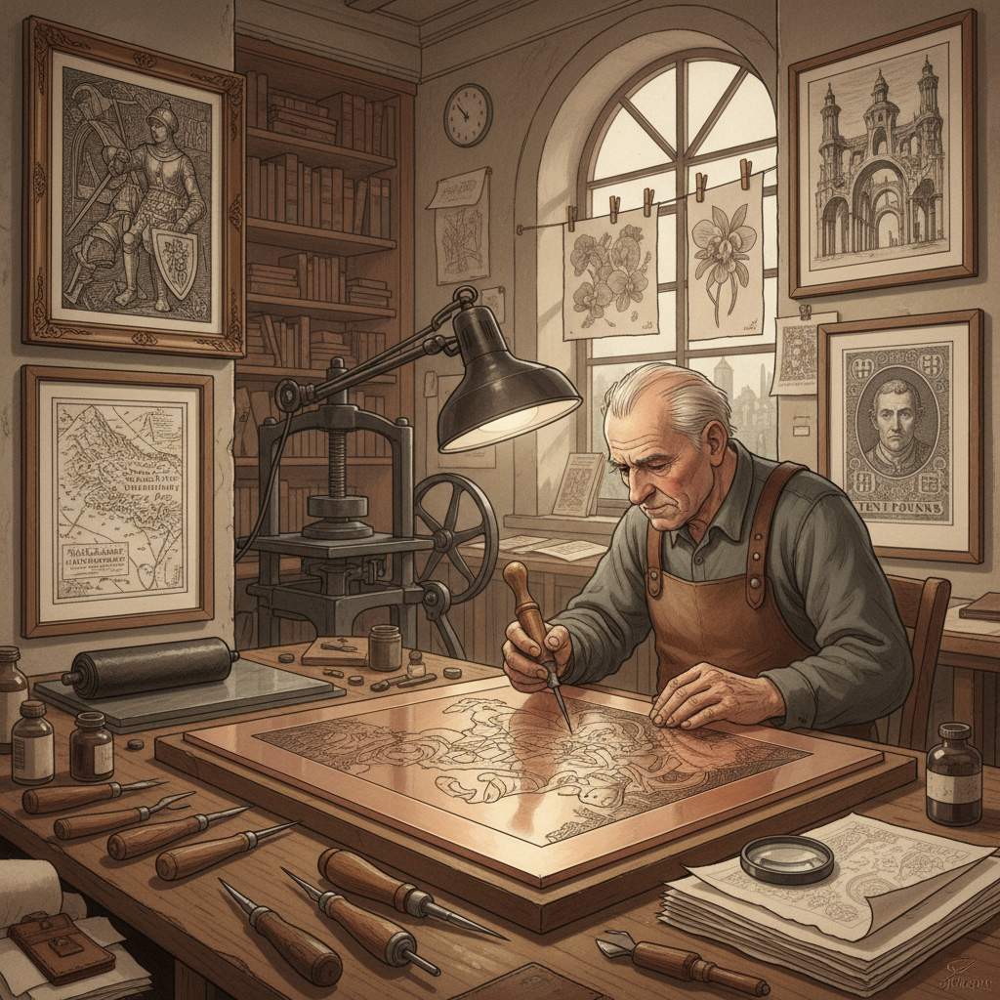

# Copperplate Engraving 铜版雕刻

> "Copperplate engraving is drawing in reverse with a burin — the engraver pushing a sharp steel tool through polished copper to carve furrows that will hold ink, each line requiring absolute control and foresight because the image emerges mirrored, building tone through parallel lines so precisely spaced they create the illusion of continuous shade, a technique so demanding it takes years to master yet produces prints of unmatched clarity and permanence." — Unknown

## 概述

铜版雕刻（Copperplate Engraving）是一种凹版印刷技法——使用锋利的雕刻刀（burin/graver）在抛光的铜板表面直接刻出线条，然后将油墨擦入刻痕中，擦去表面多余的油墨，通过高压印刷机将刻痕中的油墨转印到湿润的纸张上。铜版雕刻是最古老和最精细的版画技法之一。

铜版雕刻的历史可以追溯到15世纪中期的德国——最早的铜版雕刻师被称为"Master of the Playing Cards"。阿尔布雷希特·丢勒（Albrecht Dürer）将铜版雕刻提升到了艺术的最高水平。铜版雕刻在16-19世纪是最重要的图像复制技术——书籍插图、地图、肖像、纸币都使用铜版雕刻。铜版雕刻的线条极其精细和清晰，具有独特的"金属感"质量。

## 核心特征

| 特征 | 描述 |
|------|------|
| 凹版 | 凹版印刷技法 |
| 雕刻刀 | 使用burin雕刻 |
| 铜板 | 在铜板上雕刻 |
| 精细 | 极其精细的线条 |
| 反向 | 图像需要反向雕刻 |
| 复制 | 可以多次印刷 |

## 视觉特征

- **精细**：极其精细的线条
- **清晰**：清晰锐利的边缘
- **平行线**：平行线构建色调
- **金属感**：独特的金属质感
- **黑白**：通常为黑白印刷
- **正式**：正式和精确的风格

## 代表作品

| 作品 | 艺术家 | 年代 | 意义 |
|------|--------|------|------|
| *Knight, Death and the Devil* | Albrecht Dürer | 1513 | 丢勒铜版雕刻杰作 |
| *Melencolia I* | Albrecht Dürer | 1514 | 丢勒铜版雕刻杰作 |
| *The Four Horsemen* | Albrecht Dürer | 1498 | 丢勒启示录系列 |
| *Banknote engravings* | Various | 18-21世纪 | 纸币铜版雕刻 |
| *Piranesi's Carceri* | Giovanni Piranesi | 1745-1761 | 皮拉内西监狱系列 |

## 历史时间线

| 时期 | 事件 |
|------|------|
| 15世纪中期 | 铜版雕刻的起源 |
| 15-16世纪 | 丢勒等大师的鼎盛 |
| 17-18世纪 | 铜版雕刻的商业应用 |
| 19世纪 | 照相制版逐渐取代 |
| 当代 | 铜版雕刻的艺术化传承 |

## 中国语境

铜版雕刻在中国有一定的历史——清代宫廷曾引入西方铜版雕刻技术，乾隆时期的"铜版画"（如《平定准噶尔回部得胜图》）是中国铜版雕刻的代表。中国的美术院校教授铜版雕刻作为版画专业的重要课程。当代中国有活跃的铜版画创作群体。中国的人民币印刷中也使用凹版雕刻技术。中国的版画艺术展览中经常展出铜版雕刻作品。

## AI生成概念图

## 与其他风格的关系

- **Etching** → 蚀刻
- **Mezzotint** → 美柔汀
- **Drypoint** → 干刻
- **Printmaking** → 版画
- **Line Art** → 线条艺术
- **Intaglio** → 凹版

---

*浮光艺志 | Chronicle of Artistry*
