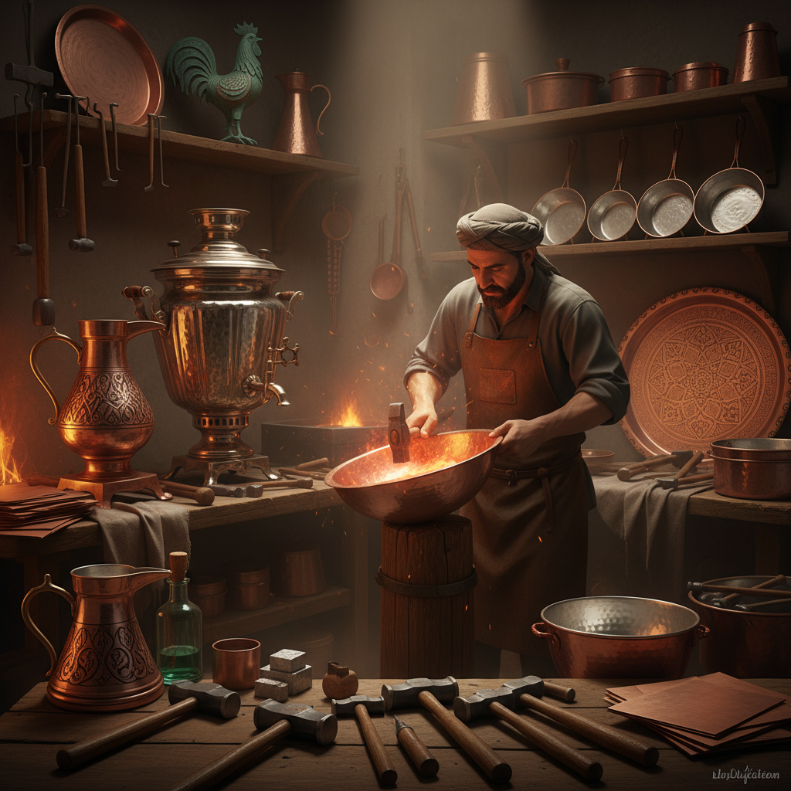

# Coppersmithing Art 铜器艺术

> "Copper is the people's gold — warm as sunset, strong as iron, workable as clay. It was humanity's first metal, the bridge between stone and bronze, the material that taught us that earth could be transformed by fire into something new. A copper vessel carries ten thousand years of human ingenuity in its hammered walls, from the first crude bowls to the most elaborate samovars and stills." — Unknown

## 概述

铜器艺术（Coppersmithing Art）是以铜为主要材料，通过锻造、铸造、雕刻和表面处理等技法创造器物和艺术品的金属工艺——包括铜器皿、铜雕塑、铜装饰品和建筑铜饰的制作。铜是人类最早使用的金属之一，铜器艺术有着极其悠久的历史。

铜器艺术的实践包括：1）铜器皿——铜制的壶、盆、锅等器皿；2）铜雕塑——铜制的雕塑作品；3）铜装饰——建筑和室内的铜装饰；4）铜版画——在铜板上雕刻的版画；5）景泰蓝——铜胎掐丝珐琅工艺；6）铜锣和铜钹——铜制乐器；7）当代铜艺——将铜作为当代艺术媒介的创作。

## 核心特征

| 特征 | 描述 |
|------|------|
| 温暖 | 温暖的红铜色调 |
| 延展 | 良好的延展性 |
| 导热 | 优秀的导热性 |
| 氧化 | 会产生绿色铜锈 |
| 古老 | 人类最早使用的金属 |
| 多用 | 功能性极强 |

## 视觉特征

- **红铜**：温暖的红铜色
- **铜绿**：氧化后的绿色铜锈
- **锤纹**：锻打的锤纹肌理
- **光泽**：抛光后的金属光泽
- **反射**：铜面的温暖反射
- **变色**：随时间变化的色泽

## 代表作品

| 作品 | 艺术家/文化 | 年代 | 意义 |
|------|-------------|------|------|
| *Statue of Liberty* | Bartholdi | 1886 | 铜制巨型雕塑 |
| *Chinese bronze vessels* | 商周 | 公元前1600年 | 中国青铜器 |
| *Turkish copper ware* | 土耳其传统 | 中世纪至今 | 土耳其铜器 |
| *Cloisonné enamel* | 中国传统 | 明代至今 | 景泰蓝 |
| *Copper roofs* | 建筑传统 | 古代至今 | 建筑铜饰 |

## 历史时间线

| 时期 | 事件 |
|------|------|
| 公元前9000年 | 最早的铜器使用 |
| 铜石并用时代 | 铜器的广泛使用 |
| 青铜时代 | 铜合金（青铜）的发明 |
| 中世纪 | 铜器工艺的精细化 |
| 当代 | 铜的当代艺术应用 |

## 中国语境

铜器艺术在中国有举世瞩目的传统——中国的商周青铜器是世界青铜文明的巅峰之作。中国的青铜器（铜锡合金）以其精美的造型和复杂的纹饰著称——司母戊鼎、四羊方尊等都是国宝级文物。中国的景泰蓝（铜胎掐丝珐琅）是中国特有的铜器艺术形式——被列入国家级非物质文化遗产。中国的铜锣、铜钹等打击乐器也是铜器艺术的重要组成部分。中国当代的一些艺术家将铜作为创作媒介——利用铜的温暖色调和氧化特性进行艺术表达。中国的铜器收藏市场极其活跃——古代青铜器是中国文物收藏中最重要的门类之一。中国的一些地区（如云南）仍然保留着传统的铜器制作工艺。

## AI生成概念图

## 与其他风格的关系

- **Bronze Art** → 青铜艺术
- **Metal Art** → 金属艺术
- **Cloisonné** → 景泰蓝
- **Blacksmithing** → 锻铁艺术
- **Sculpture** → 雕塑
- **Architectural Decoration** → 建筑装饰

---

*浮光艺志 | Chronicle of Artistry*
