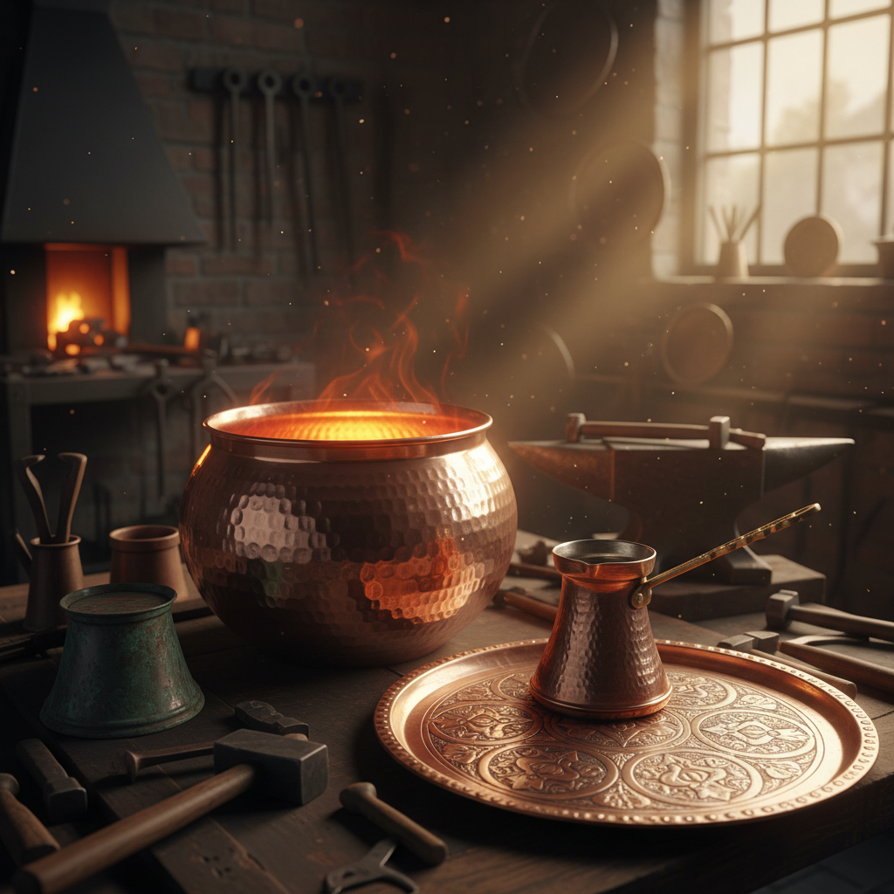

# Coppersmithing 铜匠工艺

> "Copper is the first metal humanity tamed — warm, healing, and endlessly workable." — Unknown

## 概述

铜匠工艺（Coppersmithing）是以铜为主要材料的金属加工艺术——涵盖锤打、焊接、铆接、旋压、錾刻等多种技法。铜是人类最早使用的金属之一（铜器时代），其温暖的红橙色、优异的导热性、抗菌性和极好的可塑性使其成为从厨具到建筑、从乐器到艺术品的理想材料。从土耳其的铜器集市到日本的铜壶，从欧洲的铜屋顶到当代的铜雕塑，铜匠工艺是人类最古老、最持久的金属传统之一。

铜匠工艺的美学在于：温暖的金属——铜的红橙色光泽如同凝固的夕阳，随时间氧化变绿更增添了岁月的诗意。

## 核心特征

| 特征 | 描述 |
|------|------|
| 铜 | 以铜为主要材料 |
| 温暖 | 温暖的红橙色 |
| 可塑 | 极好的可塑性 |
| 导热 | 优异的导热性 |
| 氧化 | 随时间产生铜绿 |
| 古老 | 人类最早使用的金属 |

## 视觉特征

- **红橙**：温暖的红橙色光泽
- **光泽**：抛光铜的明亮光泽
- **锤痕**：手工锤打的质感
- **氧化**：从红到棕到绿的变化
- **温暖**：视觉上的温暖感
- **反射**：铜面的温暖反射

## 代表作品

| 作品 | 艺术家 | 年代 | 意义 |
|------|--------|------|------|
| *Turkish copper bazaar* | 匿名 | 传统 | 土耳其铜器传统 |
| *Statue of Liberty* | Bartholdi | 1886 | 最大的铜制品 |
| *Japanese copper kettles* | 匿名 | 传统 | 日本铜壶 |
| *Arts & Crafts copper* | Various | 1880s-1920s | 工艺美术运动铜器 |
| *Contemporary copper art* | Various | 当代 | 当代铜艺术 |

## 历史时间线

| 时期 | 事件 |
|------|------|
| 公元前9000年 | 最早的铜器使用 |
| 铜器时代 | 铜成为主要金属 |
| 古代 | 各文明的铜器传统 |
| 中世纪 | 铜匠行会 |
| 工业革命 | 铜的工业化应用 |
| 当代 | 铜在艺术和建筑中 |

## 中国语境

中国的铜器传统极其悠久——从商周青铜器到明清铜炉（宣德炉），铜器贯穿了中国文明的全部历史。虽然商周青铜器以铸造为主，但锤打铜器在民间有广泛传统。云南的斑铜、西藏的铜佛像、广东的铜器都是中国铜匠工艺的代表。当代中国的铜艺术在传统与现代之间寻找新的表达。

## AI生成概念图

## 与其他风格的关系

- **Raising** → 铜器起形
- **Repoussé** → 铜器锤揲
- **Patina** → 铜绿的美学
- **Metalwork** → 金属工艺
- **Blacksmithing** → 铁匠的铜版本
- **Architecture** → 铜屋顶和装饰

---

*浮光艺志 | Chronicle of Artistry*
