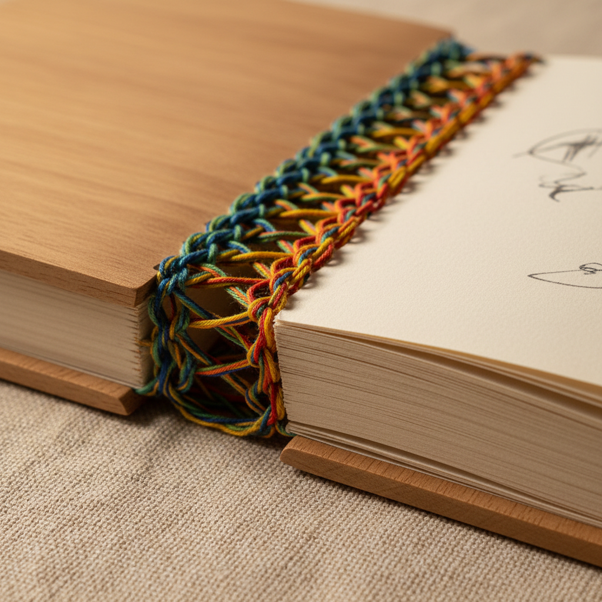

# Coptic Binding Art 科普特装帧艺术

> "Coptic binding is the skeleton made beautiful — exposed spine sewing that needs no glue, no cover boards hiding the structure, no pretense that the book is anything other than gathered pages held together by thread. The chain-link stitching along the spine is both engineering and ornament, allowing the book to open completely flat while displaying the craftsmanship that holds it together." — Unknown

## 概述

科普特装帧艺术（Coptic Binding Art）是一种源自古埃及科普特基督教社区的书籍装帧技法——以其暴露的链式缝线和无需胶水的结构著称。科普特装帧是已知最早的书籍装帧形式之一（约2-4世纪），其特点是书脊完全暴露，缝线形成装饰性的链式图案，书籍可以完全平摊打开。

科普特装帧艺术的实践包括：1）帖子制作——将纸张折叠成帖子；2）封面准备——制作木板或纸板封面；3）链式缝合——用链式针法将帖子缝合在一起；4）封面连接——将封面通过缝线连接到书芯；5）装饰缝线——使用彩色线创造装饰效果；6）变体缝法——各种链式缝合的变体；7）当代科普特装帧——将传统技法与现代设计结合的创作。

## 核心特征

| 特征 | 描述 |
|------|------|
| 暴露 | 书脊缝线完全暴露 |
| 链式 | 链式缝合结构 |
| 无胶 | 不需要胶水 |
| 平摊 | 可以完全平摊打开 |
| 古老 | 最早的装帧形式之一 |
| 装饰 | 缝线本身是装饰 |

## 视觉特征

- **缝线**：暴露的装饰性缝线
- **链式**：链式图案的节奏感
- **结构**：清晰可见的结构
- **色彩**：彩色缝线的色彩
- **质朴**：质朴自然的美感
- **手工**：明显的手工质感

## 代表作品

| 作品 | 艺术家/文化 | 年代 | 意义 |
|------|-------------|------|------|
| *Nag Hammadi codices* | 埃及 | 3-4世纪 | 最早的科普特装帧 |
| *Ethiopian bindings* | 埃塞俄比亚 | 传统 | 埃塞俄比亚装帧 |
| *Contemporary artist books* | 国际 | 当代 | 当代艺术家书籍 |
| *Handmade journals* | 国际 | 当代 | 手工日记本 |
| *Modern coptic variations* | 国际 | 当代 | 现代科普特变体 |

## 历史时间线

| 时期 | 事件 |
|------|------|
| 2-4世纪 | 科普特装帧在埃及的起源 |
| 中世纪 | 埃塞俄比亚的延续 |
| 19世纪 | 考古发现科普特装帧实物 |
| 1970年代 | 手工书运动的复兴 |
| 当代 | 科普特装帧的全球化发展 |

## 中国语境

科普特装帧在中国的手工书爱好者中获得了广泛关注。中国传统的线装书与科普特装帧有相似之处——都是暴露缝线的装帧形式。中国当代的手工书创作者将科普特装帧与中国传统装帧元素结合——创造出融合东西方的装帧设计。中国的设计院校中，科普特装帧作为书籍设计课程的重要内容——培养学生对手工装帧的理解。中国的手工市集和工作坊中，科普特装帧是最受欢迎的手工书体验项目之一——因其相对简单且效果美观。中国的一些独立出版物使用科普特装帧——作为一种独特的设计语言。

## AI生成概念图

## 与其他风格的关系

- **Bookbinding** → 书籍装帧
- **Japanese Stab Binding** → 日本线装
- **Artist Books** → 艺术家书籍
- **Paper Art** → 纸艺
- **Textile Art** → 纺织艺术
- **Craft** → 手工艺

---

*浮光艺志 | Chronicle of Artistry*
