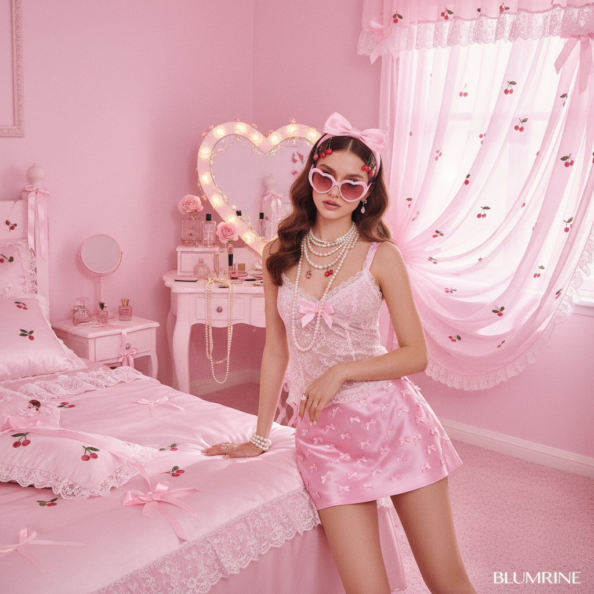
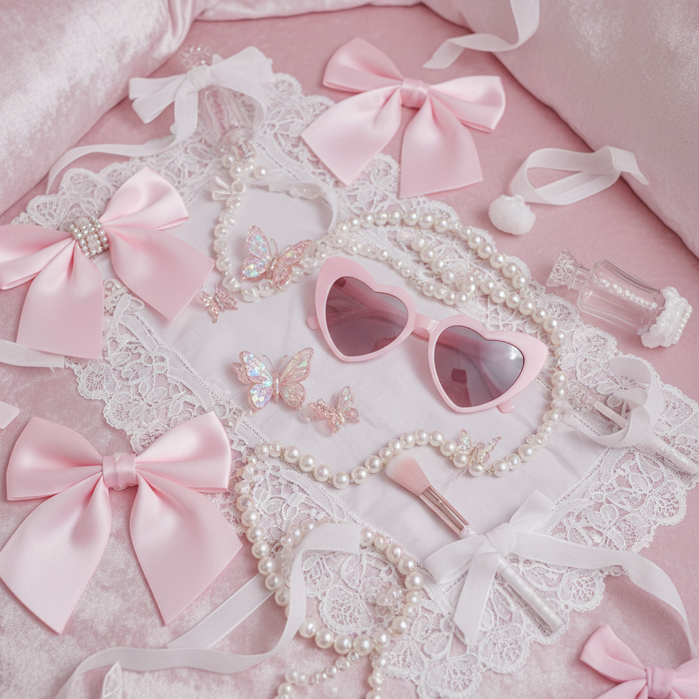

# Coquette Y2K | 千禧甜心风

## 概述

- **时间跨度**：2000s 起源，2020s 大规模回潮
- **发源地**：社交媒体（TikTok、Pinterest）对千禧元素的重新演绎
- **核心理念**：蝴蝶结、蕾丝、珍珠、粉色——将Y2K的大胆与法式浪漫的温柔结合
- **别名**：Bow Girl、Soft Y2K、Dollette

## 历史背景

Coquette（法语"调情的女人"）美学根植于洛可可时代的女性气质表达，但在2020年代与Y2K复兴浪潮结合后，形成了独特的 Coquette Y2K 风格。它从 Blumarine 2022 年的蝴蝶结复兴、Miu Miu 的超短裙风潮中汲取灵感，同时回溯2000年代初 Paris Hilton 和 Britney Spears 的甜美造型。

与原始Y2K的科技未来感不同，Coquette Y2K 更强调**柔软、浪漫、女性化**的一面。

### 两条时间线

**2000年代原始版本**：
- Paris Hilton 的粉色天鹅绒运动套装+吉娃娃
- Britney Spears 的学生制服+蝴蝶结造型
- Juicy Couture 的水钻logo
- 日本涩谷系的"姬辣妹"（Hime Gyaru）——蝴蝶结+卷发+粉色

**2020年代回潮版本**：
- TikTok #coquette 标签超过50亿播放
- Blumarine 2022 蝴蝶结系列引爆时尚圈
- Sandy Liang 蝴蝶结发夹成为现象级单品
- "Bow-ification"——把蝴蝶结加到一切物品上

### 为什么在2020s爆发？

Coquette Y2K 的回潮不是偶然的。经历了2010年代的"girl boss"叙事和中性化审美后，Z世代女性开始重新审视"女性气质"的含义。蝴蝶结和粉色不再被视为"被动的性别规训"，而是一种**有意识的美学选择**——"我选择可爱，因为我想要，不是因为你期待我这样。"

这种态度与第四波女性主义的"选择权"话语高度契合。

## 视觉特征

### 核心元素
- **蝴蝶结（Bows）**：头发上、衣服上、鞋子上——无处不在
- **蕾丝与缎带**：内衣外穿、蕾丝边装饰
- **珍珠与水钻**：千禧年的bling感+古典珍珠
- **粉色系主导**：从baby pink到hot pink
- **心形元素**：心形太阳镜、心形手袋
- **樱桃、草莓图案**：甜美水果motif
- **缎面材质**：丝绸吊带裙、缎面枕头
- **梳妆台美学**：复古镜子、香水瓶、首饰盒

### 色彩
- Baby pink、玫瑰粉、奶油白
- 薰衣草紫、淡蓝色
- 搭配少量红色（樱桃红、唇膏红）
- 金色点缀（锁链、扣环）

### 空间美学

Coquette Y2K 不仅是穿搭风格，也是一种**房间美学**：
- 粉色丝绒窗帘
- 梳妆台上摆满香水和首饰
- 蝴蝶结形状的镜子
- 毛绒地毯和缎面枕头
- 墙上挂着 Audrey Hepburn 或 Marilyn Monroe 的海报

### 与其他风格的区别

| 风格 | 关键差异 |
|------|----------|
| McBling | 更奢华、嘻哈影响、金色为主 |
| Coquette Y2K | 更温柔、法式浪漫、粉色为主 |
| Soft Girl | 更日系、更少Y2K元素 |
| Dollette | Coquette的极端版本，更像瓷娃娃 |
| Balletcore | 专注芭蕾元素，更运动感 |
| Old Money | 更克制、更低调、更少粉色 |

## 代表案例

| 领域 | 代表 | 说明 |
|------|------|------|
| 时装 | Blumarine 2022 | 蝴蝶结复兴的引爆点 |
| 时装 | Miu Miu SS22 | 超短裙+学院风 |
| 时装 | Simone Rocha | 珍珠+蕾丝+少女感 |
| 品牌 | Sandy Liang | 蝴蝶结发夹成为现象级单品 |
| 品牌 | LoveShackFancy | 碎花+蕾丝+田园甜心 |
| 影视 | Mean Girls (2004) | Regina George的粉色星期三 |
| 影视 | Legally Blonde (2001) | Elle Woods的粉色帝国 |
| 影视 | Marie Antoinette (2006) | 索菲亚·科波拉的洛可可千禧混搭 |
| 音乐 | Lana Del Rey | 复古甜美的视觉语言 |
| 音乐 | Melanie Martinez | 娃娃屋美学 |
| 社交媒体 | #coquette on TikTok | 50亿+播放量 |

## 文化内核

Coquette Y2K 代表了Z世代对"女性气质"的重新拥抱——在经历了多年的"girl boss"和中性化审美后，年轻女性开始自觉地选择蝴蝶结和粉色，将其视为一种**有意识的美学选择**而非被动的性别规训。

### 争议与批评

这种风格也面临批评：
- **消费主义陷阱**：蝴蝶结发夹从5元涨到500元，"可爱"被商品化
- **身体政治**：Coquette美学是否暗含对特定体型（纤瘦、白皙）的偏好？
- **年龄焦虑**：对"少女感"的追求是否强化了对衰老的恐惧？

这些争论本身也是这种美学活力的证明——它足够有影响力，值得被认真讨论。

## 图片画廊

| | |
|:---:|:---:|
|  | |
| *千禧甜心风 · 粉色蝴蝶结与珍珠* | |

## 延伸阅读

- [Coquette | Aesthetics Wiki](https://aesthetics.fandom.com/wiki/Coquette)
- [Vogue: The Rise of Coquette Aesthetic](https://www.vogue.com/article/coquette-aesthetic)
- 微博：Y2K风格分类解析

---

[← FantasY2K](fantasy2k.md) | [→ Nu-Rave](nu-rave.md) | [↑ 返回目录](README.md)
