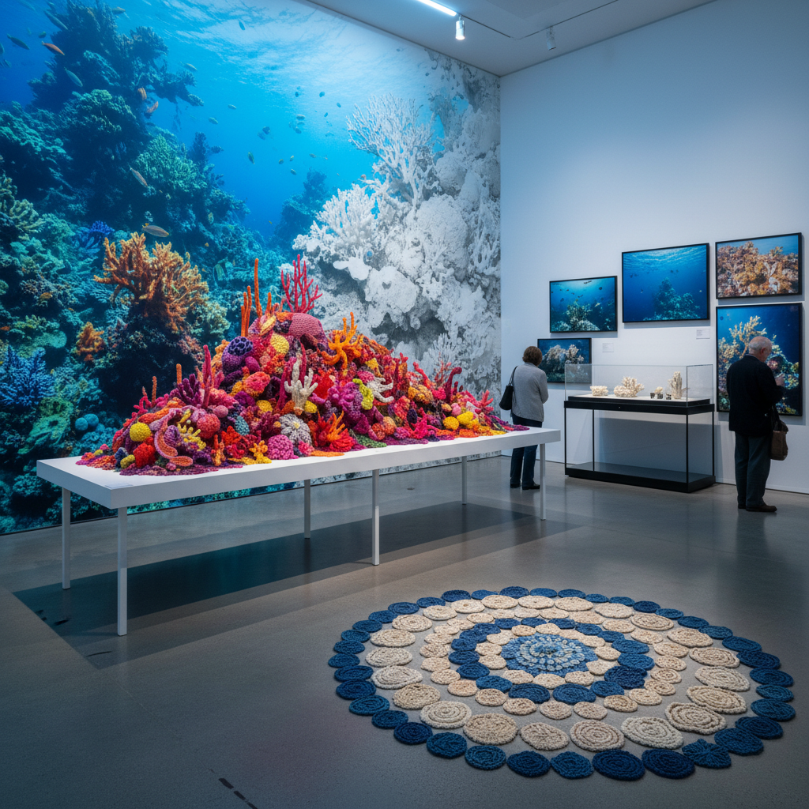

# Coral Art 珊瑚艺术

> "Coral art honors the master builders of the ocean — organisms that construct cities of calcium carbonate over centuries, that paint the sea floor in impossible colors, that create the most biodiverse ecosystems on Earth through patient accretion, and that now face extinction from warming and acidification, making every coral artwork both a celebration of their beauty and an elegy for what we are losing, a reminder that the greatest architecture on Earth was never human." — Unknown

## 概述

珊瑚艺术（Coral Art）是以珊瑚——海洋中的造礁生物——为灵感、主题和媒介的艺术实践。珊瑚礁是地球上最复杂、最美丽、最濒危的生态系统之一，被称为"海洋中的热带雨林"。珊瑚艺术既是对珊瑚之美的赞颂，也是对珊瑚礁危机的回应。

珊瑚艺术的实践包括：1）珊瑚形态的艺术化——将珊瑚的多样形态（分支形、脑形、扇形、板形）转化为雕塑、装置和纺织品；2）珊瑚色彩的探索——珊瑚的荧光色彩（粉红、紫色、蓝色、绿色）作为调色板；3）珊瑚白化的表达——用艺术表达珊瑚白化和死亡的生态危机；4）人工珊瑚礁——创造兼具艺术性和生态功能的人工礁体；5）珊瑚的数学——珊瑚的分形结构和双曲几何作为数学艺术的灵感。

## 核心特征

| 特征 | 描述 |
|------|------|
| 形态 | 多样的珊瑚形态 |
| 色彩 | 荧光色彩 |
| 生态 | 生态危机意识 |
| 建造 | 生物建造 |
| 数学 | 分形和双曲几何 |
| 脆弱 | 美丽与脆弱 |

## 视觉特征

- **分支**：珊瑚的分支结构
- **荧光**：荧光粉红和紫色
- **白化**：白色的死珊瑚
- **纹理**：珊瑚表面的精细纹理
- **水下**：水下的蓝色光线
- **群落**：珊瑚群落的复杂性

## 代表作品

| 作品 | 艺术家 | 年代 | 意义 |
|------|--------|------|------|
| *Crochet Coral Reef* | Margaret & Christine Wertheim | 2005至今 | 钩针珊瑚礁 |
| *Underwater sculptures* | Jason deCaires Taylor | 2006至今 | 水下雕塑 |
| *Coral bleaching art* | Various | 2010年代 | 白化艺术 |
| *Bio-rock coral* | Various | 2010年代 | 电积珊瑚 |
| *3D printed reefs* | Various | 2020年代 | 3D打印珊瑚礁 |

## 历史时间线

| 时期 | 事件 |
|------|------|
| 2005 | Wertheim姐妹的钩针珊瑚礁项目 |
| 2006 | Jason deCaires Taylor的水下博物馆 |
| 2016 | 大堡礁大规模白化事件 |
| 2010年代 | 珊瑚艺术的爆发 |
| 当代 | 珊瑚修复与艺术的结合 |

## 中国语境

珊瑚艺术在中国有独特的发展背景。中国南海拥有丰富的珊瑚礁资源——从海南到南沙群岛，中国的珊瑚礁面积广大但面临严重威胁。中国传统文化中，珊瑚是珍贵的装饰材料——红珊瑚在中国传统中象征吉祥和富贵，是重要的珠宝材料。中国当代的一些艺术家在探索珊瑚艺术：用艺术手段呼吁保护中国的珊瑚礁生态系统、将传统的珊瑚美学与当代生态意识结合、以及参与人工珊瑚礁的艺术设计。中国的海洋生态修复项目也为珊瑚艺术提供了实践平台。

## AI生成概念图

## 与其他风格的关系

- **Eco-Art** → 生态艺术
- **Ocean Art** → 海洋艺术
- **Bio Art** → 生物艺术
- **Textile Art** → 纺织艺术
- **Mathematical Art** → 数学艺术
- **Sculpture** → 雕塑

---

*浮光艺志 | Chronicle of Artistry*
