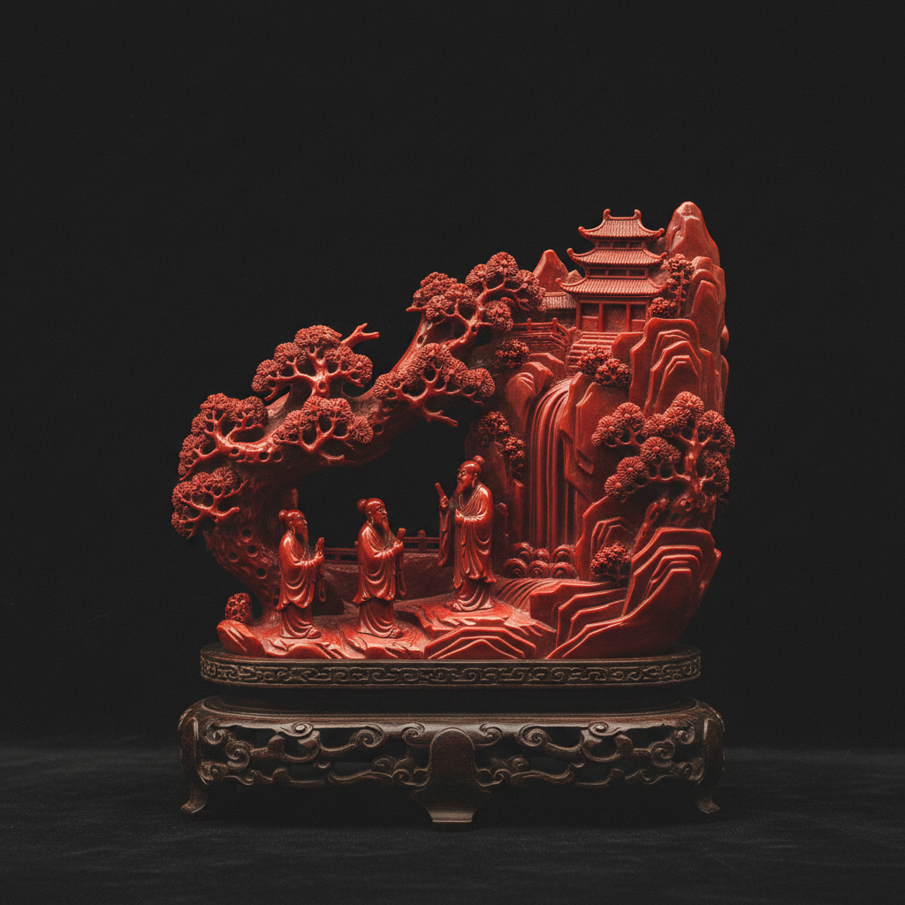

# Coral Carving Art 珊瑚雕刻艺术

> "Coral carving is the art of shaping the sea's own architecture — the calcium carbonate skeletons of marine organisms, built up over centuries in warm ocean waters, are carved into cameos, figurines, beads, and ornamental objects of extraordinary delicacy. Red coral, with its deep crimson color and fine grain, has been prized since antiquity as a material that bridges the natural and the precious, the organic and the mineral." — Unknown

## 概述

珊瑚雕刻艺术（Coral Carving Art）是使用宝石级珊瑚（主要是红珊瑚、粉珊瑚等深海珊瑚）进行雕刻和装饰的传统工艺——利用珊瑚的鲜艳色彩、细腻质地和独特的有机结构创造各种珠宝和装饰品。珊瑚雕刻在地中海地区、中国和日本有悠久的传统。

珊瑚雕刻艺术的实践包括：1）圆雕——完全立体的珊瑚雕刻；2）浮雕——在珊瑚表面雕刻浮雕图案；3）珠饰——将珊瑚制成珠子和串饰；4）镶嵌——将珊瑚镶嵌在金属首饰中；5）微雕——在小块珊瑚上进行精细雕刻；6）组合——将多块珊瑚组合成大型作品；7）当代珊瑚艺术——将传统技法与现代设计结合的创作。

## 核心特征

| 特征 | 描述 |
|------|------|
| 色彩 | 鲜艳的红色和粉色 |
| 有机 | 海洋生物的骨骼 |
| 珍贵 | 极其珍贵的材料 |
| 细腻 | 细腻的质地 |
| 古老 | 数千年的传统 |
| 脆弱 | 相对脆弱的材料 |

## 视觉特征

- **红色**：鲜艳的红色到粉色
- **光泽**：抛光后的温润光泽
- **细腻**：细腻均匀的质地
- **有机**：有机的自然形态
- **温暖**：温暖的色彩感
- **精致**：精致的雕刻细节

## 代表作品

| 作品 | 艺术家/文化 | 年代 | 意义 |
|------|-------------|------|------|
| *Torre del Greco coral* | 意大利 | 15世纪至今 | 意大利珊瑚雕刻 |
| *Chinese coral carvings* | 中国 | 清代至今 | 中国珊瑚雕刻 |
| *Japanese coral art* | 日本 | 传统 | 日本珊瑚艺术 |
| *Tibetan coral jewelry* | 西藏 | 传统 | 藏族珊瑚首饰 |
| *Contemporary coral art* | 当代 | 当代 | 当代珊瑚艺术 |

## 历史时间线

| 时期 | 事件 |
|------|------|
| 古代 | 地中海珊瑚的采集和使用 |
| 罗马时期 | 珊瑚作为护身符的传统 |
| 15世纪 | 意大利珊瑚雕刻行业的兴起 |
| 清代 | 中国珊瑚雕刻的巅峰 |
| 当代 | 珊瑚保护与可持续利用 |

## 中国语境

珊瑚雕刻艺术在中国有极其重要的地位。中国自古就珍视红珊瑚——将其列为"七宝"之一。清代宫廷大量使用珊瑚——珊瑚朝珠、珊瑚摆件是皇室珍藏。中国台湾是世界重要的珊瑚加工中心——台湾珊瑚雕刻以精细著称。中国的珊瑚雕刻传统将玉雕技法应用于珊瑚——创造出精美的人物、花卉和动物造型。中国藏族文化中，珊瑚是极其重要的装饰材料——与绿松石、蜜蜡并列为藏族三大宝石。中国当代的珊瑚市场面临可持续性挑战——随着国际珊瑚保护法规的加强，合法珊瑚材料日益珍贵。中国的一些珊瑚雕刻师开始探索替代材料——在保持传统技艺的同时关注海洋保护。

## AI生成概念图

## 与其他风格的关系

- **Cameo Carving** → 浮雕宝石
- **Jade Carving** → 玉雕
- **Jewelry** → 珠宝艺术
- **Marine Art** → 海洋艺术
- **Sculpture** → 雕塑
- **Organic Art** → 有机材料艺术

---

*浮光艺志 | Chronicle of Artistry*
