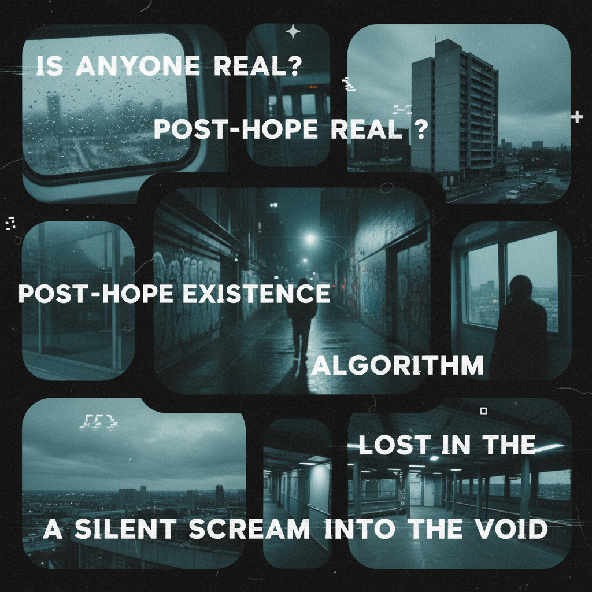

# Corecore 核核 / Post-Internet Art



> **"当你把所有的'-core'叠在一起，剩下的就是存在本身——TikTok 时代的影像诗。"**

## 概述

| 维度 | 描述 |
|------|------|
| 时期 | 2022–至今 |
| 别名 | Corecore, Nichetok, Video Essay TikTok, Post-Internet Collage |
| 核心色彩 | 无固定色板——取决于拼贴素材 |
| 关键元素 | 影像拼贴、哲学旁白、情绪蒙太奇、反消费主义 |
| 代表人物 | TikTok 匿名创作者、Adam Curtis、Terrence Malick |
| 关联风格 | Vaporwave, Liminal Space, Nostalgiacore, Dreamcore |

---

## 历史脉络

### 2022："-core"的终点

Corecore 在 2022 年末出现在 TikTok 上，是对无穷无尽的 "-core" 美学标签的**元评论**：

**背景**：
- 2020–2022 年，TikTok 上出现了数百种 "-core" 美学
- Cottagecore, Goblincore, Barbiecore, Balletcore, Normcore...
- 每种都试图将生活的某个方面"美学化"
- Corecore 问：当一切都是 "-core" 时，还剩下什么？

### 形式特征

Corecore 视频的典型结构：
1. **影像拼贴**：将不相关的视频片段剪辑在一起
2. **情绪音乐**：通常是忧郁的钢琴或环境音乐
3. **哲学/存在主义旁白**：关于孤独、消费主义、意义的缺失
4. **无叙事**：不讲故事，只传递情绪
5. **反算法**：不试图"有用"或"有趣"，只试图"真实"

### 文化意义

Corecore 被认为是 Z 世代的**存在主义表达**：
- 对社交媒体的疲劳和批判
- 对消费主义的质疑
- 对"一切都要有美学标签"的反讽
- 对真实人类连接的渴望
- 一种用 TikTok 的语言批判 TikTok 的方式

### 与影像艺术的关系

Corecore 实际上是**影像散文(video essay)**和**蒙太奇理论**在短视频时代的民主化：
- Adam Curtis 的纪录片拼贴手法
- Chris Marker《La Jetée》的静态影像叙事
- Godard 的跳切和政治蒙太奇
- Vaporwave 的采样和重新语境化

---

## 视觉语法

### 色彩系统

```
Corecore 没有固定色板——它的"色彩"来自素材本身：

常见色调倾向：
  低饱和 — 忧郁、疏离
  过曝/欠曝 — 不完美的真实
  蓝色调 — 数字屏幕的冷光
  暖色闪回 — 怀旧片段

但关键是：不刻意调色
  — 与其他美学的精心调色形成对比
  — "不美化"本身就是美学立场
```

### 标志性元素

| 类别 | 元素 |
|------|------|
| 素材 | 电影片段、纪录片、监控录像、手机视频 |
| 音乐 | Radiohead、Sigur Rós、环境音乐、钢琴独奏 |
| 文字 | 哲学引用、存在主义文本、诗歌 |
| 主题 | 孤独、消费主义、自然、人类连接、时间 |
| 手法 | 蒙太奇、慢动作、重复、静默 |
| 反面 | 不卖东西、不教东西、不娱乐——只"存在" |

---

## 与千禧怀旧的关系

Corecore 与千禧怀旧的关系是**批判性的**：

### 对怀旧本身的反思
- 千禧怀旧说："过去更好"
- Corecore 问："为什么我们总是觉得过去更好？"
- 它不怀念某个特定时代，而是反思"怀念"这个行为本身

### 与 Vaporwave 的平行
- Vaporwave (2010s)：用消费主义的碎片制造忧郁美学
- Corecore (2020s)：用社交媒体的碎片制造存在主义美学
- 两者都是"用系统的工具批判系统"

---

## 中国语境

- 抖音上的"emo视频"/"丧系剪辑"
- B站的影像散文/视频论文
- "内卷"和"躺平"讨论的视觉化
- 与中国互联网"发疯文学"的情绪共振

---

## 设计应用

| 场景 | 应用方式 |
|------|----------|
| 视频 | 蒙太奇拼贴+环境音乐+哲学文本 |
| 品牌 | 反广告、真实感、不完美美学 |
| 摄影 | 抓拍、不修图、日常瞬间 |
| 出版 | 影像散文、视觉诗歌、拼贴杂志 |

---

## 延伸阅读

- "What is Corecore?" (Dazed, 2023)
- Adam Curtis 纪录片美学分析
- 蒙太奇理论与短视频的关系

---

## 相关风格

← [Liminal Space 阈限空间](liminal-space.md) | [Nostalgiacore](nostalgiacore.md) →

↑ [返回千禧怀旧目录](README.md) | [返回总目录](../README.md)
