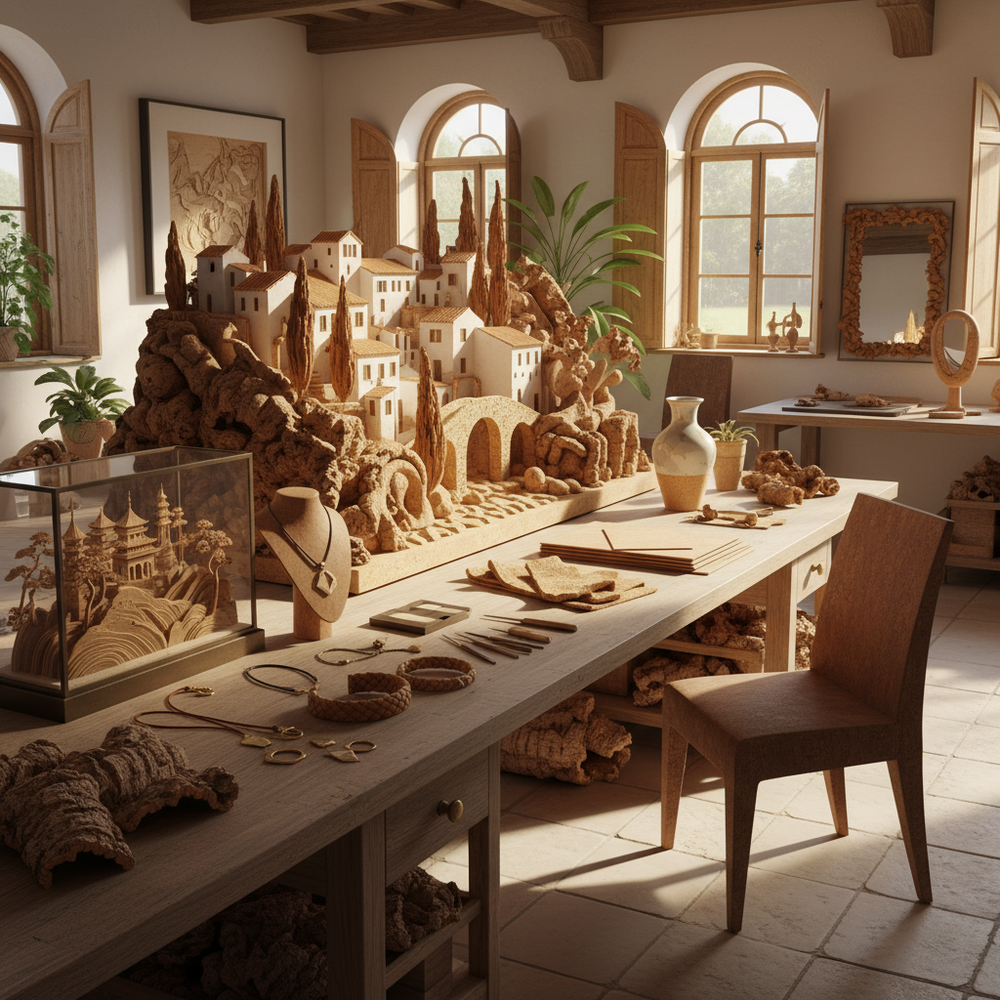

# Cork Art 软木艺术

> "Cork is the bark of a living tree that can be harvested without harming it — the tree simply grows a new layer. This makes cork one of the most sustainable materials on Earth, a gift that keeps giving. As an art material, cork offers warmth, texture, lightness, and a connection to the Mediterranean landscape where cork oaks have grown for millennia." — Unknown

## 概述

软木艺术（Cork Art）是以软木（栓皮栎树皮）为主要材料进行艺术创作的实践。软木是一种独特的天然材料——轻盈、有弹性、防水、隔热、隔音，且可以在不伤害树木的情况下反复采收，是最可持续的天然材料之一。

软木艺术的实践包括：1）软木雕刻——在软木块上进行雕刻创作；2）软木拼贴——用软木片拼贴成图案或画面；3）软木建筑模型——用软木制作精细的建筑模型（18世纪传统）；4）软木首饰——用软木制作的轻盈首饰；5）软木家具设计——用软木设计的当代家具；6）软木装置——用软木塞或软木片创作的大型装置；7）软木版画——用软木作为版画的印版。

## 核心特征

| 特征 | 描述 |
|------|------|
| 轻盈 | 极其轻盈 |
| 温暖 | 温暖的触感和色调 |
| 可持续 | 最可持续的材料之一 |
| 弹性 | 天然的弹性 |
| 纹理 | 独特的蜂窝状纹理 |
| 多功能 | 可雕、可切、可压 |

## 视觉特征

- **暖棕**：软木的天然暖棕色
- **纹理**：蜂窝状的细胞纹理
- **轻盈**：视觉上的轻盈感
- **有机**：有机的自然质感
- **温暖**：温暖的视觉感受
- **朴素**：朴素自然的美感

## 代表作品

| 作品 | 艺术家 | 年代 | 意义 |
|------|--------|------|------|
| *Cork architectural models* | Various | 18世纪 | 软木建筑模型 |
| *Cork sculptures* | Various | 当代 | 软木雕塑 |
| *Cork installations* | Various | 2000年代 | 软木装置艺术 |
| *Cork furniture* | Portuguese designers | 当代 | 软木家具设计 |
| *Cork jewelry* | Portuguese artisans | 当代 | 软木首饰 |

## 历史时间线

| 时期 | 事件 |
|------|------|
| 古代 | 地中海地区使用软木 |
| 18世纪 | 软木建筑模型的流行 |
| 19世纪 | 软木工业化生产 |
| 20世纪 | 葡萄牙软木产业 |
| 当代 | 软木作为可持续艺术材料 |

## 中国语境

软木艺术在中国有一个独特的分支——"软木画"（又称"木画"），是福建福州的传统工艺美术。福州软木画起源于20世纪初，艺术家将进口的栓皮栎软木切割成极薄的片状，然后雕刻、拼接成精美的立体山水画、花鸟画和建筑模型。福州软木画以其精细的雕工和诗意的构图著称，能在方寸之间展现亭台楼阁、山水花鸟的完整场景。这一工艺已被列入国家级非物质文化遗产名录。中国当代的一些设计师也在探索软木材料的当代应用——将软木的可持续性和温暖质感与现代设计理念结合。

## AI生成概念图

## 与其他风格的关系

- **Wood Art** → 木艺术
- **Sustainable Art** → 可持续艺术
- **Sculpture** → 雕塑
- **Installation Art** → 装置艺术
- **Eco Art** → 生态艺术
- **Material Art** → 材料艺术

---

*浮光艺志 | Chronicle of Artistry*
