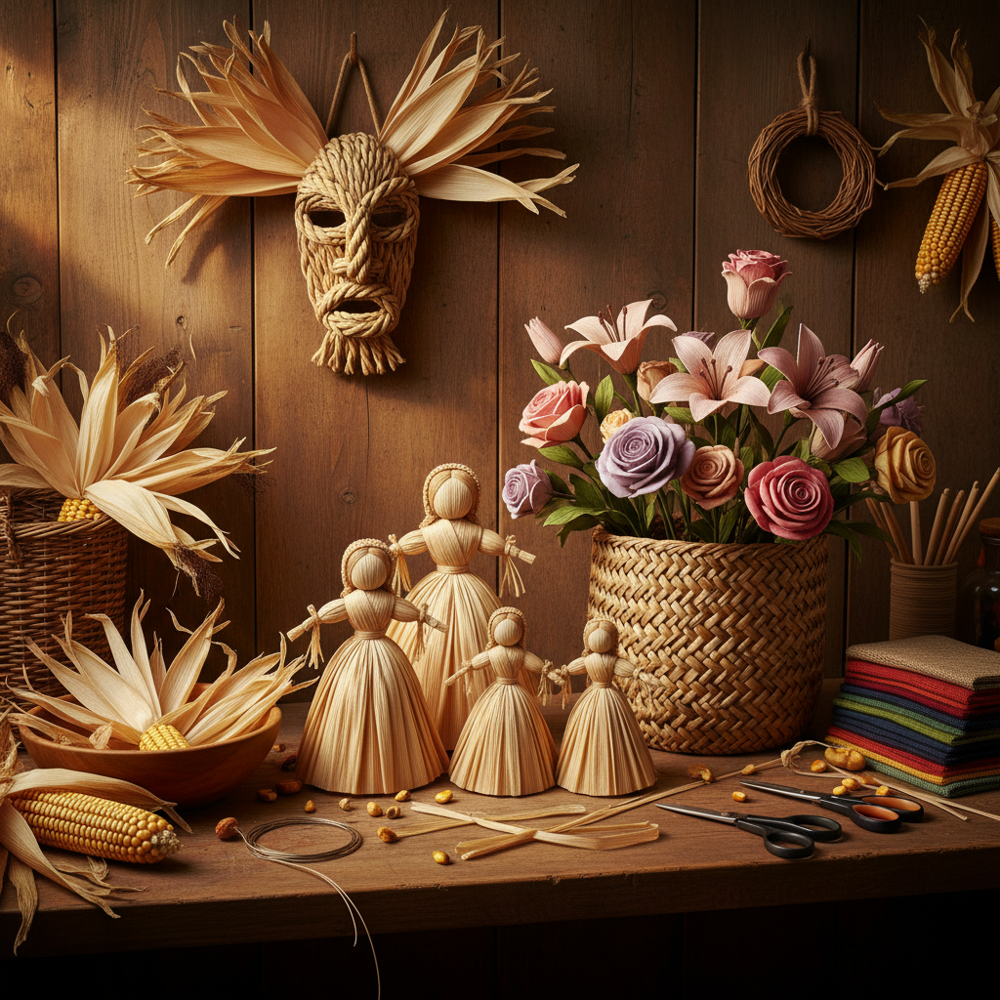

# Corn Husk Art 玉米皮艺术

> "A corn husk is the wrapping of sustenance — thin, fibrous, golden when dried, surprisingly strong and pliable when dampened. In the hands of an artist, these agricultural castoffs become angels and dolls, flowers and baskets, masks and mats. Corn husk art is the alchemy of the harvest: transforming the discarded into the cherished, the humble into the beautiful." — Unknown

## 概述

玉米皮艺术（Corn Husk Art）是以干燥的玉米苞叶为材料进行编织、造型和装饰创作的艺术形式——利用玉米皮天然的柔韧性、半透明质感和金色光泽，通过折叠、缠绕、编织和染色等技法创造人偶、花卉、篮筐和装饰品。玉米皮艺术是美洲原住民和欧洲移民文化中重要的民间工艺传统。

玉米皮艺术的实践包括：1）玉米皮人偶——用玉米皮制作的传统人偶；2）玉米皮花卉——用玉米皮制作的仿真花朵；3）玉米皮编织——用玉米皮编织的篮筐和垫子；4）玉米皮面具——用玉米皮制作的仪式面具；5）玉米皮装饰——节日和家居装饰品；6）染色玉米皮——用天然或人工染料着色的玉米皮创作；7）当代玉米皮艺术——将传统技法与现代设计结合。

## 核心特征

| 特征 | 描述 |
|------|------|
| 天然 | 天然农作物材料 |
| 柔韧 | 湿润时极其柔韧 |
| 半透明 | 独特的半透明质感 |
| 金色 | 干燥后的金色 |
| 环保 | 废物利用 |
| 朴素 | 朴素的民间美学 |

## 视觉特征

- **金色**：干燥玉米皮的金色
- **半透明**：薄如纸的半透明感
- **纹理**：天然的纤维纹理
- **柔软**：柔软的褶皱和曲线
- **层次**：多层叠加的效果
- **温暖**：温暖的自然色调

## 代表作品

| 作品 | 艺术家 | 年代 | 意义 |
|------|--------|------|------|
| *Corn husk dolls* | 美洲原住民 | 古代至今 | 传统玉米皮人偶 |
| *Slovak corn husk figures* | 斯洛伐克传统 | 古代至今 | 欧洲玉米皮人偶 |
| *Corn husk flowers* | Various | 当代 | 玉米皮花卉 |
| *Iroquois corn husk masks* | 易洛魁传统 | 古代至今 | 仪式面具 |
| *Contemporary corn husk art* | Various | 当代 | 当代玉米皮艺术 |

## 历史时间线

| 时期 | 事件 |
|------|------|
| 古代 | 美洲原住民的玉米皮工艺 |
| 16世纪 | 玉米传入欧洲和亚洲 |
| 18-19世纪 | 欧洲移民的玉米皮工艺 |
| 20世纪 | 玉米皮工艺的民俗化 |
| 当代 | 玉米皮艺术的复兴和创新 |

## 中国语境

玉米皮艺术在中国有独特的发展。玉米在明代传入中国后，中国北方的农民逐渐发展出利用玉米皮的工艺传统。中国东北和华北地区有用玉米皮编织坐垫、鞋垫和篮筐的传统。中国的一些民间艺人用玉米皮制作精美的花卉和人偶——利用玉米皮的天然色泽和半透明质感创造出独特的视觉效果。中国当代的一些手工艺爱好者在探索玉米皮艺术的现代化——将玉米皮与其他材料结合、用染色技法丰富色彩、以及将玉米皮工艺融入当代设计。中国的农村手工艺振兴项目中，玉米皮编织是重要的内容之一。

## AI生成概念图

## 与其他风格的关系

- **Straw Art** → 草编艺术
- **Folk Art** → 民间艺术
- **Doll Making** → 人偶制作
- **Basket Weaving** → 编篮艺术
- **Natural Material Art** → 天然材料艺术
- **Eco Art** → 生态艺术

---

*浮光艺志 | Chronicle of Artistry*
