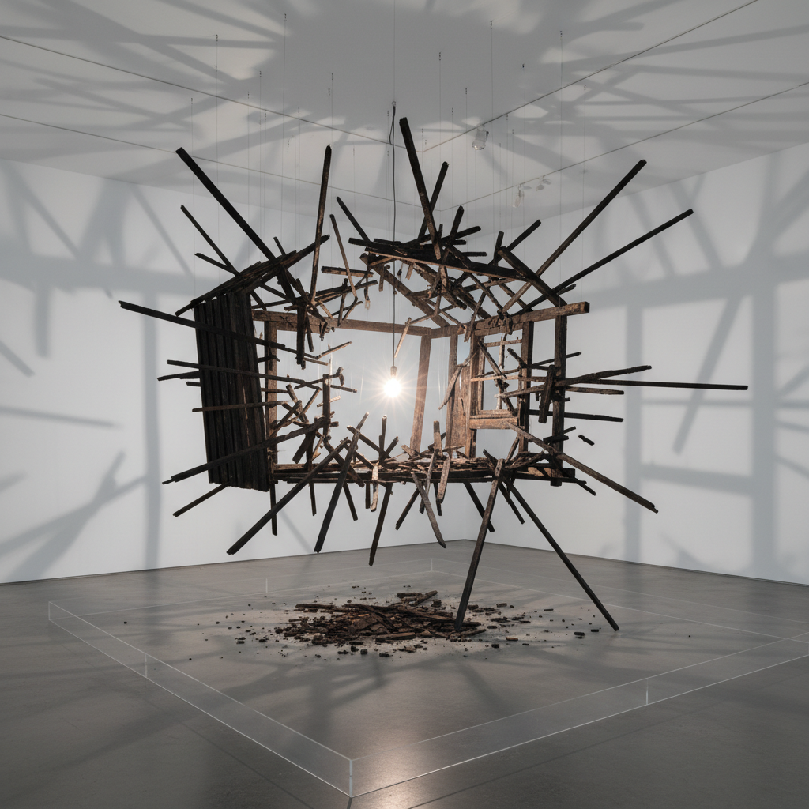

# Cornelia Parker 科妮莉亚·帕克

> **时期：** 1956–至今  
> **关键词：** 爆炸碎片、悬挂装置、暴力转化、物质诗学

## 概述

Cornelia Parker 是英国装置艺术家，以将暴力行为的结果转化为诗意装置而闻名。最著名的《冷暗物质》是一间被炸毁的花园棚屋的碎片，用钢丝悬挂在展厅中央，被单一灯泡照亮，如同宇宙大爆炸的瞬间被冻结。

## 风格特征

- **暴力后的诗意**：将破坏、压碎、拉伸等暴力过程的结果转化为美
- **悬挂装置**：碎片用钢丝悬挂在空中，如同失重状态
- **光与影**：单一光源创造出戏剧性的影子
- **物质转化**：银器被压扁、铅笔被碾碎、硬币被火车碾过
- **叙事性标题**：标题提供作品的暴力历史和诗意框架

## 代表作品

- *Cold Dark Matter: An Exploded View*（1991）
- *Thirty Pieces of Silver*（1988-1989）
- *The Maybe*（1995）
- *War Room*（2015）

## 概念图

