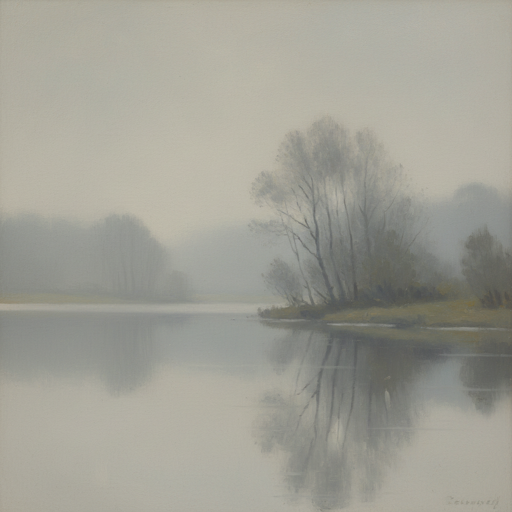

# Camille Corot 柯罗

> "Be guided by feeling alone. Before any site and any object, abandon yourself to your first impression." — Camille Corot

## 概述

卡米耶·柯罗（Camille Corot，1796–1875）是法国风景画大师，巴比松画派的重要成员。他以银灰色调的抒情风景和朦胧的晨雾效果闻名，被称为"印象派的祖父"——他对光线和大气的敏感直接启发了莫奈一代。

## 核心特征

| 特征 | 描述 |
|------|------|
| 银灰色调 | 标志性的珍珠灰与银绿 |
| 晨雾效果 | 朦胧的大气透视 |
| 柔和光线 | 清晨和黄昏的柔光 |
| 树木诗意 | 轻盈颤动的树叶 |
| 户外写生 | 意大利和法国的直接观察 |
| 人物点缀 | 风景中的小型人物 |

## 代表作品

| 作品 | 年代 | 意义 |
|------|------|------|
| *Ville-d'Avray* | 多幅 | 银色池塘的诗意 |
| *The Bridge at Narni* | 1826 | 意大利光线的发现 |
| *Souvenir de Mortefontaine* | 1864 | 记忆中的风景 |
| *Woman Reading* | 1869 | 晚期人物画的亲密感 |

## AI生成概念图

## 与其他风格的关系

- **Barbizon School** → 巴比松画派的核心成员
- **Impressionism** → "印象派的祖父"
- **Constable** → 英国风景画的法国回应
- **Monet** → 直接影响了莫奈的光线处理
