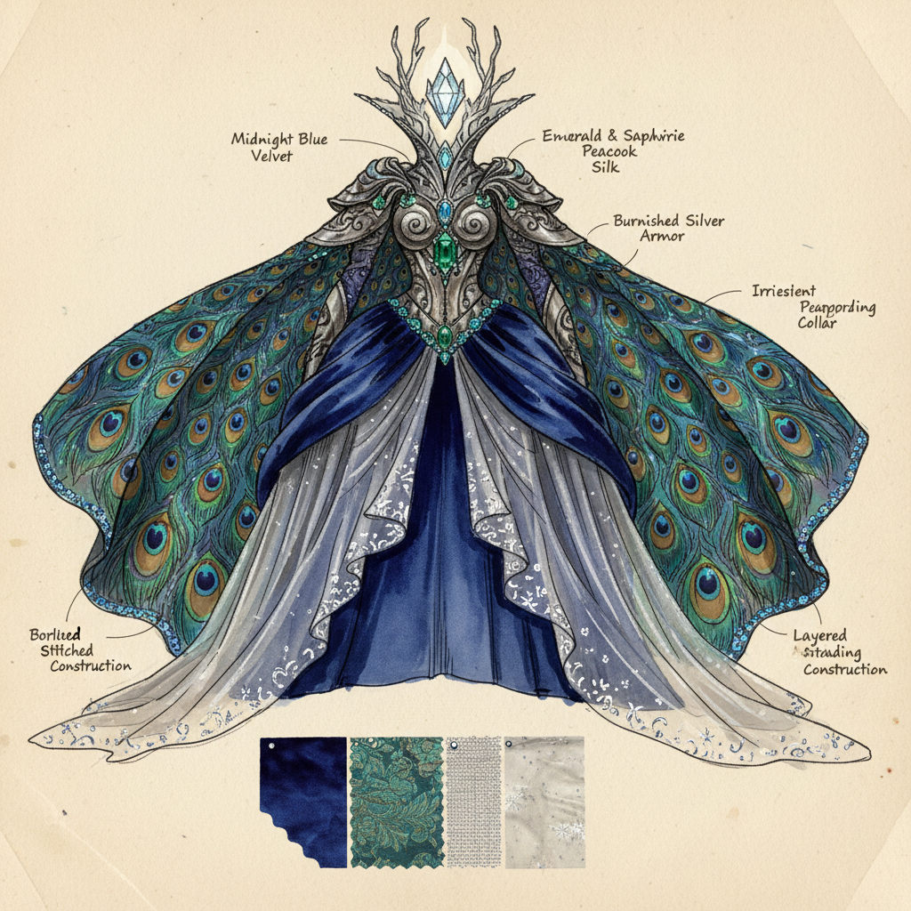

# Costume Design 戏服设计

> **时期：** 古希腊–至今  
> **关键词：** 角色塑造、时代考证、面料选择、色彩叙事、舞台与银幕

## 概述

Costume Design（戏服设计）是通过服装视觉语言塑造角色身份、传达叙事信息的设计艺术。从古希腊戏剧的面具和长袍到当代电影的精密历史还原，戏服设计师用面料、色彩、剪裁和细节讲述故事——观众在角色开口说话之前，就已经通过服装"读到"了他们的身份、阶层、性格和命运。

## 风格特征

- **角色塑造**：服装即角色的视觉身份证
- **时代考证**：历史准确性与艺术化的平衡
- **色彩叙事**：用色彩变化映射角色弧线
- **面料语言**：材质传达的阶层和情绪信息
- **整体协调**：与布景、灯光的视觉统一

## 代表人物与作品

- 伊迪丝·海德（好莱坞黄金时代）
- 石冈瑛子《入侵脑细胞》《惊情四百年》
- 科琳·阿特伍德《芝加哥》《魔法黑森林》
- 桑迪·鲍威尔《莎翁情史》

## 概念图

