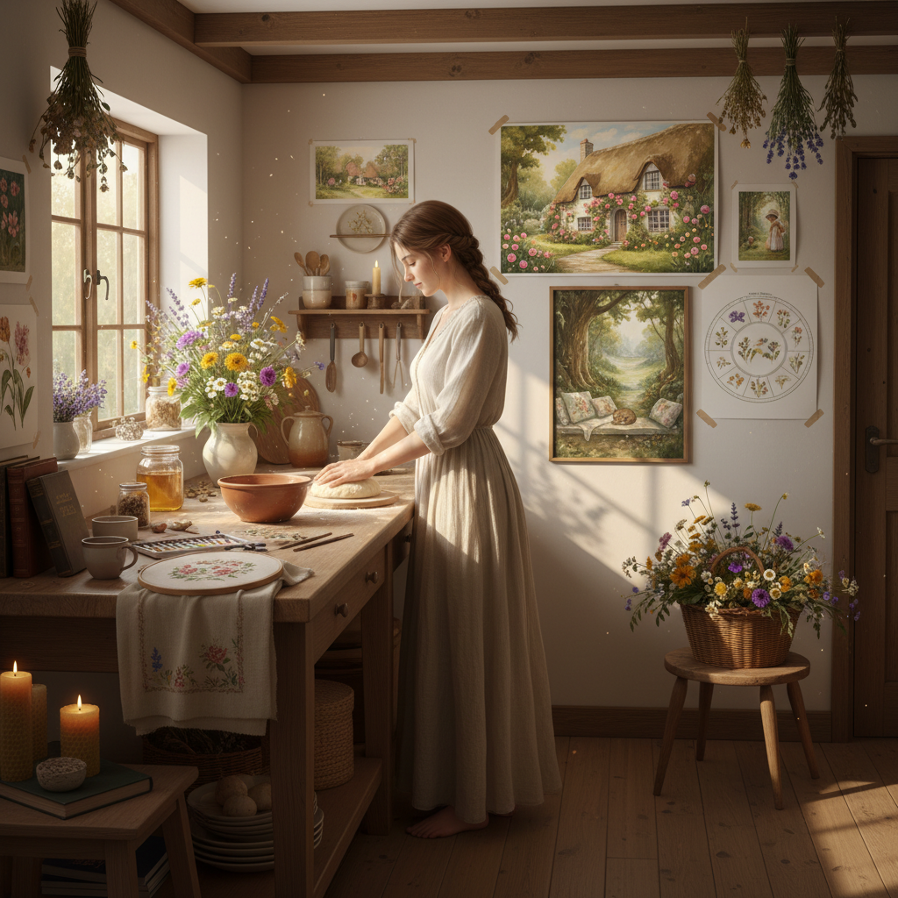

# Cottagecore Art 田园核心艺术

> "Cottagecore is a gentle rebellion against the digital age — a longing for stone cottages with climbing roses, bread baking in wood-fired ovens, wildflower meadows humming with bees, and the slow rhythms of a life lived close to the earth, an aesthetic that romanticizes rural domesticity not as historical fact but as emotional refuge, a visual poem about the peace we imagine our grandmothers knew and the simplicity we suspect we have lost." — Unknown

## 概述

田园核心（Cottagecore）是2010年代末至2020年代兴起的一种互联网美学和文化运动，浪漫化乡村生活、手工制作、自给自足和与自然的亲密关系。Cottagecore的视觉世界充满了石头小屋、花园、烘焙、刺绣、野花、蘑菇、蜜蜂、亚麻布和田园风光——一种对前工业化乡村生活的理想化想象。

Cottagecore在2018-2020年间通过Tumblr、Instagram和TikTok等平台迅速传播，在COVID-19疫情期间达到高峰——当人们被困在城市公寓中时，对乡村宁静生活的向往变得格外强烈。Cottagecore不仅是一种视觉美学，也是一种生活方式运动——包括手工制作、园艺、烘焙、缝纫、采集等实践。它也与可持续生活、慢生活运动和LGBTQ+社区有密切联系。

## 核心特征

| 特征 | 描述 |
|------|------|
| 乡村 | 浪漫化的乡村生活 |
| 手工 | 手工制作和传统技艺 |
| 自然 | 与自然的亲密关系 |
| 慢生活 | 慢节奏的生活方式 |
| 怀旧 | 对过去的怀旧想象 |
| 自给 | 自给自足的理想 |

## 视觉特征

- **花卉**：野花和花园植物
- **小屋**：石头或木头小屋
- **烘焙**：面包和糕点
- **亚麻**：亚麻和棉布质感
- **蘑菇**：蘑菇和森林元素
- **柔和**：柔和的暖色调

## 代表作品

| 作品 | 艺术家 | 年代 | 意义 |
|------|--------|------|------|
| *Cottagecore aesthetic* | Various creators | 2018起 | 互联网美学运动 |
| *folklore/evermore* | Taylor Swift | 2020 | 泰勒的田园核心专辑 |
| *Studio Ghibli films* | Hayao Miyazaki | 1980年代起 | 宫崎骏的田园美学 |
| *Stardew Valley* | ConcernedApe | 2016 | 田园生活模拟游戏 |
| *Beatrix Potter illustrations* | Beatrix Potter | 1900年代 | 波特的田园插画 |

## 历史时间线

| 时期 | 事件 |
|------|------|
| 2018 | Cottagecore在Tumblr兴起 |
| 2019 | Instagram和TikTok的传播 |
| 2020 | COVID-19期间的爆发 |
| 2020 | Taylor Swift的folklore专辑 |
| 当代 | Cottagecore的持续影响 |

## 中国语境

田园核心在中国有独特的文化回响。中国的"田园生活"美学有悠久的传统——从陶渊明的"采菊东篱下"到当代的李子柒视频，中国文化中一直有对田园生活的浪漫化想象。李子柒的YouTube频道可以被视为中国版的cottagecore——展示传统手工制作、田园烹饪和与自然和谐共处的生活。中国的"归隐"文化、茶道、花艺和传统手工艺都与cottagecore的精神相通。中国年轻人中的"躺平"文化和对慢生活的向往也与cottagecore的反消费主义倾向有共鸣。

## AI生成概念图

## 与其他风格的关系

- **Romanticism** → 浪漫主义
- **Arts and Crafts** → 工艺美术运动
- **Folk Art** → 民间艺术
- **Pastoral Art** → 田园艺术
- **Dark Academia** → 暗黑学院风
- **Goblincore** → 哥布林核心

---

*浮光艺志 | Chronicle of Artistry*
