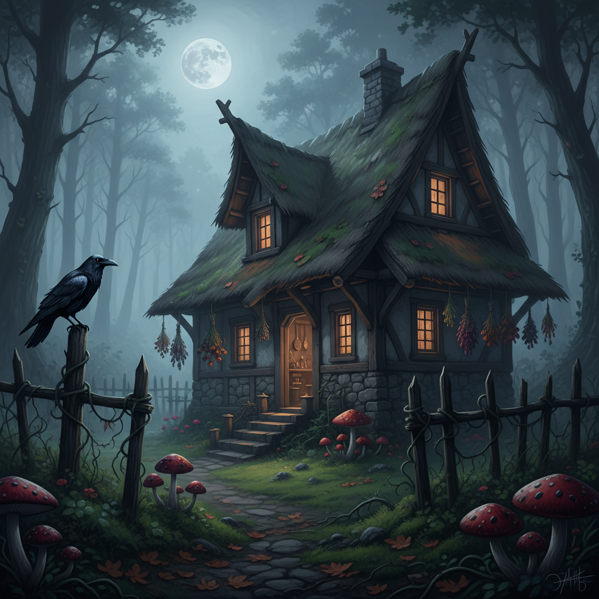

# Cottagecore Dark 暗黑田园核



> **"毒蘑菇、乌鸦、荆棘——田园生活美丽而危险的另一面。"**

## 概述

| 维度 | 描述 |
|------|------|
| 时期 | 2020–至今 |
| 别名 | Dark Cottagecore, Goblin Cottagecore, Witch Cottage |
| 核心色彩 | 深绿、暗红、黑色、棕色、紫色 |
| 关键元素 | 毒蘑菇、乌鸦、荆棘、药草、暴风雨 |
| 代表人物 | Brothers Grimm 原版童话、Baba Yaga |
| 关联风格 | Cottagecore, Witchcore, Goblincore, Dark Romantic |

---

## 历史脉络

### 童话的另一面

| 时代 | 表现 |
|------|------|
| 古代 | 民间故事中的黑暗森林 |
| 1812 | 格林兄弟原版童话（暴力版） |
| 2019 | Cottagecore 主流化 |
| 2020 | Dark Cottagecore 作为"反甜美"分支出现 |
| 2021 | 与 Witchcore 合流 |

### 它反对什么？

| Cottagecore | Dark Cottagecore |
|-------------|-----------------|
| 阳光明媚 | 暴风雨天 |
| 烤面包 | 熬药水 |
| 野花 | 毒蘑菇 |
| 小兔子 | 乌鸦 |
| "一切都好" | "自然是美丽且危险的" |
| 逃避现实 | 面对黑暗 |

### 核心哲学

Dark Cottagecore 的精神是**"自然不只有阳光——暴风雨也是美的"**：
- 腐烂是生命循环的一部分
- 黑暗不是邪恶——是深度
- 森林里有美丽也有危险
- "我是住在森林深处的那个女巫"
- 接受自然的全部——包括死亡

---

## 视觉语法

### 色彩系统

```
主色：
  深绿 (#013220) — 苔藓、森林
  暗红 (#8B0000) — 毒浆果、血
  黑色 (#1A1A1A) — 乌鸦、夜晚
  深棕 (#3D2B1F) — 泥土、树皮
  暗紫 (#301934) — 毒蘑菇

辅色：
  灰色 (#696969) — 暴风雨天空
  骨白 (#F9F6EE) — 骨头、蘑菇
  铜绿 (#4F7942) — 氧化金属

质感：
  苔藓 — 潮湿、柔软
  枯叶 — 腐烂、循环
  蜘蛛网 — 时间、被遗忘
  粗麻 — 原始、手工
  铁锈 — 老旧、时间
```

### 标志性元素

| 类别 | 元素 |
|------|------|
| 植物 | 毒蘑菇、荆棘、枯树、苔藓 |
| 动物 | 乌鸦、黑猫、蛾子、蛇 |
| 物品 | 药草瓶、蜡烛、旧书、骨头 |
| 天气 | 暴风雨、浓雾、阴天 |
| 建筑 | 废弃小屋、长满苔藓的石墙 |
| 氛围 | 森林深处、黄昏、月光 |

---

## 与千禧怀旧的关系

### 疫情时代的"暗面"
- 2020 疫情 → Cottagecore 爆发
- 但不是所有人都想要"阳光田园"
- Dark Cottagecore = "我也想逃到乡下，但我是那个女巫"
- 对过度甜美的反叛

---

## 中国语境

- "暗黑田园"/"暗黑森系"在小红书的讨论
- 与"暗黑萝莉"/"哥特森女"的交叉
- 中国版：深山老林+药草+古风暗黑
- 与中国民间故事中的"山鬼"意象呼应

---

## 设计应用

| 场景 | 应用方式 |
|------|----------|
| 品牌 | 深色+手绘植物+粗糙质感+神秘 |
| 包装 | 深色纸+药草插画+蜡封 |
| 空间 | 深色木+干花+蜡烛+苔藓 |
| 摄影 | 阴天+森林+烟雾+暗色调 |

---

## 相关风格

← [Cottagecore 田园核](cottagecore.md) | [Witchcore 巫术核](witchcore.md) →

↑ [返回千禧怀旧目录](README.md) | [返回总目录](../README.md)
