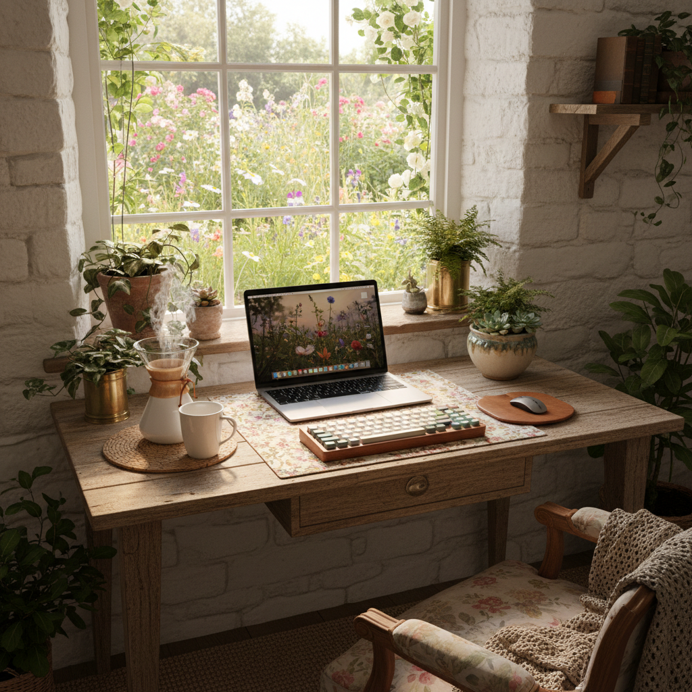

# Cottagecore Tech 田园科技



> **"用MacBook在花园里写代码——当硅谷程序员梦想成为农夫。"**

## 概述

| 维度 | 描述 |
|------|------|
| 时期 | 2020–至今 |
| 别名 | Cottagecore Tech, Pastoral Tech, Garden Office |
| 核心色彩 | 苔藓绿、奶油白、木色、终端绿、薰衣草 |
| 关键元素 | 花园中的笔记本电脑、木质书桌、植物与代码 |
| 代表人物 | 远程工作者、独立开发者、数字游牧民 |
| 关联风格 | Cottagecore, Japandi, Solarpunk, Lo-Fi |

---

## 历史脉络

### 2020：疫情催生的融合

| 背景 | 结果 |
|------|------|
| 疫情远程工作 | 程序员搬到乡下 |
| Cottagecore 流行 | 田园生活成为理想 |
| 科技行业倦怠 | "我想辞职去种地" |
| 可持续发展 | 低碳生活+远程工作 |

### 文化基因

| 来源 | 贡献 |
|------|------|
| Cottagecore | 田园生活的浪漫化 |
| 远程工作文化 | 地点自由 |
| 独立开发者 | 一个人+一台电脑 |
| Solarpunk | 技术与自然的和谐 |
| 数字游牧 | 在任何地方工作 |

### 核心矛盾与魅力

Cottagecore Tech 的有趣之处在于它的**内在矛盾**：
- 想要简单生活 ← → 依赖复杂技术
- 想要远离屏幕 ← → 靠屏幕谋生
- 想要自然 ← → 需要 WiFi
- 这种矛盾本身就是当代生活的缩影

---

## 视觉语法

### 色彩系统

```
主色：
  苔藓绿 (#6B8E23) — 自然、植物
  奶油白 (#FFFDD0) — 温暖、纸张
  木色 (#DEB887) — 书桌、小屋
  终端绿 (#00FF00 低饱和) — 代码、技术
  薰衣草 (#E6E6FA) — 柔和、平静

辅色：
  深棕 (#654321) — 皮革、木材
  天蓝 (#87CEEB) — 天空、窗外
  蜂蜜金 (#DAA520) — 阳光、蜂蜜

质感：
  木材 — 书桌、小屋
  亚麻 — 窗帘、桌布
  苔藓 — 自然覆盖
  屏幕光 — 代码、界面
  纸张 — 笔记、手账
```

### 标志性元素

| 类别 | 元素 |
|------|------|
| 科技 | MacBook、机械键盘、耳机 |
| 自然 | 花园、植物、窗外风景 |
| 空间 | 木质书桌、阳光房、花园棚屋 |
| 饮品 | 手冲咖啡、花草茶 |
| 活动 | 写代码、种菜、烤面包、散步 |
| 氛围 | 安静、专注、自给自足 |

---

## 与千禧怀旧的关系

### 对"硅谷文化"的反叛
- 开放式办公室 → 花园书桌
- 免费零食 → 自己种菜
- 996 → 自己的节奏
- 这是千禧一代科技工作者的"中年觉醒"

### 与 Lo-Fi 的精神共鸣
- 两者都追求"安静的专注"
- Lo-Fi = 听着音乐学习/工作
- Cottagecore Tech = 在花园里学习/工作
- 都是对"噪音世界"的逃离

---

## 中国语境

- "数字游牧"/"远程办公"在大理/丽江的实践
- "程序员辞职去乡下"的社交媒体叙事
- 与"躺平"文化的交叉
- 小红书上的"花园办公"/"阳台工位"
- 独立开发者/自由职业者的生活方式

---

## 设计应用

| 场景 | 应用方式 |
|------|----------|
| 品牌 | 自然色+等宽字体+植物元素+木质 |
| 空间 | 木质书桌+植物+自然光+简洁科技 |
| UI | 暖色+自然纹理+简洁+终端风格 |
| 内容 | 代码截图+花园照片+手冲咖啡 |

---

## 相关风格

← [Cottagecore 田园核](cottagecore.md) | [Solarpunk 太阳朋克](solarpunk.md) →

↑ [返回千禧怀旧目录](README.md) | [返回总目录](../README.md)
