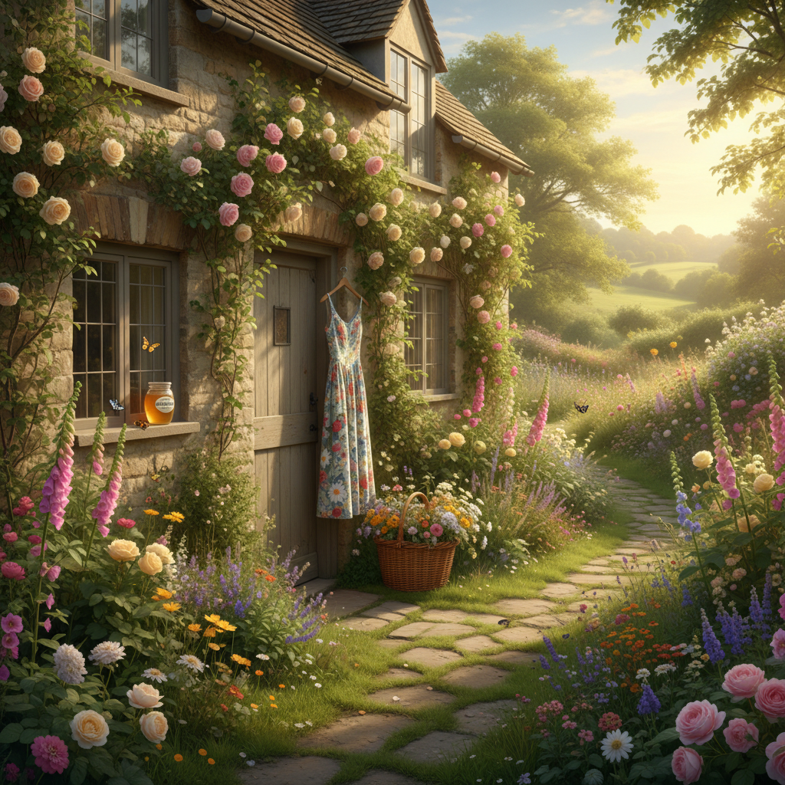
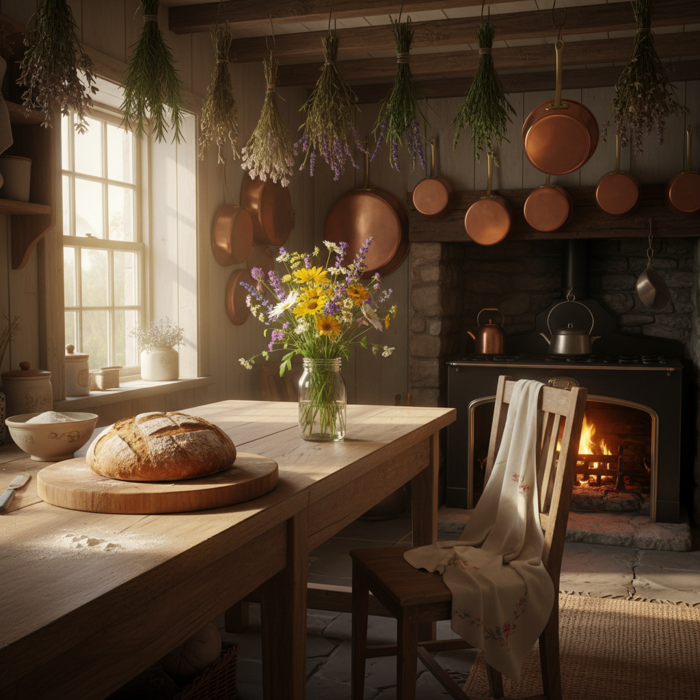

# Cottagecore 田园核





> **"逃离算法，回到祖母的花园——烤面包、摘野花、假装WiFi从未存在。"**

## 概述

| 维度 | 描述 |
|------|------|
| 时期 | 2018–至今（2020疫情期间爆发） |
| 别名 | Cottagecore, Farmcore, Countrycore, Grandmacore |
| 核心色彩 | 奶油白、草绿、麦穗金、薰衣草紫、泥土棕 |
| 关键元素 | 碎花裙、草帽、面包烘焙、野花、蘑菇、蜜蜂 |
| 代表人物 | Taylor Swift《folklore》、Studio Ghibli、Beatrix Potter |
| 关联风格 | Twee, Goblincore, Dark Academia, Forestcore |

---

## 历史脉络

### 2018–2019：Tumblr 与 Pinterest 的酝酿

Cottagecore 最初在 Tumblr 和 Pinterest 上以 #cottagecore 标签出现，是一种对数字时代的**浪漫化逃避主义**：

- 想象一种从未真正经历过的乡村生活
- 对工业化农业和城市生活的温和抗议
- 与 LGBTQ+ 社群的深度绑定（"两个女孩在乡下养羊"的乌托邦想象）

### 2020：疫情催化的爆发

COVID-19 封城是 Cottagecore 的决定性时刻：

- **物理隔离** → 对自然和户外的渴望
- **居家烘焙热潮** → 酸面包、饼干、果酱成为社交媒体内容
- **Taylor Swift《folklore》(2020.7)** → 将 Cottagecore 推入绝对主流
- **Animal Crossing: New Horizons** → 虚拟田园生活的完美载体
- **TikTok #cottagecore** → 超过 100 亿播放量

### 文化根源

Cottagecore 并非全新发明，它有深厚的文化根源：

| 来源 | 贡献 |
|------|------|
| 英国田园文学 | Jane Austen、Brontë 姐妹的乡村想象 |
| Arts & Crafts 运动 (1880s) | William Morris 对工业化的反抗 |
| Studio Ghibli | 《魔女宅急便》《哈尔的移动城堡》的欧洲乡村 |
| Beatrix Potter | Peter Rabbit 的英国乡村插画 |
| 70年代回归土地运动 | 嬉皮士的公社生活 |
| Hobbit/Shire 美学 | 托尔金笔下的夏尔田园 |

### 2022–至今：商业化与批评

Cottagecore 已经高度商业化：
- 快时尚品牌大量生产碎花裙
- "Cottagecore wedding" 成为婚礼趋势
- 批评声音：美化了历史上的农村贫困和劳动剥削
- 被指为"白人中产阶级的田园幻想"

---

## 视觉语法

### 色彩系统

```
主色（全部取自自然）：
  奶油白 (#FFFDD0) — 亚麻布、面粉、牛奶
  草绿 (#7CFC00) — 草地、藤蔓、苔藓
  麦穗金 (#DAA520) — 阳光、蜂蜜、小麦
  薰衣草 (#E6E6FA) — 花田、黄昏
  泥土棕 (#8B4513) — 木头、泥土、面包皮
  玫瑰粉 (#FFB7C5) — 花瓣、腮红

禁忌色：
  荧光色（太人工）
  纯黑（太都市）
  金属色（太科技）

质感：
  亚麻/棉麻 — 天然纤维
  陶土 — 手工制品
  木材 — 未上漆的原木
  干花 — 时间的痕迹
  蜡封 — 手写信的仪式感
```

### 标志性元素

| 类别 | 元素 |
|------|------|
| 服装 | 碎花长裙、灯笼袖衬衫、围裙、草帽 |
| 活动 | 烘焙面包、采摘野花、刺绣、读书、写信 |
| 动物 | 蘑菇、蜜蜂、蝴蝶、兔子、鹿、青蛙 |
| 空间 | 石头小屋、花园、温室、厨房、壁炉 |
| 食物 | 酸面包、果酱、蜂蜜、草莓、茶 |
| 物品 | 柳条篮、陶罐、蜡烛、干花、手写信 |
| 图案 | 碎花、格子（田园格）、蘑菇、藤蔓 |

---

## 与千禧怀旧的关系

Cottagecore 与千禧怀旧的关系是**反向互补**的：

### 逃离 vs 怀念
- **Vaporwave/Mallsoft** 怀念的是**消费空间**（商场、电子产品）
- **Cottagecore** 逃离的正是这些空间，回到"前消费主义"的想象

### 共同的情感内核
两者共享同一种情感：**对当下的不满，通过想象另一个时空来获得安慰**
- Vaporwave：想象一个永远停留在 1995 年的商场
- Cottagecore：想象一个从未被互联网触及的乡村

### Z世代的双重逃避
Z世代同时拥抱 Cottagecore 和数字怀旧，这并不矛盾：
- 周一到周五：在屏幕前工作/学习 → 怀念 Y2K 的互联网乐观主义
- 周末：想象逃离屏幕 → Cottagecore 的田园幻想
- 两者都是对"当下"的不满的不同出口

---

## 中国语境

Cottagecore 在中国的对应概念：

### "田园风"与"归隐"
- 李子柒的视频美学 = 中国版 Cottagecore 的极致表达
- 小红书上的"乡村生活"内容
- "躺平"文化中的田园想象
- 莫干山/大理/丽江的"逃离北上广"叙事

### 本土化差异
- 西方 Cottagecore：英国石头小屋、欧洲花园
- 中国版本：竹林、茶园、古镇、土灶、腌菜

---

## 设计应用

| 场景 | 应用方式 |
|------|----------|
| 品牌设计 | 手绘插画+自然色板+衬线字体 |
| 包装 | 牛皮纸+干花+蜡封+手写标签 |
| 摄影 | 自然光+浅景深+花朵/食物道具 |
| 空间 | 原木家具+亚麻布+陶器+绿植 |

---

## 延伸阅读

- Aesthetics Wiki: [Cottagecore](https://aesthetics.fandom.com/wiki/Cottagecore)
- Taylor Swift《folklore》视觉分析
- "Cottagecore and the Fantasy of Escape" 文化批评

---

## 相关风格

← [Twee 小清新独立](twee.md) | [Dark Academia 暗黑学院](dark-academia.md) →

↑ [返回千禧怀旧目录](README.md) | [返回总目录](../README.md)
