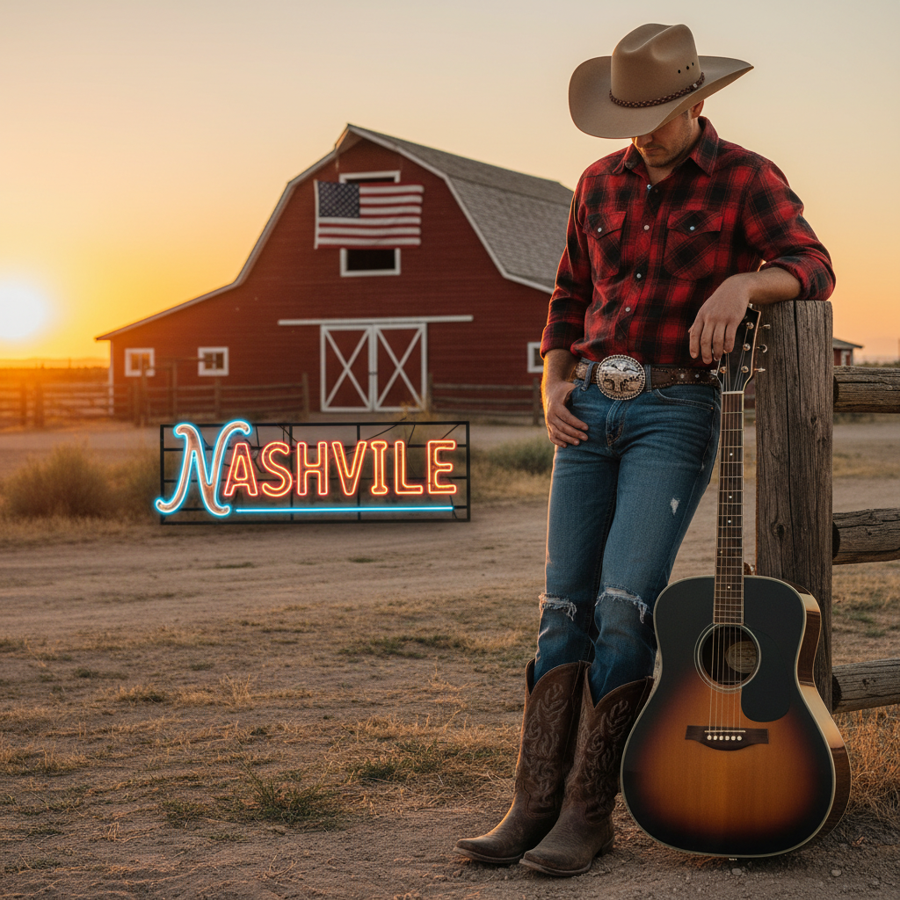

# Country Aesthetic 乡村美学



> **"牛仔帽、方格衬衫、木栅栏——Nashville 的黄金时代永不落幕。"**

## 概述

| 维度 | 描述 |
|------|------|
| 时期 | 1920s 起源 / 至今持续 / 2023 Beyoncé 复兴 |
| 别名 | Country, Western, Cowboy, Nashville |
| 核心色彩 | 棕色、米白、牛仔蓝、红色、金色 |
| 关键元素 | 牛仔帽、靴子、方格衬衫、木栅栏、马 |
| 代表人物 | Dolly Parton、Johnny Cash、Beyoncé (Cowboy Carter) |
| 关联风格 | Americana, Coastal Cowgirl, Western, Vintage |

---

## 历史脉络

### 从牧场到流行文化

| 年份 | 事件 |
|------|------|
| 1920s | 乡村音乐在美国南方成型 |
| 1950s | Nashville 成为乡村音乐之都 |
| 1969 | Johnny Cash "Man in Black" |
| 1980s | Urban Cowboy 运动 |
| 1990s | Garth Brooks 让乡村音乐主流化 |
| 2019 | Lil Nas X "Old Town Road"——乡村×嘻哈 |
| 2024 | Beyoncé《Cowboy Carter》——乡村音乐的多元化 |

### 核心哲学

Country Aesthetic 的精神是**"简单生活、诚实劳动、广阔天地"**：
- 土地 = 根（"我来自这片土地"）
- 简单 > 复杂
- 社区 > 个人
- "一把吉他、一辆卡车、一片天空"
- 传统、家庭、信仰

---

## 视觉语法

### 色彩系统

```
主色：
  棕色 (#8B4513) — 皮革、大地
  米白 (#F5F5DC) — 棉花、蕾丝
  牛仔蓝 (#4169E1) — 牛仔布
  红色 (#B22222) — 谷仓、格纹
  金色 (#DAA520) — 麦田、日落

辅色：
  绿色 (#228B22) — 牧场
  黑色 (#000000) — Johnny Cash
  天蓝 (#87CEEB) — 天空

质感：
  牛仔布 — 裤子、夹克
  皮革 — 靴子、马鞍
  格纹法兰绒 — 衬衫
  木材 — 栅栏、谷仓
  绳索 — 套索、装饰
```

### 标志性元素

| 类别 | 元素 |
|------|------|
| 服装 | 牛仔帽、方格衬衫、牛仔裤、流苏 |
| 鞋 | 牛仔靴（尖头、刺绣） |
| 配饰 | 皮带扣、bolo领带、bandana |
| 场景 | 牧场、谷仓、篝火、日落、公路 |
| 音乐 | 吉他、班卓琴、口琴 |
| 符号 | 马、仙人掌、星星、马蹄铁 |

---

## 与千禧怀旧的关系

### Beyoncé 效应 (2024)
- 《Cowboy Carter》= 乡村音乐的多元化宣言
- "黑人也是乡村音乐的一部分"
- 打破了乡村音乐的种族边界
- 让全球重新关注乡村美学

### Coastal Cowgirl 的兴起
- 2022–2023 "Coastal Cowgirl" 趋势
- 牛仔帽 + 比基尼 + 海滩
- 乡村美学的时尚化/性感化
- 从"乡土"到"时髦"的转变

---

## 中国语境

- "西部牛仔"在中国流行文化中的形象
- 与中国西部（新疆、内蒙）的视觉对话
- 牛仔帽/牛仔靴在中国时尚中的应用
- "乡村风"/"田园风"的中国版本

---

## 设计应用

| 场景 | 应用方式 |
|------|----------|
| 品牌 | 手写字体+皮革+木材+大地色 |
| 空间 | 木材+皮革+格纹+暖光+植物 |
| 时尚 | 牛仔+皮革+流苏+刺绣+靴子 |
| 活动 | 篝火+音乐+户外+社区+BBQ |

---

## 相关风格

← [Americana 美式复古](americana.md) | [Coastal Cowgirl 海岸牛仔女孩](coastal-cowgirl.md) →

↑ [返回千禧怀旧目录](README.md) | [返回总目录](../README.md)
