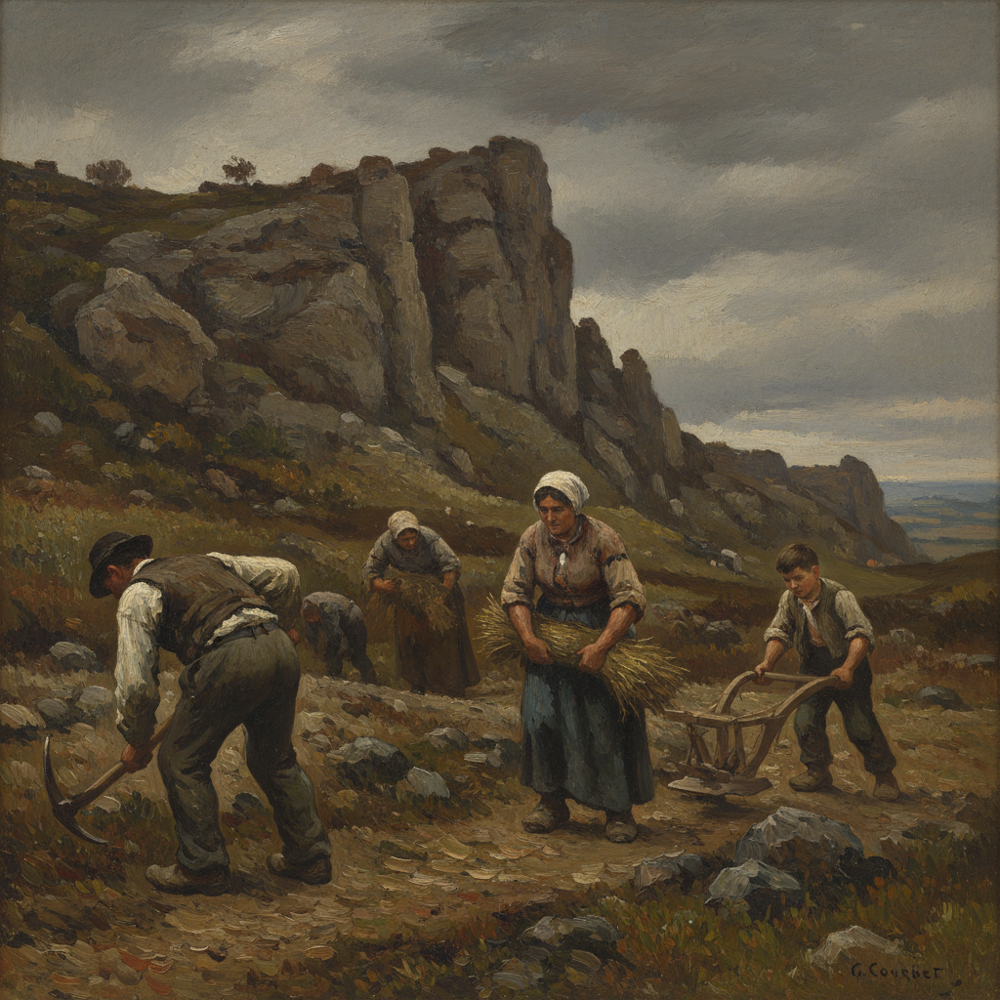

# Gustave Courbet 库尔贝

> "I have studied the art of the masters and the art of the moderns, avoiding any preconceived system and without prejudice." — Gustave Courbet

## 概述

居斯塔夫·库尔贝（Gustave Courbet，1819–1877）是法国现实主义运动的创始人和领袖。他拒绝学院派的理想化和浪漫主义的夸张，坚持只画自己亲眼所见的事物——农民、石匠、葬礼、裸体，以真实的尺度和真实的粗糙呈现。

库尔贝的宣言很简单："给我看一个天使，我就画一个天使。"他将绘画从神话和历史中解放出来，让它面对当下的现实。

## 核心特征

| 特征 | 描述 |
|------|------|
| 现实主义 | 只画亲眼所见——拒绝理想化 |
| 反学院 | 挑战沙龙的等级制度和题材限制 |
| 厚涂法 | 用调色刀大面积涂抹颜料 |
| 平民题材 | 农民、工人、日常生活的尊严 |
| 大尺幅 | 用历史画的尺寸画普通人 |
| 物质感 | 强调颜料本身的物质存在 |

## 视觉特征

- **笔触**：厚重的、调色刀涂抹的颜料层
- **色调**：深沉的土色——褐、灰、深绿
- **质感**：颜料的物质感——厚薄可见
- **光线**：自然的、不戏剧化的光线
- **人物**：真实比例的普通人——不美化
- **构图**：直接的、正面的呈现

## 代表作品

| 作品 | 年代 | 意义 |
|------|------|------|
| *A Burial at Ornans* | 1849–50 | 现实主义的宣言 |
| *The Stone Breakers* | 1849 | 劳动的尊严（毁于二战） |
| *The Origin of the World* | 1866 | 最大胆的裸体画 |
| *The Artist's Studio* | 1855 | "真实的寓言" |
| *The Wave* | 1869 | 自然力量的物质化 |

## 真实作品（公共领域）

| 作品 | 来源 |
|------|------|
| *A Burial at Ornans* | [Musée d'Orsay](https://www.musee-orsay.fr/en/artworks/un-enterrement-ornans-702) |
| *The Artist's Studio* | [Musée d'Orsay](https://www.musee-orsay.fr/en/artworks/latelier-du-peintre-702) |
| *The Wave* | [Met Museum](https://www.metmuseum.org/art/collection/search/436002) |

> ⚠️ 本条目优先使用真实作品。

## AI生成概念图

## 与其他风格的关系

- **Realism** → 现实主义运动的创始人
- **Manet** → 马奈直接继承了库尔贝的反叛
- **Impressionism** → 为印象派的户外写生铺路
- **Social Realism** → 社会现实主义的精神源头
