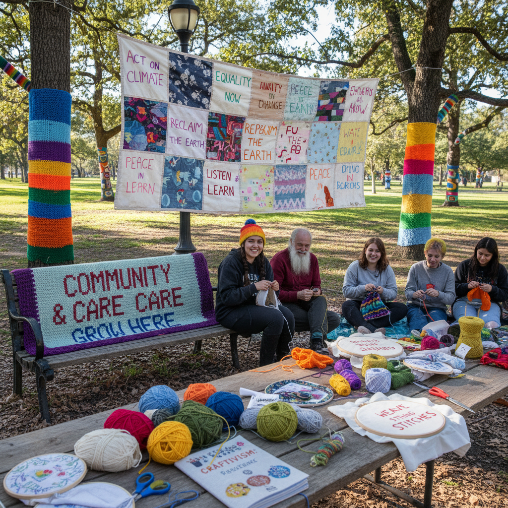

# Craft Activism Art 工艺行动主义艺术

> "Craft activism is the radical act of making things by hand in a world that has automated everything — the recognition that knitting a protest banner, quilting a political message, or yarn-bombing a tank is not merely cute or quaint but a genuine form of resistance, that the slow, patient, traditionally feminine labor of craft carries political weight precisely because it has been dismissed, that every stitch is a vote for a different kind of world, one made with care and attention rather than speed and profit, and that the most subversive thing you can do in a consumer society is to make something yourself." — Unknown

## 概述

工艺行动主义（Craft Activism / Craftivism）是将传统手工艺实践与社会和政治行动主义结合的运动。这个术语由Betsy Greer在2003年提出，指使用编织、刺绣、缝纫、拼布等传统工艺作为抗议、倡导和社区建设的工具。工艺行动主义挑战了"工艺是非政治的"和"行动主义必须是激烈的"这两个假设。

工艺行动主义的实践包括：1）纱线轰炸（Yarn Bombing）——用编织物覆盖公共空间的物体；2）抗议编织——为抗议活动编织横幅和标语；3）政治刺绣——将政治信息绣在织物上；4）社区缝纫——通过集体手工艺建设社区；5）修补运动——通过修补衣物来抵抗快时尚。工艺行动主义有明确的女性主义维度——它重新评价了被贬低为"女性工作"的手工艺实践，将其转化为政治表达的工具。

## 核心特征

| 特征 | 描述 |
|------|------|
| 手工 | 手工制作的政治性 |
| 慢 | 慢速的抵抗 |
| 女性 | 女性主义的维度 |
| 社区 | 社区的建设 |
| 温和 | 温和的激进主义 |
| DIY | DIY精神 |

## 视觉特征

- **纱线**：彩色的纱线和织物
- **文字**：绣出的政治文字
- **覆盖**：覆盖公共物体
- **手工**：明显的手工痕迹
- **色彩**：温暖的手工色彩
- **集体**：集体创作的痕迹

## 代表作品

| 作品 | 艺术家 | 年代 | 意义 |
|------|--------|------|------|
| *Yarn bombing* | Magda Sayeg | 2005 | 纱线轰炸的先驱 |
| *Pussyhat Project* | Krista Suh & Jayna Zweiman | 2017 | 编织作为抗议 |
| *Craftivism* book | Betsy Greer | 2014 | 运动的理论化 |
| *Cross-stitch protests* | Various | 2010年代 | 十字绣抗议 |
| *Visible mending* | Various | 2020年代 | 可见修补运动 |

## 历史时间线

| 时期 | 事件 |
|------|------|
| 2003 | Betsy Greer提出"Craftivism" |
| 2005 | 纱线轰炸运动的兴起 |
| 2010年代 | 工艺行动主义的全球化 |
| 2017 | Pussyhat运动 |
| 当代 | 气候行动中的工艺 |

## 中国语境

工艺行动主义在中国有独特的表现形式。中国有丰富的手工艺传统——刺绣、编织、剪纸、布艺——这些传统在当代语境中获得了新的政治和社会意义。中国的一些艺术家和社区组织者在使用传统手工艺作为社区建设和文化保护的工具——如组织农村妇女的刺绣合作社、通过手工艺项目保护少数民族文化、或用传统工艺创作关于环境和社会议题的作品。中国的"慢生活"和"手作"运动也与工艺行动主义有精神上的联系——通过手工制作来抵抗消费主义和快节奏生活。中国的一些年轻人通过手工艺社群（如编织小组、刺绣工作坊）建立社区连接，这本身就是一种温和的社会行动。

## AI生成概念图

## 与其他风格的关系

- **Feminist Art** → 女性主义艺术
- **Textile Art** → 纺织艺术
- **Street Art** → 街头艺术
- **Community Art** → 社区艺术
- **Slow Movement** → 慢运动
- **DIY Culture** → DIY文化

---

*浮光艺志 | Chronicle of Artistry*
