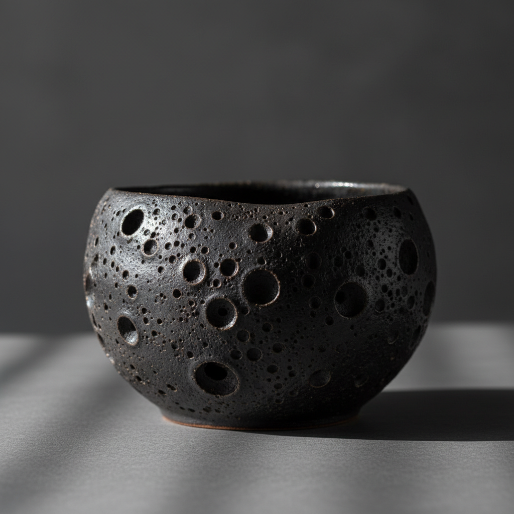

# Crater Glaze Art 火山釉艺术

> "Crater glaze is the moon's surface brought to earth — a glaze loaded withite calcium orite silicon carbide that boils and bubbles violently during firing, each bubble bursting and freezing mid-eruption as the kiln cools, leaving behind a landscape of craters and volcanic pits that catch shadow and light like a miniature alien terrain, the violence of the fire preserved in permanent geological calm." — Unknown

## 概述

火山釉艺术（Crater Glaze Art）是一种通过在釉料中添加产气物质（如碳化硅、�ite碳酸钙等），使釉面在烧制过程中产生大量气泡，气泡破裂后形成火山口状凹坑的陶瓷釉料技法。火山釉的表面如月球表面或火山地貌——布满大小不一的圆形凹坑，每个凹坑都是一个冻结的气泡破裂瞬间，形成独特的地质景观般的纹理。

火山釉艺术的核心要素包括：1）产气剂——碳化硅、碳酸钙等在高温下产生气体的物质；2）高温熔融——釉料在高温下完全熔化成液态；3）气泡形成——产气剂释放气体形成气泡；4）气泡破裂——气泡在釉面破裂形成凹坑；5）冻结效果——冷却时凹坑被冻结保留；6）厚施釉——厚层施釉增强效果；7）表面质感——粗犷的月球表面般质感。

## 核心特征

| 特征 | 描述 |
|------|------|
| 火山口凹坑 | 气泡破裂形成的圆形凹坑 |
| 月球表面 | 如月球地貌的粗犷质感 |
| 产气反应 | 釉中物质在高温下产气 |
| 厚重釉层 | 需要厚层施釉 |
| 地质美感 | 如自然地貌的纹理 |
| 触感丰富 | 凹凸不平的立体表面 |

## 视觉特征

- **圆形凹坑**：大小不一的火山口状凹坑
- **月球质感**：如月球表面的粗犷纹理
- **厚重感**：厚实的釉层体量
- **阴影效果**：凹坑中的光影变化
- **熔岩流**：釉料流动的痕迹
- **原始力量**：粗犷有力的视觉冲击

## 代表作品

| 作品 | 艺术家/文化 | 年代 | 意义 |
|------|-------------|------|------|
| *Beatrice Wood火山釉* | Beatrice Wood | 20世纪 | 火山釉先驱 |
| *当代火山釉花瓶* | 各地陶艺家 | 当代 | 当代火山釉创作 |
| *月球表面系列* | 当代陶艺家 | 当代 | 月球质感探索 |
| *火山釉茶器* | 日本陶艺家 | 当代 | 茶道中的火山釉 |
| *大型火山釉雕塑* | 当代陶艺家 | 当代 | 火山釉的雕塑应用 |

## 历史时间线

| 时期 | 事件 |
|------|------|
| 古代 | 火山釉效果作为偶然现象出现 |
| 20世纪初 | 有意识地开发火山釉配方 |
| 1950年代 | 工作室陶艺中火山釉的探索 |
| 1970年代 | 火山釉配方的系统化研究 |
| 当代 | 火山釉作为成熟的装饰技法 |

## 中国语境

火山釉在中国当代陶艺中有广泛的应用。中国传统陶瓷中的某些"窑变"效果——如釉面上的气泡痕迹——可以被视为火山釉的自然前身。中国当代陶艺家在火山釉领域进行了大量实验，开发出各种独特的配方和效果。火山釉的粗犷质感与中国当代艺术中对"原始力量"的追求相呼应。在中国的陶瓷市场中，火山釉茶器和花器因其独特的触感和视觉效果而受到收藏者的欢迎。

## AI生成概念图

## 与其他风格的关系

- **Crawl Glaze** → 缩釉
- **Volcanic Art** → 火山美学
- **Texture Art** → 肌理艺术
- **Lunar Art** → 月球美学
- **Brutalism** → 粗野主义
- **Studio Pottery** → 工作室陶艺

---

*浮光艺志 | Chronicle of Artistry*
