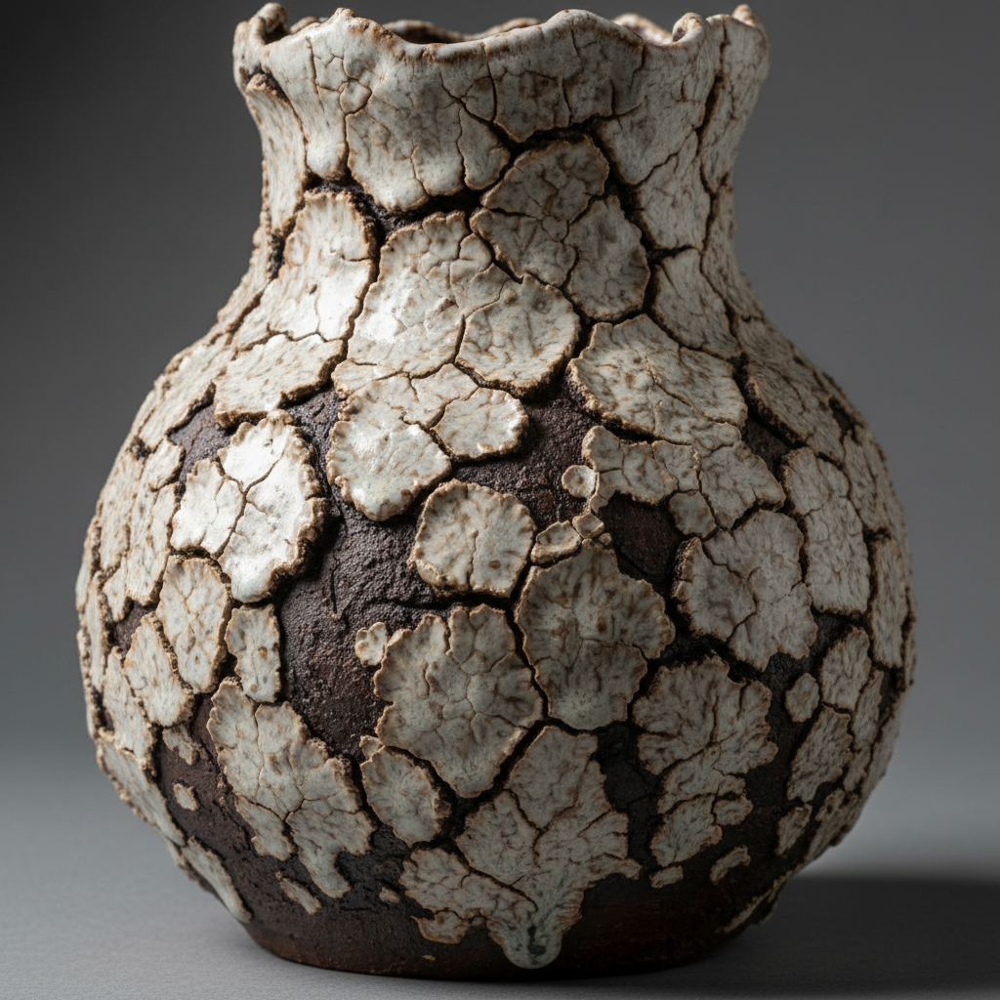

# Crawl Glaze Art 缩釉艺术

> "Crawl glaze is controlled imperfection — a glaze formulated to shrink and pull apart during firing, breaking into islands and rivulets that reveal the clay body beneath like dry earth cracking in summer heat, each fissure and bead a deliberate embrace of what conventional ceramics would call a defect, transformed by intention into a texture of primal, volcanic beauty." — Unknown

## 概述

缩釉艺术（Crawl Glaze Art）是一种利用釉料在烧制过程中收缩、开裂和聚集的特性来创造独特纹理效果的陶瓷技法。缩釉（也称爬釉、缩缩釉）是传统陶瓷中被视为缺陷的现象——釉料在熔融时收缩拉开，露出下方的坯体或底釉。但在当代陶艺中，这种"缺陷"被有意利用，通过特殊配方使釉料产生可控的缩釉效果，形成如火山岩、干裂大地或珊瑚般的独特质感。

缩釉艺术的核心要素包括：1）高收缩配方——使用高比例的高岭土或氧化镁；2）厚施釉——厚层施釉增加收缩效果；3）干燥控制——控制干燥速度影响裂纹形态；4）双层釉——底釉与缩釉的组合效果；5）温度选择——不同温度产生不同缩釉效果；6）纹理变化——从细密裂纹到大块岛状的变化；7）触感丰富——立体的表面触感。

## 核心特征

| 特征 | 描述 |
|------|------|
| 釉面收缩 | 釉料在烧制中收缩开裂 |
| 露底效果 | 釉层拉开露出坯体或底釉 |
| 火山质感 | 如火山岩般的粗犷纹理 |
| 可控缺陷 | 将缺陷转化为装饰 |
| 立体触感 | 凹凸不平的表面质感 |
| 自然美 | 如自然地貌的有机图案 |

## 视觉特征

- **岛状分布**：釉料聚集成岛状块
- **裂缝网络**：釉层间的裂缝露出底色
- **珠状聚集**：釉料收缩成珠状
- **火山纹理**：如熔岩凝固的粗犷质感
- **双色对比**：缩釉与底色的对比
- **立体浮雕**：凸起的釉面形成浮雕效果

## 代表作品

| 作品 | 艺术家/文化 | 年代 | 意义 |
|------|-------------|------|------|
| *Peter Voulkos缩釉作品* | Peter Voulkos | 20世纪 | 抽象表现主义陶瓷 |
| *当代缩釉花器* | 各地陶艺家 | 当代 | 当代缩釉创作 |
| *火山釉系列* | 当代陶艺家 | 当代 | 火山质感探索 |
| *缩釉茶器* | 日本陶艺家 | 当代 | 茶道中的缩釉美学 |
| *大型缩釉雕塑* | 当代陶艺家 | 当代 | 缩釉的雕塑应用 |

## 历史时间线

| 时期 | 事件 |
|------|------|
| 古代 | 缩釉作为烧制缺陷出现 |
| 宋代 | 中国某些窑口的缩釉被欣赏 |
| 20世纪中期 | 缩釉被有意用于艺术创作 |
| 1960年代 | 抽象表现主义陶瓷中的缩釉 |
| 当代 | 缩釉作为成熟的装饰技法 |

## 中国语境

缩釉在中国陶瓷史上有特殊的地位。中国传统陶瓷中，缩釉通常被视为缺陷，但某些情况下也被欣赏——如宋代某些窑口的"蟹爪纹"就是一种轻微的缩釉效果。中国当代陶艺家开始有意识地利用缩釉效果进行创作，将传统的"缺陷"转化为独特的美学语言。这与中国传统美学中"化腐朽为神奇"的理念相通。中国陶瓷教育中，缩釉的成因和控制是釉料学的重要内容。

## AI生成概念图

## 与其他风格的关系

- **Crater Glaze** → 火山釉
- **Texture Art** → 肌理艺术
- **Wabi-Sabi** → 侘寂美学
- **Abstract Expressionism** → 抽象表现主义
- **Volcanic Art** → 火山美学
- **Defect Aesthetics** → 缺陷美学

---

*浮光艺志 | Chronicle of Artistry*
