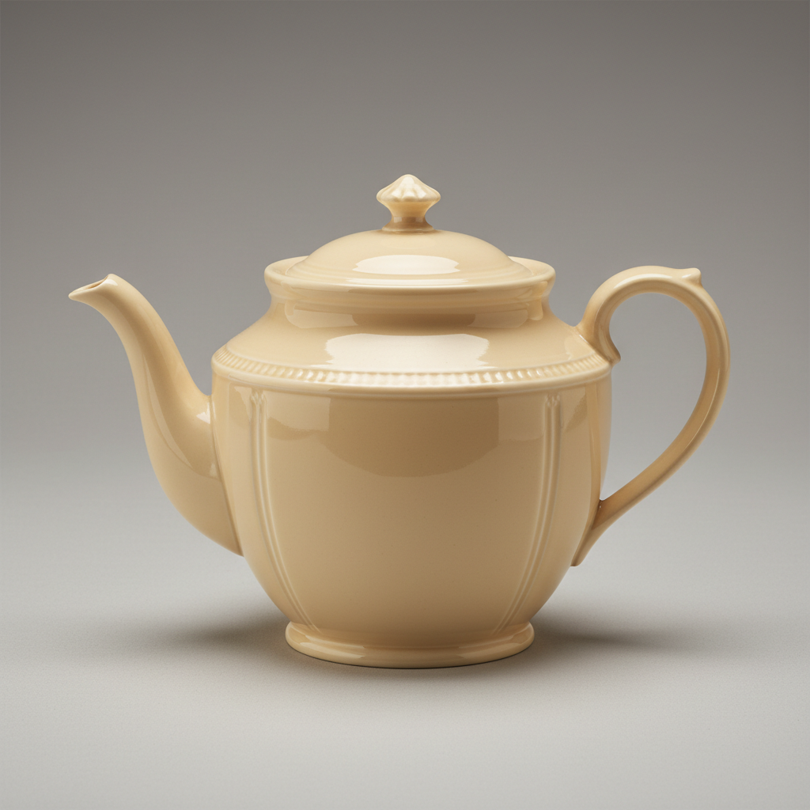

# Creamware Art 奶油色陶艺

> "Creamware is elegance democratized — Josiah Wedgwood's refined cream-colored earthenware brought the look of porcelain to every middle-class table at a fraction of the cost, its smooth pale body and clear lead glaze providing a perfect canvas for painted decoration, transfer printing, or the simple beauty of its own warm ivory tone, revolutionizing the pottery industry and earning the name Queen's Ware from royal patronage." — Unknown

## 概述

奶油色陶艺（Creamware Art）是18世纪英国发展出的一种精细陶器——以其温暖的奶油色调、光滑的表面和透明的铅釉著称。乔赛亚·韦奇伍德（Josiah Wedgwood）将奶油色陶器发展到极致，获得了夏洛特王后的赞助而命名为"女王陶器"（Queen's Ware）。奶油色陶器以其优雅的外观和相对低廉的价格，使精美餐具进入了普通家庭。

奶油色陶艺的实践包括：1）配方——精细的粘土和石英配方；2）成型——模具成型或轮制；3）素烧——初次烧制；4）施釉——施加透明铅釉；5）釉烧——二次烧制；6）装饰——手绘、转印或浮雕装饰；7）当代奶油色陶——将传统工艺与现代设计结合。

## 核心特征

| 特征 | 描述 |
|------|------|
| 奶油色 | 温暖的奶油色调 |
| 精细 | 精细的陶器质地 |
| 透明釉 | 透明的铅釉 |
| 韦奇伍德 | 韦奇伍德的代表产品 |
| 平民化 | 使精美陶器平民化 |
| 英国 | 18世纪英国的发明 |

## 视觉特征

- **奶油色**：温暖的象牙/奶油色调
- **光滑**：光滑精细的表面
- **光泽**：透明釉的温润光泽
- **优雅**：优雅简洁的造型
- **轻薄**：相对轻薄的器壁
- **温暖**：温暖的整体色调

## 代表作品

| 作品 | 艺术家/文化 | 年代 | 意义 |
|------|-------------|------|------|
| *Wedgwood Queen's Ware* | 英国 | 1760年代起 | 韦奇伍德女王陶器 |
| *Leeds creamware* | 英国 | 18世纪 | 利兹奶油色陶 |
| *Staffordshire creamware* | 英国 | 18世纪 | 斯塔福德郡奶油色陶 |
| *Swedish Rörstrand creamware* | 瑞典 | 18世纪 | 瑞典罗斯特兰德奶油色陶 |
| *Contemporary creamware* | 国际 | 当代 | 当代奶油色陶 |

## 历史时间线

| 时期 | 事件 |
|------|------|
| 1740年代 | 奶油色陶器的早期发展 |
| 1760年代 | 韦奇伍德完善奶油色陶 |
| 1765年 | 获得"女王陶器"称号 |
| 18世纪后期 | 奶油色陶器的全欧洲传播 |
| 当代 | 奶油色陶器的持续生产 |

## 中国语境

奶油色陶器与中国的陶瓷传统有一定的关联。中国的白瓷——是欧洲陶瓷工业试图模仿的目标，奶油色陶是这一过程中的重要步骤。中国的德化白瓷——其温暖的象牙色调与奶油色陶有相似的审美。中国的陶瓷出口——对英国陶瓷工业的发展有间接的推动作用。中国的陶瓷教育中，韦奇伍德和奶油色陶作为工业革命时期陶瓷史的重要内容——在相关课程中介绍。中国的陶瓷收藏界——对韦奇伍德的历史产品有一定的了解和收藏。

## AI生成概念图

## 与其他风格的关系

- **Wedgwood** → 韦奇伍德
- **Jasperware** → 碧玉陶
- **Transferware** → 转印陶
- **Porcelain** → 瓷器
- **Industrial Ceramics** → 工业陶瓷
- **Neoclassical** → 新古典主义

---

*浮光艺志 | Chronicle of Artistry*
