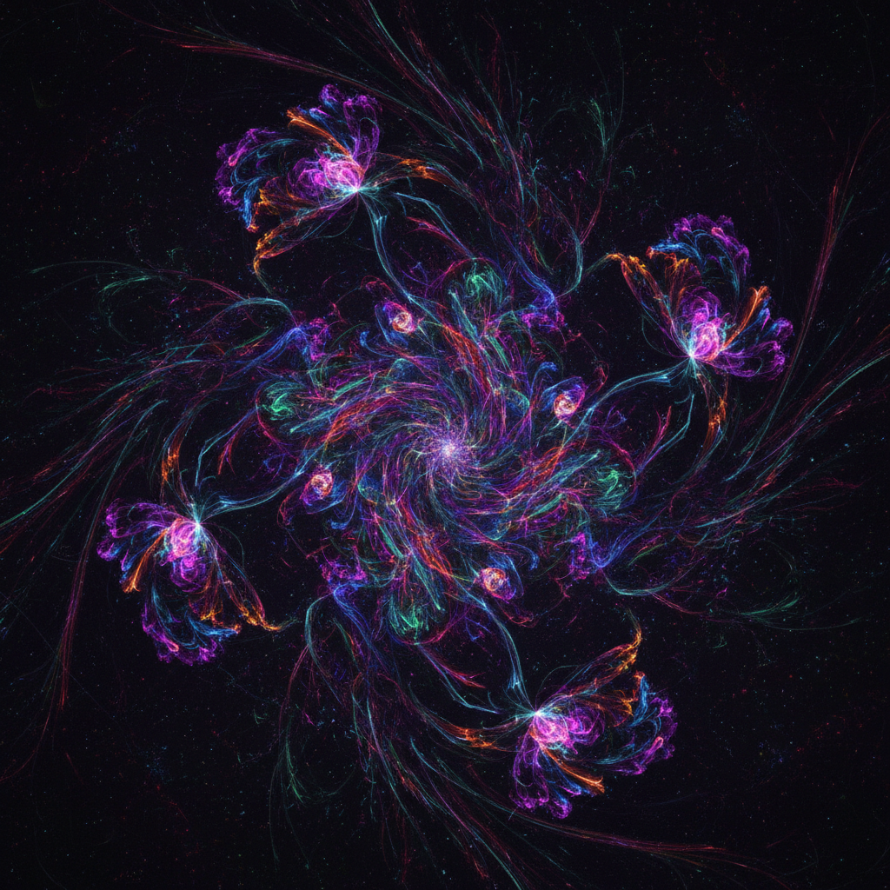

# Creative Coding 创意编程

> **时期：** 2001–至今  
> **关键词：** Processing、代码素描、生成式设计、互动艺术、开源工具

## 概述

创意编程（Creative Coding）是以编程作为创造性表达工具的实践——代码不是为了解决工程问题，而是为了创造美、探索模式、生成意外。从Processing语言的诞生（2001）到p5.js、openFrameworks、TouchDesigner等工具的普及，创意编程降低了技术门槛，让设计师和艺术家能够用代码作为画笔。

## 风格特征

- **代码素描**：快速迭代的视觉实验
- **参数化**：通过调整变量探索无限变体
- **互动性**：响应鼠标、摄像头、传感器的实时作品
- **开源共享**：代码公开，社区协作
- **跨学科**：数学、自然、音乐的可视化

## 代表人物与作品

- Casey Reas & Ben Fry（Processing创始人）
- Zach Lieberman（openFrameworks）
- Daniel Shiffman《The Nature of Code》
- Manolo Gamboa Naon 生成式插画

## 概念图

