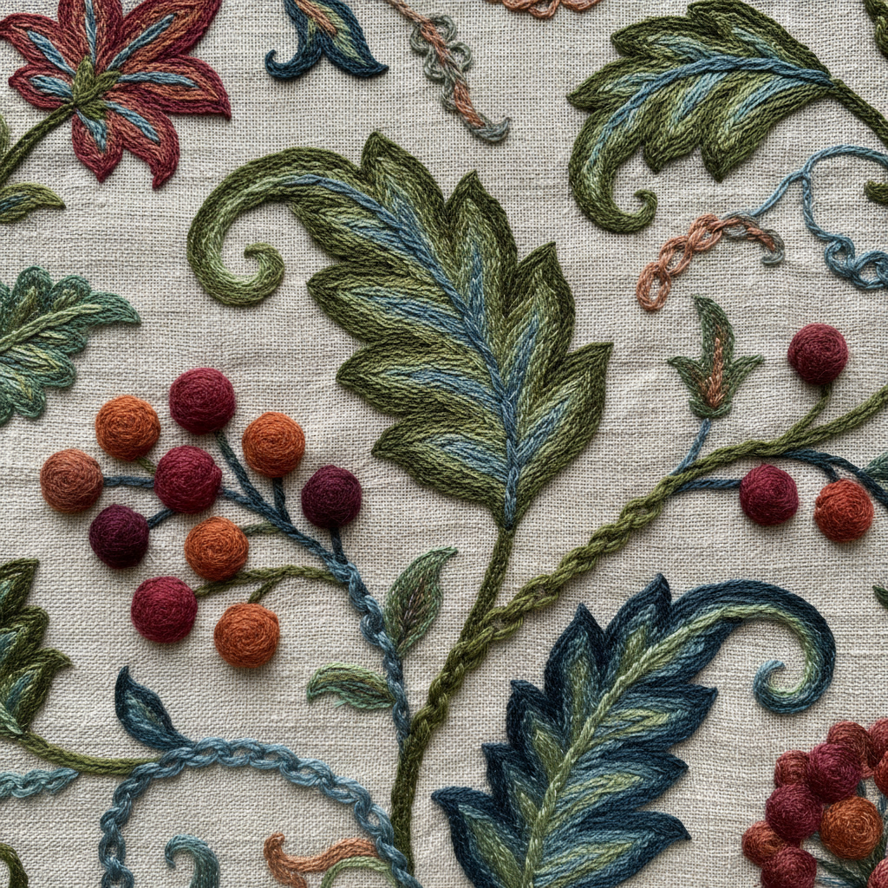

# Crewel Art 毛线刺绣艺术

> "Crewel is painting with wool — a two-ply worsted yarn worked in free-form stitches on linen twill, building landscapes of texture from smooth satin to looped French knots. Unlike counted-thread work, crewel follows drawn designs with the freedom of a brush, filling leaves with long-and-short shading and stems with chain stitch trails that wind across the cloth like living vines." — Unknown

## 概述

毛线刺绣艺术（Crewel Art）是一种使用毛线（crewel wool，细羊毛纱线）在亚麻布或棉布上进行自由刺绣的传统技法。与十字绣等计数绣不同，毛线刺绣遵循预先绘制的图案，使用多种针法自由填充——包括长短针、链式针、茎针、法式结粒等，创造出丰富的纹理和色彩效果。

毛线刺绣艺术的实践包括：1）长短针（Long and Short Stitch）——渐变色彩填充；2）链式针（Chain Stitch）——线条和轮廓；3）茎针（Stem Stitch）——茎干和线条；4）法式结粒（French Knots）——点状纹理；5）铺针（Laid Work）——大面积填充；6）Jacobean设计——经典的花卉和藤蔓图案；7）当代毛线刺绣——将传统技法与现代设计结合的创作。

## 核心特征

| 特征 | 描述 |
|------|------|
| 毛线 | 使用细羊毛纱线 |
| 自由 | 自由刺绣不计数 |
| 纹理 | 丰富的纹理效果 |
| 花卉 | 经典花卉图案 |
| 英式 | 英国刺绣传统 |
| 多针 | 多种针法组合 |

## 视觉特征

- **纹理**：丰富的毛线纹理
- **色彩**：柔和的色彩渐变
- **自然**：自然主义的花卉
- **流动**：流动的藤蔓线条
- **温暖**：毛线的温暖质感
- **层次**：多层次的针法效果

## 代表作品

| 作品 | 艺术家/文化 | 年代 | 意义 |
|------|-------------|------|------|
| *Bayeux Tapestry* | 英国/法国 | 11世纪 | 贝叶挂毯（实为毛线刺绣） |
| *Jacobean crewelwork* | 英国 | 17世纪 | 雅各宾时期毛线刺绣 |
| *Tree of Life designs* | 英国 | 17-18世纪 | 生命之树图案 |
| *Royal School of Needlework* | 英国 | 1872年起 | 皇家刺绣学校作品 |
| *Contemporary crewel* | 国际 | 当代 | 当代毛线刺绣 |

## 历史时间线

| 时期 | 事件 |
|------|------|
| 11世纪 | 贝叶挂毯的制作 |
| 17世纪 | Jacobean毛线刺绣的黄金时代 |
| 18世纪 | 殖民地美国的毛线刺绣 |
| 维多利亚时代 | 毛线刺绣的复兴 |
| 当代 | 毛线刺绣的现代化发展 |

## 中国语境

毛线刺绣在中国有一定的认知和实践。中国传统刺绣以丝线为主——但毛线刺绣作为一种西方技法在近代传入中国。中国的手工爱好者群体中，毛线刺绣（crewel）作为一种休闲手工——近年来获得越来越多的关注。中国的刺绣传统中，打籽绣与法式结粒类似——长短针与中国的套针有相通之处。中国当代的纤维艺术家将毛线刺绣与中国传统刺绣技法结合——创造出融合东西方的作品。中国的手工教育中，毛线刺绣作为入门级刺绣技法——因其材料易得和针法多样而受欢迎。

## AI生成概念图

## 与其他风格的关系

- **Goldwork Embroidery** → 金线刺绣
- **Stumpwork** → 立体刺绣
- **Cross Stitch** → 十字绣
- **Textile Art** → 纺织艺术
- **Jacobean Design** → 雅各宾设计
- **Needlepainting** → 针绣画

---

*浮光艺志 | Chronicle of Artistry*
