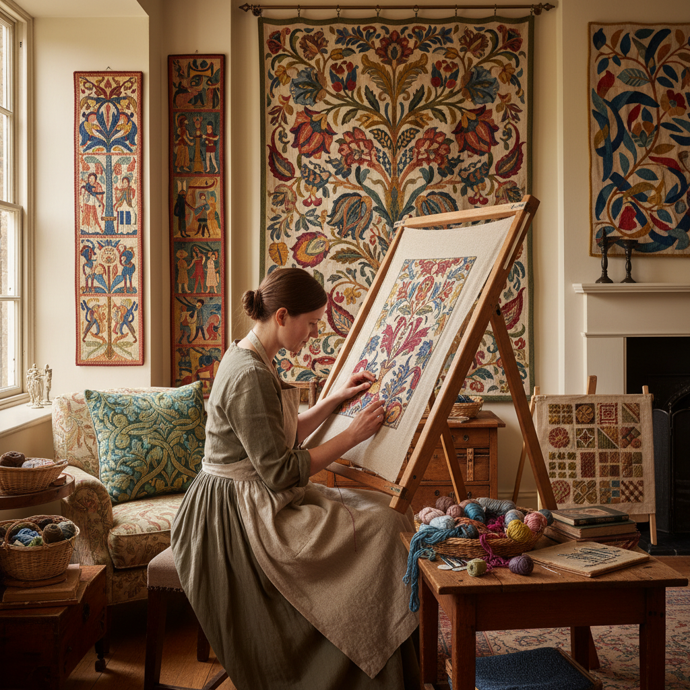

# Crewel Embroidery 毛线刺绣

> "Crewel is painting with wool — a twisted two-ply yarn worked in dozens of stitches on linen twill, creating surfaces of extraordinary texture where satin stitch gleams beside chain stitch texture, where laid work fills broad leaves and French knots dot flower centers, all in the rich muted palette of naturally dyed wool." — Unknown

## 概述

毛线刺绣（Crewel Embroidery/Crewelwork）是一种使用毛线（crewel wool——一种细的双股加捻毛线）在亚麻斜纹布（linen twill）上进行的刺绣技法。Crewel一词来自中古英语"crule"（卷曲的线）。毛线刺绣使用多种针法——缎面针（satin stitch）、链式针（chain stitch）、铺线针（laid work）、法国结（French knots）、茎针（stem stitch）等——创造出丰富的纹理效果。

毛线刺绣的历史可以追溯到中世纪——贝叶挂毯（Bayeux Tapestry，约1070年）实际上是用毛线在亚麻布上的刺绣作品。毛线刺绣在17世纪的英国达到鼎盛——雅各宾风格（Jacobean style）的毛线刺绣以其华丽的花卉和"生命之树"图案闻名。这种风格随英国殖民者传播到美洲。当代毛线刺绣在传统和现代设计中都有活跃的实践。

## 核心特征

| 特征 | 描述 |
|------|------|
| 毛线 | 使用crewel毛线 |
| 亚麻 | 亚麻斜纹布基底 |
| 多针法 | 使用多种针法 |
| 纹理 | 丰富的纹理效果 |
| 花卉 | 传统花卉图案 |
| 英式 | 英国传统技艺 |

## 视觉特征

- **纹理**：多种针法的丰富纹理
- **色彩**：毛线的柔和色彩
- **花卉**：华丽的花卉图案
- **流动**：藤蔓的流动线条
- **立体**：针法的立体效果
- **温暖**：毛线的温暖质感

## 代表作品

| 作品 | 艺术家 | 年代 | 意义 |
|------|--------|------|------|
| *Bayeux Tapestry* | Unknown | 约1070年 | 贝叶挂毯 |
| *Jacobean crewelwork* | 英国工匠 | 17世纪 | 雅各宾毛线刺绣 |
| *Tree of Life hangings* | Various | 17-18世纪 | 生命之树壁挂 |
| *William Morris designs* | William Morris | 19世纪 | 工艺美术运动 |
| *Contemporary crewel* | Various | 当代 | 当代毛线刺绣 |

## 历史时间线

| 时期 | 事件 |
|------|------|
| 中世纪 | 贝叶挂毯等早期毛线刺绣 |
| 17世纪 | 雅各宾风格的鼎盛 |
| 18世纪 | 毛线刺绣在美洲的传播 |
| 19世纪 | 工艺美术运动的复兴 |
| 当代 | 毛线刺绣的持续创新 |

## 中国语境

毛线刺绣在中国相对小众，但中国有自己的毛线绣传统——中国的"绒绣"使用毛线在网格布上刺绣，与crewel有相似之处。上海的绒绣曾是重要的出口工艺品。当代中国的刺绣爱好者通过网络和书籍学习英式毛线刺绣。中国的手工材料市场上有crewel毛线和亚麻布的供应。毛线刺绣的丰富纹理效果吸引了中国的纤维艺术爱好者。

## AI生成概念图

## 与其他风格的关系

- **Embroidery** → 刺绣
- **Needle Painting** → 针绣绘画
- **Goldwork** → 金线刺绣
- **Stumpwork** → 立体刺绣
- **Textile Art** → 纺织艺术
- **Arts & Crafts** → 工艺美术运动

---

*浮光艺志 | Chronicle of Artistry*
