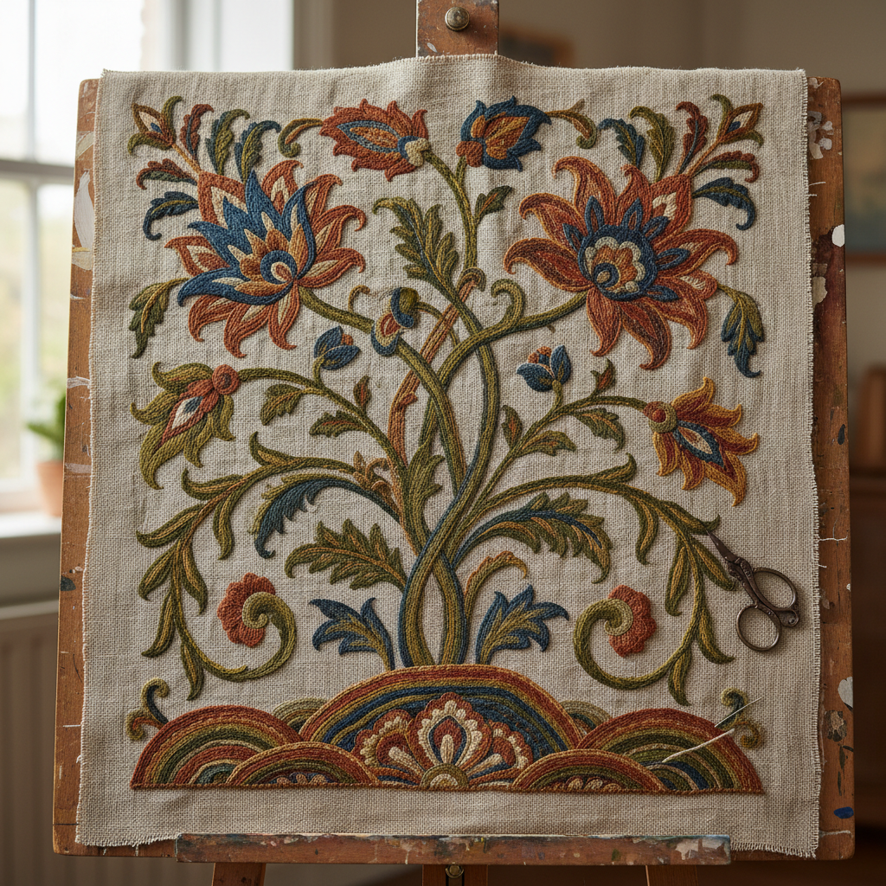

# Crewelwork Art 毛线绣艺术

> "Crewel embroidery is painting with wool — using a fine two-ply worsted yarn on linen twill, the embroiderer builds up flowing designs of leaves, flowers, and fantastical creatures with a vocabulary of textured stitches that give each element its own character. The Jacobean tree of life, with its exotic blooms and curling tendrils, is crewelwork's most iconic motif — a celebration of nature filtered through imagination." — Unknown

## 概述

毛线绣艺术（Crewelwork Art）是使用细毛线（crewel wool）在亚麻斜纹布上进行刺绣的传统技法——以其丰富的针法变化、流动的植物图案和独特的纹理效果著称。毛线绣是英国最具代表性的刺绣传统之一，尤其以17世纪雅各宾时期的"生命之树"图案闻名。

毛线绣艺术的实践包括：1）长短针——创造渐变色彩效果；2）锁链针——勾勒轮廓和填充；3）茎针——绣制茎干和线条；4）法国结——创造点状纹理；5）铺针——大面积填充；6）编织针——创造编织纹理效果；7）当代毛线绣——将传统技法与现代设计结合的创作。

## 核心特征

| 特征 | 描述 |
|------|------|
| 毛线 | 使用细毛线材料 |
| 纹理 | 丰富的纹理变化 |
| 植物 | 以植物图案为主 |
| 流动 | 流动的曲线设计 |
| 英式 | 英国刺绣传统 |
| 多针 | 使用多种针法 |

## 视觉特征

- **流动**：曲线和卷须的流动感
- **纹理**：不同针法的纹理对比
- **色彩**：毛线的柔和色彩
- **立体**：毛线的微妙立体感
- **自然**：自然主义的植物图案
- **丰富**：密集丰富的装饰效果

## 代表作品

| 作品 | 艺术家/文化 | 年代 | 意义 |
|------|-------------|------|------|
| *Jacobean Tree of Life* | 英国 | 17世纪 | 雅各宾生命之树 |
| *Bayeux Tapestry* | 英国/法国 | 11世纪 | 贝叶挂毯（毛线绣） |
| *William Morris designs* | 英国 | 19世纪 | 莫里斯设计 |
| *Royal School of Needlework* | 英国 | 19世纪至今 | 皇家刺绣学校 |
| *Contemporary crewel* | 当代 | 当代 | 当代毛线绣 |

## 历史时间线

| 时期 | 事件 |
|------|------|
| 11世纪 | 贝叶挂毯（最早的毛线绣） |
| 17世纪 | 雅各宾毛线绣的黄金时代 |
| 18世纪 | 毛线绣在北美的传播 |
| 19世纪 | 艺术与工艺运动的复兴 |
| 当代 | 毛线绣的现代化和创新 |

## 中国语境

毛线绣艺术在中国有一定的爱好者群体。中国传统刺绣主要使用丝线，但毛线绣作为一种不同的质感表达正在获得关注。中国的一些刺绣工作室开始教授毛线绣技法——将其作为拓展刺绣技能和创作可能性的选择。中国的家居装饰市场中，毛线绣风格的靠垫和挂画正在流行——以其温暖的质感和自然主义的图案受到欢迎。中国的一些设计师将毛线绣的植物图案与中国传统花卉图案结合——创造具有东方韵味的毛线绣作品。中国的手工艺社区中，毛线绣作为一种放松和创意活动正在普及——因为其相对宽容的材料和丰富的表现力。

## AI生成概念图

## 与其他风格的关系

- **Goldwork** → 金线绣
- **Stumpwork** → 立体绣
- **Jacobean Art** → 雅各宾艺术
- **Arts and Crafts** → 艺术与工艺运动
- **Textile Art** → 纺织艺术
- **Embroidery** → 刺绣艺术

---

*浮光艺志 | Chronicle of Artistry*
