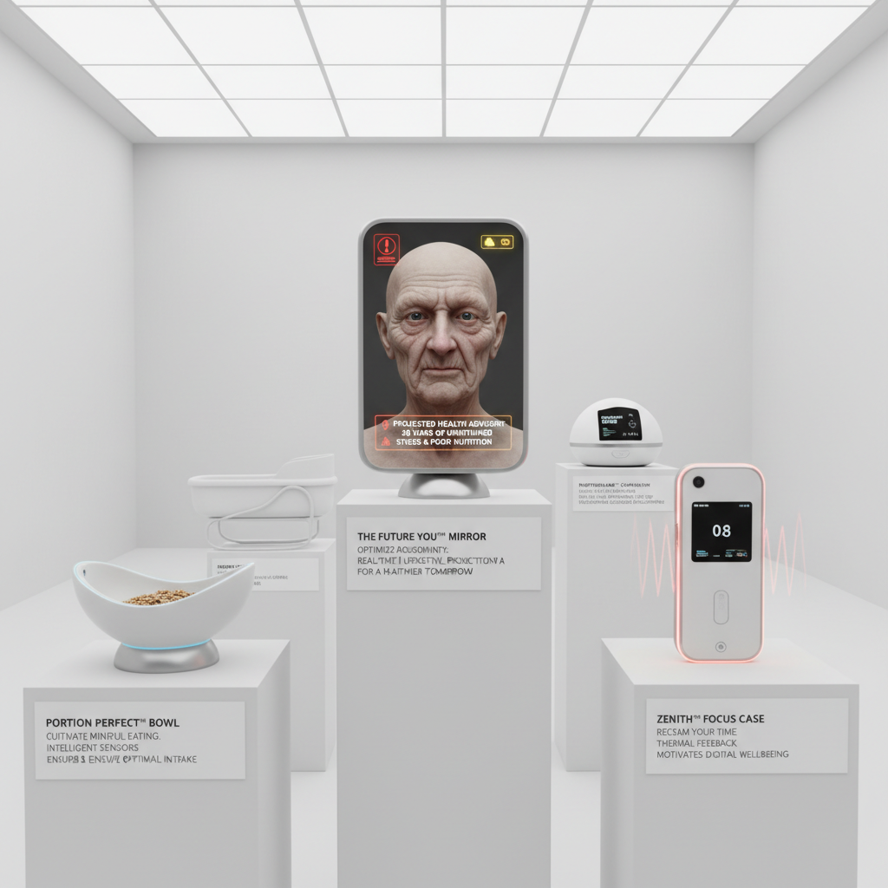

# Critical Design Art 批判设计艺术

> "Critical design uses the familiar language of consumer products to ask unfamiliar questions — what if your phone monitored your emotions and sold the data? What if furniture was designed for a society with no privacy? What if medicine was personalized by your genetic worth? By making these scenarios tangible as designed objects, critical design forces us to confront futures we might sleepwalk into, turning the design prototype from a solution into a provocation, from an answer into a question that demands we decide what kind of world we actually want to live in." — Anthony Dunne

## 概述

批判设计（Critical Design）是一种使用设计实践来质疑和挑战现状的方法，而非简单地解决问题或满足市场需求。批判设计由Anthony Dunne在1999年的著作《Hertzian Tales》中系统化提出，后来与Fiona Raby共同发展。批判设计的核心理念是：设计不应该仅仅是"肯定性的"（affirmative）——接受现状并在其中优化——也可以是"批判性的"——质疑假设、揭示隐含的价值观、并提出替代方案。

批判设计的实践包括：创造"不舒服"的产品来揭示技术的伦理问题、设计虚构的服务来质疑社会规范、以及制作原型来具象化抽象的政治和经济力量。批判设计与推测设计（Speculative Design）密切相关，但更强调对现状的批判而非对未来的想象。代表性的实践者包括：Dunne & Raby、Noam Toran、James Auger等。

## 核心特征

| 特征 | 描述 |
|------|------|
| 批判 | 对现状的批判 |
| 质疑 | 质疑隐含假设 |
| 不适 | 制造有意义的不适 |
| 具象 | 抽象问题的具象化 |
| 辩论 | 激发公众辩论 |
| 伦理 | 技术伦理的探索 |

## 视觉特征

- **产品**：看似真实的产品原型
- **日常**：日常物品的陌生化
- **精致**：精心制作的细节
- **文档**：虚构的产品文档
- **场景**：使用场景的再现
- **矛盾**：功能与伦理的矛盾

## 代表作品

| 作品 | 艺术家 | 年代 | 意义 |
|------|--------|------|------|
| *Hertzian Tales* | Anthony Dunne | 1999 | 批判设计的理论化 |
| *Placebo Project* | Dunne & Raby | 2001 | 电磁场的可感知化 |
| *Technological Dreams* | Dunne & Raby | 2007 | 技术梦想的批判 |
| *Happylife* | James Auger | 2010 | 监控技术的批判 |
| *Republic of Salivation* | Michael Burton | 2011 | 食物系统的批判 |

## 历史时间线

| 时期 | 事件 |
|------|------|
| 1999 | Dunne的《Hertzian Tales》 |
| 2001 | Placebo Project |
| 2013 | 《Speculative Everything》出版 |
| 2010年代 | 批判设计的全球传播 |
| 当代 | AI伦理中的批判设计 |

## 中国语境

批判设计在中国的设计教育中有越来越多的关注，但在实践中面临独特的挑战。中国的设计传统更强调"解决问题"和"服务市场"，批判设计的"提出问题"和"质疑现状"的立场需要在中国语境中找到合适的表达方式。一些中国的设计院校和研究者在探索"中国式批判设计"的可能性——关注中国特有的技术和社会议题，如人脸识别的普及、社交媒体的影响、快速城市化的后果等。中国的一些年轻设计师在毕业设计和独立项目中实践批判设计，探索如何在中国的文化和社会语境中有效地进行设计批判。

## AI生成概念图

## 与其他风格的关系

- **Speculative Design** → 推测设计
- **Design Fiction** → 设计虚构
- **Conceptual Art** → 概念艺术
- **Political Art** → 政治艺术
- **Anti-Design** → 反设计
- **Social Design** → 社会设计

---

*浮光艺志 | Chronicle of Artistry*
