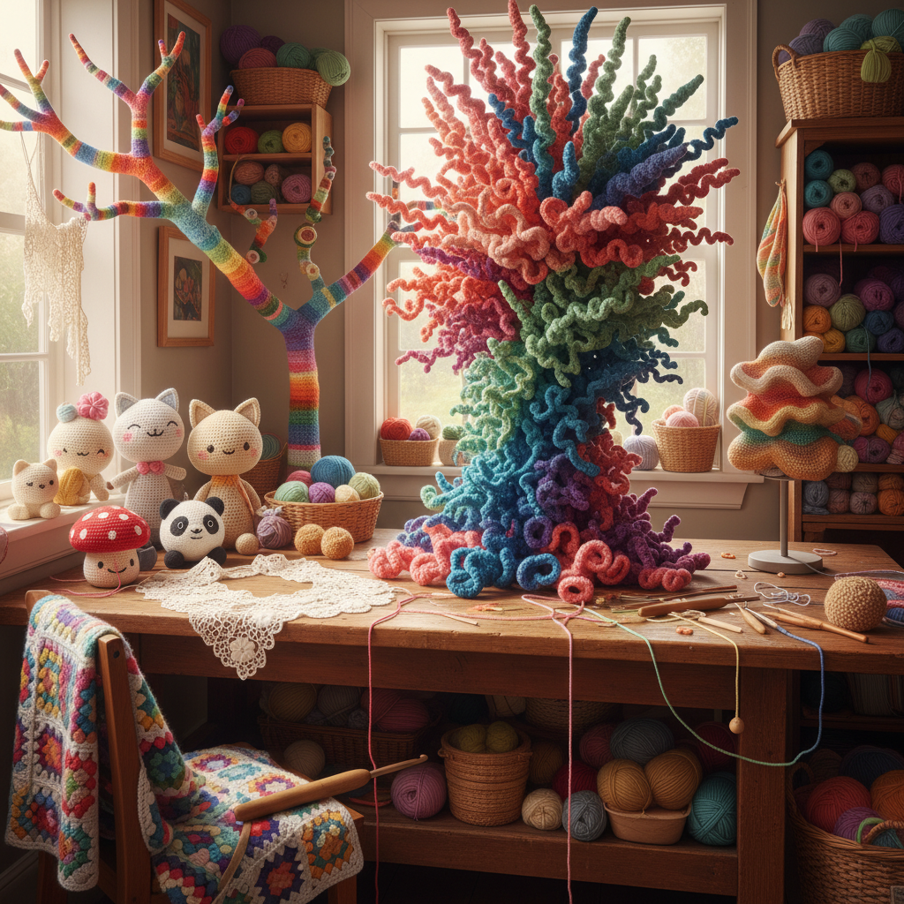

# Crochet Art 钩针艺术

> "Crochet builds fabric from a single thread and a single hook — each stitch a loop pulled through a loop, each row built upon the last, the entire structure held together by nothing but the interlocking of yarn with itself. Unlike knitting, which holds many stitches at once, crochet works one stitch at a time, making it uniquely suited to three-dimensional forms, freeform shapes, and mathematical surfaces that no other textile technique can easily produce." — Unknown

## 概述

钩针艺术（Crochet Art）是使用钩针将纱线钩织成织物和造型的艺术形式——通过一系列环环相扣的线圈创造平面织物、立体造型和装饰品。钩针编织因其灵活性和三维塑形能力，在当代艺术中获得了新的生命。

钩针艺术的实践包括：1）钩针蕾丝——精细的钩针花边和桌布；2）Amigurumi——日本风格的钩针玩偶；3）钩针雕塑——用钩针技法创作的大型雕塑；4）钩针装置——覆盖建筑或物体的钩针装置（yarn bombing）；5）双曲钩针——用钩针制作数学双曲面；6）自由形式钩针——不规则的自由形态钩针创作；7）爱尔兰钩针——精细的爱尔兰蕾丝钩针。

## 核心特征

| 特征 | 描述 |
|------|------|
| 单钩 | 只需一根钩针 |
| 三维 | 天然适合三维造型 |
| 灵活 | 极其灵活的技法 |
| 便携 | 随时随地可创作 |
| 数学 | 可表现数学曲面 |
| 社区 | 强烈的社区文化 |

## 视觉特征

- **纹理**：钩针特有的纹理图案
- **色彩**：纱线的丰富色彩
- **立体**：三维的立体形态
- **柔软**：柔软的织物质感
- **重复**：重复图案的韵律
- **有机**：有机的曲线形态

## 代表作品

| 作品 | 艺术家 | 年代 | 意义 |
|------|--------|------|------|
| *Crochet Coral Reef* | Margaret & Christine Wertheim | 2005至今 | 双曲钩针珊瑚礁 |
| *Yarn bombing* | Various | 2005至今 | 钩针城市装置 |
| *Amigurumi* | 日本传统 | 当代 | 钩针玩偶 |
| *Irish crochet lace* | 爱尔兰传统 | 19世纪至今 | 爱尔兰钩针蕾丝 |
| *Hyperbolic crochet* | Daina Taimina | 1997 | 数学钩针 |

## 历史时间线

| 时期 | 事件 |
|------|------|
| 19世纪初 | 钩针编织在欧洲兴起 |
| 1840年代 | 爱尔兰钩针蕾丝的发展 |
| 20世纪 | 钩针作为家庭手工艺 |
| 1997 | 双曲钩针的数学应用 |
| 当代 | 钩针作为当代艺术媒介 |

## 中国语境

钩针艺术在中国有广泛的群众基础和独特的发展。中国的钩针编织在20世纪中期非常流行——许多中国家庭都有钩针桌布、窗帘和装饰品。中国的钩针艺术家将传统钩针技法与中国元素结合——用钩针制作中国结、中国龙、旗袍造型等具有中国特色的作品。中国的Amigurumi（钩针玩偶）社群非常活跃，大量手工爱好者在社交媒体上分享作品。中国当代的一些纤维艺术家将钩针技法用于大型装置创作——用钩针覆盖树木、建筑或公共空间。中国的钩针蕾丝产业（如山东的抽纱）曾是重要的出口手工艺品。

## AI生成概念图

## 与其他风格的关系

- **Knitting Art** → 编织艺术
- **Fiber Art** → 纤维艺术
- **Textile Art** → 纺织艺术
- **Sculpture** → 雕塑
- **Mathematical Art** → 数学艺术
- **Street Art** → 街头艺术

---

*浮光艺志 | Chronicle of Artistry*
